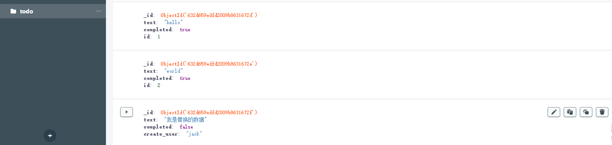

# Mongodb

  Mongodb的一个简介: MongoDB 是一个基于分布式文件存储的数据库。由 C++ 语言编写。旨在为 WEB 应用提供可扩展的高性能数据存储解决方案

[MongoDB下载地址](https://www.mongodb.com/try/download/community)

  使用命令行连接mongodb数据库
```js
mongod --dbpath db
// 指定数据文件夹, 在命令行下使用mongod命令需配置环境变量
```


  Mongodb中的一些概念
1. database:    数据库
2. collection:  数据库表/文档
3. row:         数据记录行/文档
4. index:       索引

  ObjectID 是唯一主键。由于ObjectId 保存了创建的时间戳, 在文档保存的时候不需要保存时间戳字段。
```js
> var newObject = ObjectId()
> newObject.getTimestamp()
ISODate("2017-11-25T07:21:10Z")
```

  The official MongoDB driver for Node.js. The Node.js driver is a library you can use to connect and communicate
  with MongoDB.

[npm-mongodb](https://www.mongodb.com/docs/drivers/node/current/quick-start/)

```js
// 安装mongodb模块
npm install mongodb --save


// 连接数据库
const { MongoClient } = require('mongodb')
const client = new MongoClient('mongodb://localhost:27017');
async function run () {
  try {
    // 创建数据库
    const database = client.db('test')
    // 创建表/集合
    const todos = database.collection('todos')
    // 插入一条数据
    await todos.insertOne({
      text: 'Vue',
      completed: false
    })
  } finally {
    await client.close()
  }
}
run()
```

## find / findOne

  You can query for a single document in a collection with the collection.findOne() method. And you can query
  for multiple documents in a collection with collection.find().

  You can also define additional query options such as sort and projection to configure the result set.

```js
// 数据库里的数据
[
  {
    firstName: "lebron",
    lastName: "james",
    age: 38
  },
  {
    firstName: "kyrie",
    lastName: "irving",
    age: 30
  },
  {
    firstName: "chris",
    lastName: "pual",
    age: 37
  },
  {
    firstName: "kevin",
    lastName: "durant",
    age: 34
  },
  {
    firstName: "stephen",
    lastName: "curry",
    age: 34
  }
]
```
```js
// findOne()
/* 下面是三种方法的数据格式 */
//...
const database = client.db('test')
const players = database.collection('player')

const result = players.findOne({})
/*
{
  _id: new ObjectId("632d5b3f325d58c57ebdd737"),
  firstName: 'lebron',
  lastName: 'james',
  age: 38
}
*/

// 排序
const result = players.findOne({}, {
  sort: {age: -1}
})
/*
{
  _id: new ObjectId("632d5b3f325d58c57ebdd737"),
  firstName: 'lebron',
  lastName: 'james',
  age: 38
}
*/

const result = players.findOne({}, {
  sort: {age: 1}
})
/*
{
  _id: new ObjectId("632d5b3f325d58c57ebdd738"),
  firstName: 'kyrie',
  lastName: 'irving',
  age: 30
}
*/

// 指定返回字段
const result = players.findOne({}, {
  projection: { _id: 0, firstName: 1, lastName: 1 }
})
/*
{ firstName: 'lebron', lastName: 'james' }
*/
```
```js
// find()

const result = await players.find().toArray()
// 以数组的方式返回所有数据

// 年龄小于32的
const result = await players.find({ age: { $lt: 32 }}).toArray()
/*
[
  {
    _id: new ObjectId("632d5b3f325d58c57ebdd738"),
    firstName: 'kyrie',
    lastName: 'irving',
    age: 30
  }
]

*/
// 年龄大于32的
const result = await players.find({ age: { $gt: 37 }}).toArray()
/*
[
  {
    _id: new ObjectId("632d5b3f325d58c57ebdd737"),
    firstName: 'lebron',
    lastName: 'james',
    age: 38
  }
]
*/

// 所有数据从小到大排列
const result = await players.find({}, {
  sort: {
    age: 1
  }
}).toArray()

// 所有数据从大到小排列
const result = await players.find({}, {
  sort: {
    age: -1
  }
}).toArray()

// 查询有某个字段的
const result = await collection.find({
  age: {
    $exists: true
  }
})

// forEach
const cursor = players.find({})
await cursor.forEach(doc => {console.log(doc)})
```

  Note that large numbers of matched documents can cause performance issues or failures if the operation exceeds memory constraints.
  Consider using **forEach()** to iterate through results unless you want to return all documents at once.
```js
const result = await players.find({}).toArray()

const cursor = players.find({})
for await (const doc of cursor) {
  console.log(doc)
}

// You can use the hasNext() method to check if a cursor can provide additional data.
while(await cursor.hasNext()) {
  console.log(await cursor.next())
}

// cursors expose the stream() method to convert them to Node Readable Streams.
cursor.stream().on('data', doc => {
  console.log(doc)
})
```

## insertOne / insertMany

  You can insert a document into a collection using **collection.insertOne()** method. To insert a document,
  define an object that contains the fields and values that you want to store. If the specified collection does
  not esist, the insertOne() method creates the collection.

```js
// insertOne()
const database = client.db('test')
const todos = database.collection('todo')
const result = await todos.insertOne({
  text: '学习Vue',
  completed: false,
  id: 1
})
console.log(result)
/*
{
  acknowledged: true,
  insertedId: new ObjectId("632d650bf3597df45e479b4c")
}
*/
```

  You can insert multiple documents using the **collection.insertMany()** method. The insertMany() takes an toArray
  of documents to insert into the specified collection.
```js
// insertMany()
const result = await todos.insertMany([
  {
    text: 'hello',
    completed: false,
    id: 1
  },
  {
    text: 'world',
    completed: true,
    id: 2
  },
  {
    text: '你好 世界',
    completed: false,
    id: 3
  }
])
/*
{
  acknowledged: true,
  insertedCount: 3,
  insertedIds: {
    '0': new ObjectId("632d659edfd2009b8631672d"),
    '1': new ObjectId("632d659edfd2009b8631672e"),
    '2': new ObjectId("632d659edfd2009b8631672f")
  }
}
*/
```

## updateOne / updateMany / replaceOne

  You can update a single document using the **collection.updateOne()** method. The **updateOne()** method accepts a filter document
  and an update document.

  set the **upsert** option to true to create a new document if no documents match the filter.
  Update operations mutate specified fields in one or more documents and leave other fields and values unchanged.
```js
const databse = client.db('test')
const todos = databse.collection('todo');
const result = await todos.updateOne(
  {id: 1}, // create a filter
  {
    $set: {
      completed: true
    }
  },
  {
    upsert: true // this option instructs the method to create a document if no documents
  }
)
console.log(result)
/*
{
  acknowledged: true,
  modifiedCount: 1,
  upsertedId: null,
  upsertedCount: 0,
  matchedCount: 1
}
*/
```
```js
// 更新数组的某个数据
// 数据源
[{
   name: "Steve Lobsters",
   address: "731 Yexington Avenue",
   items: [
     { type: "beverage", name: "Water", size: "17oz", },
     { type: "pizza", size: "large", toppings: ["pepperoni"], },
     { type: "pizza", size: "medium", toppings: ["mushrooms", "sausage", "green peppers"], comment: "Extra green peppers please!", },
     { type: "pizza", size: "large", toppings: ["pineapple, ham"], comment: "red pepper flakes on top", },
     { type: "calzone", fillings: ["canadian bacon", "sausage", "onion"], },
     { type: "beverage", name: "Diet Pepsi", size: "16oz", },
   ],
 },
 {
   name: "Popeye",
   address: "1 Sweethaven",
   items: [
     { type: "pizza", size: "large", toppings: ["garlic, spinach"], },
     { type: "calzone", toppings: ["ham"], },
   ],
}]

const result = await pizza.updateOne({ name: "Steve Lobsters", "items.type": "pizza" }, {
  // 更新数组items 第一条数据的 size属性
  $set: { "items.$.size": "extra large" }
})


const result = await pizza.updateOne({ name: 'Popeye' }, {
  // items的每个 toppings数组 新增一条 fresh mozzarella
  $push: { 'items.$[].toppings': 'fresh mozzarella' }
})

const result = await collection.updateMany({ name: 'Steve Lobsters'}, {
  $push: { 'items.$[orderItem].toppings': 'garlic' }
}, {
  arrayFilters: [{
    'orderItem.type': 'pizza',
    'orderItem.size': 'large'
  }]
})
// items: the array in the document to update
// orderItem: the identifier for the filtered positional operator
// toppings: the field on the items array element to update
// garlic: the value to push onto the toppings array
```

  You can update multiple documents using the **collection.updateMany()** method.
```js
const result = await todos.updateMany({completed: false}, {
  $set: {
    completed: true
  }
})
/*
{
  acknowledged: true,
  modifiedCount: 4,
  upsertedId: null,
  upsertedCount: 0,
  matchedCount: 4
}
*/
```

  **collection.replaceOne()** This operation removes all fields and values in the original document and replaces
  them with the fields and value in the replacement document. The value of the _id field remains the same unless you
  explicitly specify a new value for _id in the replacement document.

  Replace operations remove all existing fields in one or more documents and substitute them with specified fields and values.
```js
const result = await todos.replaceOne(
  {id: 3},
  {
    text: '我是替换的数据',
    completed: false,
    create_user: 'jack'
  },
  {
    upsert: true
  }
)
```


## DeleteOne / DeleteMany

  **deleteOne()** if you do not provide a query document (or if you provide an empty document), MongoDB matches
  all documents in the collection and deletes the first match.
```js
// deleteOne()  删除一条数据
const result = await todos.deleteOne({ id: 0 })
console.log(result)
// { acknowledged: true, deletedCount: 1 }
```

  you can delete multiple documents in a collection ad once using the **collection.deleteMany()**.
  While you can use **deleteMany()** to delete all documents in a collection, consider using **drop()** insteat for better
  performance and clearer code.
```js
const result = await todos.deleteMany({completed: true})
console.log(result) // { acknowledged: true, deletedCount: 4 }
```

## Count documents

  The Node.js driver provides two methods for counting documents in a collection.

1. collection.countDocuments()

  return the number of documents in the collection that match the specified query. If you specify an empty query document,
  **countDocuments()** returns the total number of documents in the collection.
```js
// 先插入1000条数据
const array = []
for (let i = 0; i < 1000; i++) {
  array.push({
    title: `Hello - ${i}`,
    id: Math.random()
  })
}
const result = await todos.insertMany(array)

const result_1 = await todos.countDocuments()
const result_2 = await todos.estimatedDocumentCount()
console.log(result_1, result_2) // 1000 1000
```
  **estimatedDocumentCount()** is faster than **countDocuments()**.  **countDocuments()** takes longer to return,
  but provides an accurate count of the number of documents and supports specifying a filter.

```js
const result_1 = await todos.countDocuments({ title: 'Hello - 10' })
// 1
```

## Retrieve distinct value

  You can retrieve a list of distinct values for a field across a collection by using the **collection.distinct()** method.
  The distinct() method requires a document filed as a parameter.

```js
//...
const database = client.db('test')
const players = database.collection('player')
const result = await players.distinct('age')
console.log(result) // [30, 34, 37, 38]

const result = await players.distinct('firstName')
console.log(result) // [ 'chris', 'kevin', 'kyrie', 'lebron', 'stephen' ]
```

  下面的demo来自官网。 (数据源如下所示)
```json
[
   { "_id": 1, "restaurant": "White Bear", "borough": "Queens", "cuisine": "Chinese" },
   { "_id": 2, "restaurant": "Via Carota", "borough": "Manhattan", "cuisine": "Italian" },
   { "_id": 3, "restaurant": "Borgatti's", "borough": "Bronx", "cuisine": "Italian" },
   { "_id": 4, "restaurant": "Tanoreen", "borough": "Brooklyn", "cuisine": "Middle Eastern" },
   { "_id": 5, "restaurant": "Äpfel", "borough": "Queens", "cuisine": "German" },
   { "_id": 6, "restaurant": "Samba Kitchen", "borough": "Manhattan", "cuisine": "Brazilian" },
]
```


```js
const cursor = await collection.distinct('borough')
// [ 'Bronx', 'Brooklyn', 'Manhattan', 'Queens' ]

const cursor = await collection.distinct('cuisine', {
  borough: { $ne: 'Brooklyn' } // exclude Broklyn restuarants from the output.
})
// [ 'Brazilian', 'Chinese', 'German', 'Italian' ]
```

## Sort

  Use sort to change the order in which read operations return documents. To sort returned documents by a field in
  ascending(lowest first) order, use a value of **1**.

```json
// 数据源
[
  { "_id": 1, "name": "The Brothers Karamazov", "author": "Dostoyevsky", "length": 824 },
  { "_id": 2, "name": "Les Misérables", "author": "Hugo", "length": 1462 },
  { "_id": 3, "name": "Atlas Shrugged", "author": "Rand", "length": 1088 },
  { "_id": 4, "name": "Infinite Jest", "author": "Wallace", "length": 1104 },
  { "_id": 5, "name": "Cryptonomicon", "author": "Stephenson", "length": 918 },
  { "_id": 6, "name": "A Dance with Dragons", "author": "Martin", "length": 1104 },
]
```
```js
const cursor = await collection.find({}).sort({length: -1}) // 从大到小
const cursor = await collection.find({}).sort({length: 1}) // 从小到大

// 作为find的第二个参数传递, 效果一样
const result = await cursor.find({}, {
  sort: {
    length: -1
  }
}).toArray()

/**
 * 上述数据源中有两本书的长度一致, 所以返回的结果顺序是无法保证的, 这时可以再指定额外的一个参数用来排序。
 */
const result = await cursor.find({}).sort({
  length: 1,
  author: -1
}).toArray()
```

## Skip

  Use skip to omit documents from the beginning of the list of returned documents for a read operation.
  Using skip without using sort omits arbitrary documents.

```json
// 数据源
[
   { "_id": 1, "name": "apples", "qty": 5, "rating": 3 },
   { "_id": 2, "name": "bananas", "qty": 7, "rating": 1 },
   { "_id": 3, "name": "oranges", "qty": 6, "rating": 2 },
   { "_id": 4, "name": "avocados", "qty": 3, "rating": 5 },
]
```
```js
const result = await collection.find({}, {
  sort: {
    rating: -1
  },
  skip: 2 // 从大到小排序后 忽略两条数据
}).toArray()
console.log(result)
/**
 * [
      { _id: 3, name: 'oranges', qty: 6, rating: 2 },
      { _id: 2, name: 'bananas', qty: 7, rating: 1 }
    ]

  */

// 或者通过链式调用
const result = await collection.find().sort({
  rating: -1
}).skip(2).toArray()

// 超过返回的数据长度, 返回[]
const result = await collection.find().sort({
  rating: -1
}).skip(5).toArray()
```

## Limit

  Limit the number of reuturned results. If limit is used with the skip method, the skip applies first and the limit only applies to
  the documents left over after the skip.
```js
// 此处查询的数据和sort部分一致
const collection = database.collection('book')

const result = await collection.find({}).sort({
  length: -1
}).limit(3).toArray()
/*
[
  { _id: 2, name: 'Les Misérables', author: 'Hugo', length: 1462 },
  { _id: 6, name: 'A Dance with Dragons', author: 'Martin', length: 1104},
  { _id: 4, name: 'Infinite Jest', author: 'Wallace', length: 1104 }
]
*/

// 另一种写法
const result = await collection.find({}, {
  sort: {
    length: -1
  },
  limit: 3
}).toArray()
```
:::tip
The order in which you call *limit* and *sort* does not matter because the driver reorders the calls to apply the sort first
and the limit after it

```js
// 效果一样的
collection.find(query).sort({ length: -1 }).limit(3);
collection.find(query).limit(3).sort({ length: -1 });
```
:::


## Specify field to return

  Use a projection to control which fields appear in the documents returned by read operations.Many requests only require
  certain fields.

  有两种使用方式: 显式的指定需要返回的字段, 设置属性为1. 或者显式地设置不需要返回的字段, 设置属性为0

```js
const collection = database.collection('fruit')
// The projection document specifies a value of *1* for *name* to indicate that the 
// read operation result should include the name field of each returned document.
const result = await collection.find({}).project({name: 1}).toArray()

// _id 默认会返回, 因为对每条数据来说是一个特别的标识符, 除非显示的指定不要返回_id.
/*
[
  { _id: 1, name: 'apples' },
  { _id: 2, name: 'bananas' },
  { _id: 3, name: 'oranges' },
  { _id: 4, name: 'avocados' }
]
*/

const result = await collection.find({}).project({name: 0}).toArray()
/*
[
  { _id: 1, qty: 5, rating: 3 },
  { _id: 2, qty: 7, rating: 1 },
  { _id: 3, qty: 6, rating: 2 },
  { _id: 4, qty: 3, rating: 5 }
]
*/
```

## Indexes

  Indexes are data structures that support the efficient execution of queries in MongoDB. They contain copies of parts of the data
  in documents to make queries more efficient.

  Without indexes, MongoDB must scan every document in a collection to find the documents that match each query.

  The default name for an index is the concatenation of the indexed keys and each key's direction in the index. using underscores as
  a separator.
```js
const index = await cursor.createIndex({ length: 1})
console.log(index)  // length_1

// the index sorts first by length and then, sorts by name
const index = await cursor.createIndex({ length: 1, name: 1})
console.log(index)  // length_1_name_1

const index = await cursor.createIndex({ length: 1}, { name: 'query length'})
console.log(index)  // query length

// 数据源
const data = {
  location: { state: "NY", city: "New York" }
}
// create an index on an Embedded Field
cursor.createIndex({ 'location.state': 1 })

// create an index on an Embedded document
cursor.createIndex({ location: 1 })
```
```js
// Single Field Indexes

await cursor.createIndex({ length: 1 })
const result = await cursor.find({}).sort({ length: 1}).project({title: 1}).toArray()
console.log(result)

// Compound Indexes
/*
The order of the indexed fields has a strong impact on the effectiveness of a particular
index of a given query
*/
const index = await cursor.createIndex({length: 1,  name: 1})
console.log(index) // length_1_name_1
const result = await cursor.find({}).sort({length:1,  name:1}).project({name:1, length:1}).toArray()
console.log(result)


// Clustered Indexes
/*
Clustered indexes are indexes that improve the performance of insert, update and delete operations.
*/
const db = client.db('tea');
await db.createCollection('ratings', {
  clusteredIndex: {
    key: { _id: 1 },
    unique: true
  }
});
```

[Quick-Start](https://www.mongodb.com/docs/drivers/node/current/quick-reference/)

[Mongodb](https://www.mongodb.com/docs/manual/introduction/)