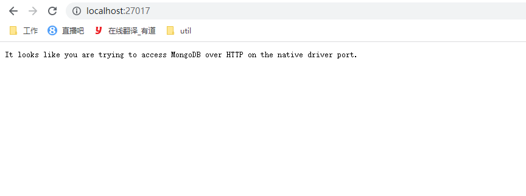
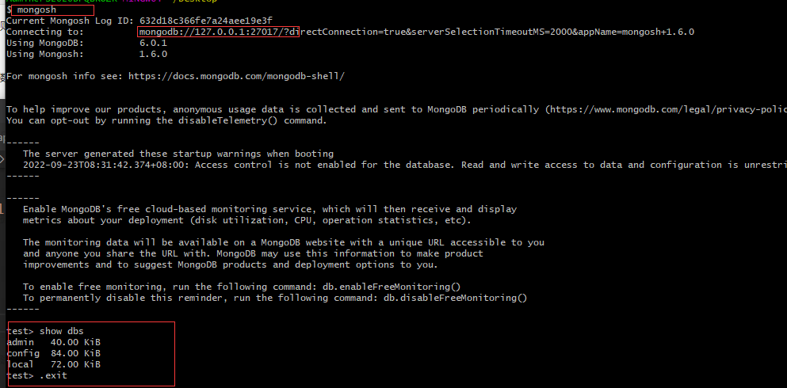
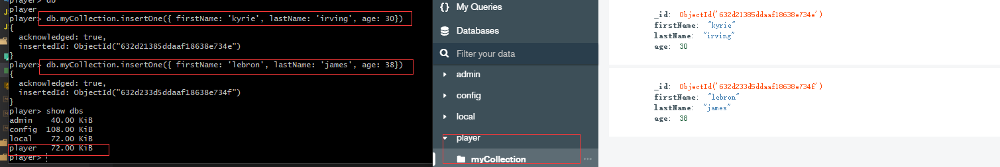
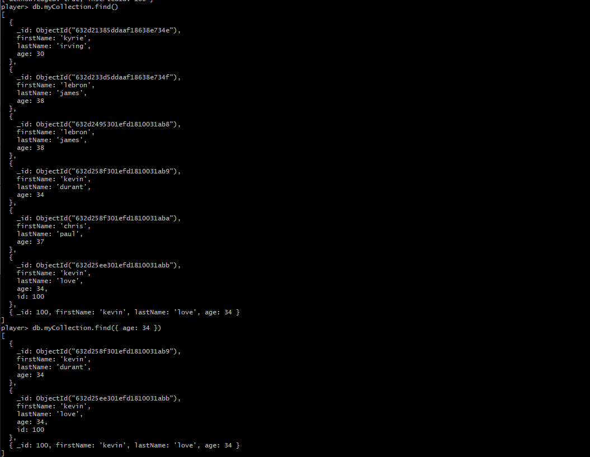
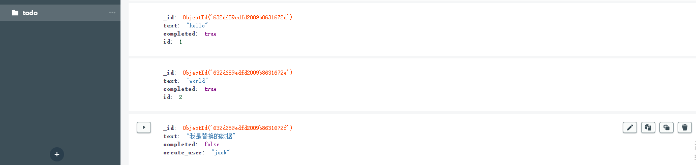

# Mongodb

  Mongodb的一个简介: MongoDB 是一个基于分布式文件存储的数据库。由 C++ 语言编写。旨在为 WEB 应用提供可扩展的高性能数据存储解决方案

[MongoDB下载地址](https://www.mongodb.com/try/download/community)

  使用命令行连接mongodb数据库
```js
mongod --dbpath db
// 指定数据文件夹, 在命令行下使用mongod命令需配置环境变量
```



  Mongodb中的一些概念
1. database:    数据库
2. collection:  数据库表/文档
3. row:         数据记录行/文档
4. index:       索引

  ObjectID 是唯一主键。由于ObjectId 保存了创建的时间戳, 在文档保存的时候不需要保存时间戳字段。
```js
> var newObject = ObjectId()
> newObject.getTimestamp()
ISODate("2017-11-25T07:21:10Z")
```

## mongosh

  MongoDB Shell is the quickest way to connect to MongoDB, Easily query data, configure settings and execute other actions with
  this modern, estensible command-line interface.

[MongoDB Shell下载地址](https://downloads.mongodb.com/compass/mongosh-1.6.0-win32-x64.zip)

  同样配置好环境变量, 在命令行和数据库进行交互:
```js
mongosh
// 等同于 mongosh 'mongodb://localhost:27017' (默认启动在27017端口)

// mongosh 指定端口连接数据库
mongosh --port 28015
mongosh 'mongodb://localhost:28015'

// 连接远程数据库
mongosh 'mongodb://mongodb0.example.com:28015'
mongosh '--host mongodb0.example.com --port 28015'

// 连接指定数据库
mongosh 'mongodb://localhost:27017/db1'

// 退出数据库的连接
.exit / exit / exit()
quit / quit()
```


```js
// 数据库相关
use DATABASE_NAME // (如果数据库不存在, 则创建数据库, 否则切换到指定数据库)

// 删除数据库
db.dropDatabase()

> use player
> show dbs
 admin
 config
 local
// 新创建的数据库并没有数据, 所以没有显示

db  //显示当前使用的数据库

// 创建表
db.createCollection(name, options)
// player> db.createCollection("runoob")
// { ok: 1 }

// 查看已创建的表
show collections

// 删除表
db.myCollection.drop()


// 插入一条数据, 如果数据表不存在, 则会创建一张表。
db.myCollection.insertOne({ firstName: 'kyrie', lastName: 'irving', age: 30})
db.myCollection.insertOne({ firstName: 'lebron', lastName: 'james', age: 38})
```



**CRUD operations create, read, update and delete documents.**

### Insert documents

```js
// 插入一条或者多条数据(插入多条数据传入一个数据)
// db.collection.insertOne() / db.collection.insertMany()
db.myCollection.insertMany([
  {
    firstName: 'kevin',
    lastName: 'durant',
    age: 34
  },
  {
    firstName: 'chris',
    lastName: 'paul',
    age: 37
  }
])

/* If the document does not specify an _id field, MongoDB adds the _id field with an 
ObjectID value to the new document
*/
db.myCollection.insertOne({
  firstName: 'kevin',
  lastName: 'love',
  age: 34,
  _id: 100
})
```
### Query documents

  use the db.collection.find() method in the MongoDB shell to query documents in a collection.
```js
// 返回所有的数据
db.myCollection.find()

// 返回指定数据
db.myCollection.find({ age: 34 })
```
### Update documents

```js
// 分别更新一条/更新多条/替换一个数据
// db.collection.updateOne() / db.collection.updateMany() / db.collection.replaceOne()

db.myCollection.updateOne({firstName:'lebron'}, {$set:{firstName: 'hello'}})
db.myCollection.updateOne({firstName:'lebron'}, {$set:{age: '40'}})

db.myCollection.updateMany({age: 34}, {$set:{age: 43}})
```

### Delete documents

```js
// db.collection.deleteMany() / db.collection.deleteOne()
db.myCollection.deleteMany({}) // 删除所有的数据

db.myCollection.deleteMany({firstName: 'lebron'})
db.myCollection.deleteMany({firstName: 'hello'})
db.myCollection.deleteOne({age: 43})  // delete only one document that matches a condition
```


[Perform CRUD operations 参考文档](https://www.mongodb.com/docs/mongodb-shell/crud/)

## mongodb

  The official MongoDB driver for Node.js. The Node.js driver is a library you can use to connect and communicate
  with MongoDB.

[npm-mongodb](https://www.mongodb.com/docs/drivers/node/current/quick-start/)

```js
// 安装mongodb模块
npm install mongodb --save


// 连接数据库
const { MongoClient } = require('mongodb')
const client = new MongoClient('mongodb://localhost:27017');
async function run () {
  try {
    // 创建数据库
    const database = client.db('test')
    // 创建表/集合
    const todos = database.collection('todos')
    // 插入一条数据
    await todos.insertOne({
      text: 'Vue',
      completed: false
    })
  } finally {
    await client.close()
  }
}
run()
```

### find / findOne

  You can query for a single document in a collection with the collection.findOne() method. And you can query
  for multiple documents in a collection with collection.find().

  You can also define additional query options such as sort and projection to configure the result set.

```js
// 数据库里的数据
[
  {
    firstName: "lebron",
    lastName: "james",
    age: 38
  },
  {
    firstName: "kyrie",
    lastName: "irving",
    age: 30
  },
  {
    firstName: "chris",
    lastName: "pual",
    age: 37
  },
  {
    firstName: "kevin",
    lastName: "durant",
    age: 34
  },
  {
    firstName: "stephen",
    lastName: "curry",
    age: 34
  }
]
```
```js
// findOne()
/* 下面是三种方法的数据格式 */
//...
const database = client.db('test')
const players = database.collection('player')

const result = players.findOne({})
/*
{
  _id: new ObjectId("632d5b3f325d58c57ebdd737"),
  firstName: 'lebron',
  lastName: 'james',
  age: 38
}
*/

// 排序
const result = players.findOne({}, {
  sort: {age: -1}
})
/*
{
  _id: new ObjectId("632d5b3f325d58c57ebdd737"),
  firstName: 'lebron',
  lastName: 'james',
  age: 38
}
*/

const result = players.findOne({}, {
  sort: {age: 1}
})
/*
{
  _id: new ObjectId("632d5b3f325d58c57ebdd738"),
  firstName: 'kyrie',
  lastName: 'irving',
  age: 30
}
*/

// 指定返回字段
const result = players.findOne({}, {
  projection: { _id: 0, firstName: 1, lastName: 1 }
})
/*
{ firstName: 'lebron', lastName: 'james' }
*/
```
```js
// find()

const result = await players.find().toArray()
// 以数组的方式返回所有数据

// 年龄小于32的
const result = await players.find({ age: { $lt: 32 }}).toArray()
/*
[
  {
    _id: new ObjectId("632d5b3f325d58c57ebdd738"),
    firstName: 'kyrie',
    lastName: 'irving',
    age: 30
  }
]

*/
// 年龄大于32的
const result = await players.find({ age: { $gt: 37 }}).toArray()
/*
[
  {
    _id: new ObjectId("632d5b3f325d58c57ebdd737"),
    firstName: 'lebron',
    lastName: 'james',
    age: 38
  }
]
*/

// 所有数据从小到大排列
const result = await players.find({}, {
  sort: {
    age: 1
  }
}).toArray()

// 所有数据从大到小排列
const result = await players.find({}, {
  sort: {
    age: -1
  }
}).toArray()
```

### insertOne / insertMany

  You can insert a document into a collection using **collection.insertOne()** method. To insert a document,
  define an object that contains the fields and values that you want to store. If the specified collection does
  not esist, the insertOne() method creates the collection.

```js
// insertOne()
const database = client.db('test')
const todos = database.collection('todo')
const result = await todos.insertOne({
  text: '学习Vue',
  completed: false,
  id: 1
})
console.log(result)
/*
{
  acknowledged: true,
  insertedId: new ObjectId("632d650bf3597df45e479b4c")
}
*/
```

  You can insert multiple documents using the **collection.insertMany()** method. The insertMany() takes an toArray
  of documents to insert into the specified collection.
```js
// insertMany()
const result = await todos.insertMany([
  {
    text: 'hello',
    completed: false,
    id: 1
  },
  {
    text: 'world',
    completed: true,
    id: 2
  },
  {
    text: '你好 世界',
    completed: false,
    id: 3
  }
])
/*
{
  acknowledged: true,
  insertedCount: 3,
  insertedIds: {
    '0': new ObjectId("632d659edfd2009b8631672d"),
    '1': new ObjectId("632d659edfd2009b8631672e"),
    '2': new ObjectId("632d659edfd2009b8631672f")
  }
}
*/
```

### updateOne / updateMany / replaceOne

  You can update a single document using the **collection.updateOne()** method. The **updateOne()** method accepts a filter document
  and an update document.

  set the **upsert** option to true to create a new document if no documents match the filter.
```js
const databse = client.db('test')
const todos = databse.collection('todo');
const result = await todos.updateOne(
  {id: 1}, // create a filter
  {
    $set: {
      completed: true
    }
  },
  {
    upsert: true // this option instructs the method to create a document if no documents
  }
)
console.log(result)
/*
{
  acknowledged: true,
  modifiedCount: 1,
  upsertedId: null,
  upsertedCount: 0,
  matchedCount: 1
}
*/
```

  You can update multiple documents using the **collection.updateMany()** method.
```js
const result = await todos.updateMany({completed: false}, {
  $set: {
    completed: true
  }
})
/*
{
  acknowledged: true,
  modifiedCount: 4,
  upsertedId: null,
  upsertedCount: 0,
  matchedCount: 4
}
*/
```

  **collection.replaceOne()** This operation removes all fields and values in the original document and replaces
  them with the fields and value in the replacement document. The value of the _id field remains the same unless you
  explicitly specify a new value for _id in the replacement document.
```js
const result = await todos.replaceOne(
  {id: 3},
  {
    text: '我是替换的数据',
    completed: false,
    create_user: 'jack'
  },
  {
    upsert: true
  }
)
```


### deleteOne / deleteMany

  **deleteOne()** if you do not provide a query document (or if you provide an empty document), MongoDB matches
  all documents in the collection and deletes the first match.
```js
// deleteOne()  删除一条数据
const result = await todos.deleteOne({ id: 0 })
console.log(result)
// { acknowledged: true, deletedCount: 1 }
```

  you can delete multiple documents in a collection ad once using the **collection.deleteMany()**.
  While you can use **deleteMany()** to delete all documents in a collection, consider using **drop()** insteat for better
  performance and clearer code.
```js
const result = await todos.deleteMany({completed: true})
console.log(result) // { acknowledged: true, deletedCount: 4 }
```

### count documents

  The Node.js driver provides two methods for counting documents in a collection.

1. collection.countDocuments()

  return the number of documents in the collection that match the specified query. If you specify an empty query document,
  **countDocuments()** returns the total number of documents in the collection.
```js
// 先插入1000条数据
const array = []
for (let i = 0; i < 1000; i++) {
  array.push({
    title: `Hello - ${i}`,
    id: Math.random()
  })
}
const result = await todos.insertMany(array)

const result_1 = await todos.countDocuments()
const result_2 = await todos.estimatedDocumentCount()
console.log(result_1, result_2) // 1000 1000
```
  **estimatedDocumentCount()** is faster than **countDocuments()**.  **countDocuments()** takes longer to return,
  but provides an accurate count of the number of documents and supports specifying a filter.

```js
const result_1 = await todos.countDocuments({ title: 'Hello - 10' })
// 1
```

### Retrieve distinct value

  You can retrieve a list of distinct values for a field across a collection by using the **collection.distinct()** method.

```js
//...
const database = client.db('test')
const players = database.collection('player')
const result = await players.distinct('age')
console.log(result) // [30, 34, 37, 38]

const result = await players.distinct('firstName')
console.log(result) // [ 'chris', 'kevin', 'kyrie', 'lebron', 'stephen' ]
```