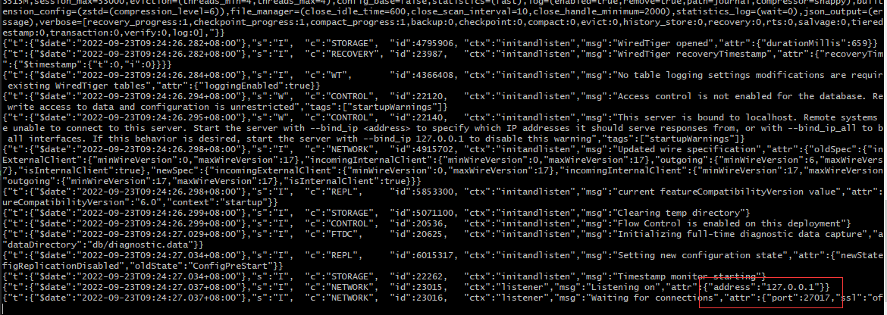

# Mongodb

  Mongodb的一个简介: MongoDB 是一个基于分布式文件存储的数据库。由 C++ 语言编写。旨在为 WEB 应用提供可扩展的高性能数据存储解决方案

[MongoDB下载地址](https://www.mongodb.com/try/download/community)

  使用命令行连接mongodb数据库
```js
mongod --dbpath db
// 指定数据文件夹, 在命令行下使用mongod命令需配置环境变量
```



  Mongodb中的一些概念
1. database:    数据库
2. collection:  数据库表/文档
3. row:         数据记录行/文档
4. index:       索引

  ObjectID 是唯一主键。由于ObjectId 保存了创建的时间戳, 在文档保存的时候不需要保存时间戳字段。
```js
> var newObject = ObjectId()
> newObject.getTimestamp()
ISODate("2017-11-25T07:21:10Z")
```

## mongosh

  MongoDB Shell is the quickest way to connect to MongoDB, Easily query data, configure settings and execute other actions with
  this modern, estensible command-line interface.

[MongoDB Shell下载地址](https://downloads.mongodb.com/compass/mongosh-1.6.0-win32-x64.zip)

  同样配置好环境变量, 在命令行和数据库进行交互:
```js
mongosh
// 等同于 mongosh 'mongodb://localhost:27017' (默认启动在27017端口)

// mongosh 指定端口连接数据库
mongosh --port 28015
mongosh 'mongodb://localhost:28015'

// 连接远程数据库
mongosh 'mongodb://mongodb0.example.com:28015'
mongosh '--host mongodb0.example.com --port 28015'

// 连接指定数据库
mongosh 'mongodb://localhost:27017/db1'

// 退出数据库的连接
.exit / exit / exit()
quit / quit()
```


```js
// 数据库相关
use DATABASE_NAME // (如果数据库不存在, 则创建数据库, 否则切换到指定数据库)

// 删除数据库
db.dropDatabase()

> use player
> show dbs
 admin
 config
 local
// 新创建的数据库并没有数据, 所以没有显示

db  //显示当前使用的数据库

// 创建表
db.createCollection(name, options)
// player> db.createCollection("runoob")
// { ok: 1 }

// 查看已创建的表
show collections

// 删除表
db.myCollection.drop()


// 插入一条数据, 如果数据表不存在, 则会创建一张表。
db.myCollection.insertOne({ firstName: 'kyrie', lastName: 'irving', age: 30})
db.myCollection.insertOne({ firstName: 'lebron', lastName: 'james', age: 38})
```


## perform CRUD operations

  CRUD operations create, read, update and delete documents.

1. Insert documents

```js
// 插入一条或者多条数据(插入多条数据传入一个数据)
// db.collection.insertOne() / db.collection.insertMany()
db.myCollection.insertMany([
  {
    firstName: 'kevin',
    lastName: 'durant',
    age: 34
  },
  {
    firstName: 'chris',
    lastName: 'paul',
    age: 37
  }
])

/* If the document does not specify an _id field, MongoDB adds the _id field with an 
ObjectID value to the new document
*/
db.myCollection.insertOne({
  firstName: 'kevin',
  lastName: 'love',
  age: 34,
  _id: 100
})
```
2. Query documents

  use the db.collection.find() method in the MongoDB shell to query documents in a collection.
```js
// 返回所有的数据
db.myCollection.find()

// 返回指定数据
db.myCollection.find({ age: 34 })
```
3. Update documents

```js
// 分别更新一条/更新多条/替换一个数据
// db.collection.updateOne() / db.collection.updateMany() / db.collection.replaceOne()

db.myCollection.updateOne({firstName:'lebron'}, {$set:{firstName: 'hello'}})
db.myCollection.updateOne({firstName:'lebron'}, {$set:{age: '40'}})

db.myCollection.updateMany({age: 34}, {$set:{age: 43}})
```

4. Delete documents

```js
// db.collection.deleteMany() / db.collection.deleteOne()
db.myCollection.deleteMany({}) // 删除所有的数据

db.myCollection.deleteMany({firstName: 'lebron'})
db.myCollection.deleteMany({firstName: 'hello'})
db.myCollection.deleteOne({age: 43})  // delete only one document that matches a condition
```


[Perform CRUD operations 参考文档](https://www.mongodb.com/docs/mongodb-shell/crud/)