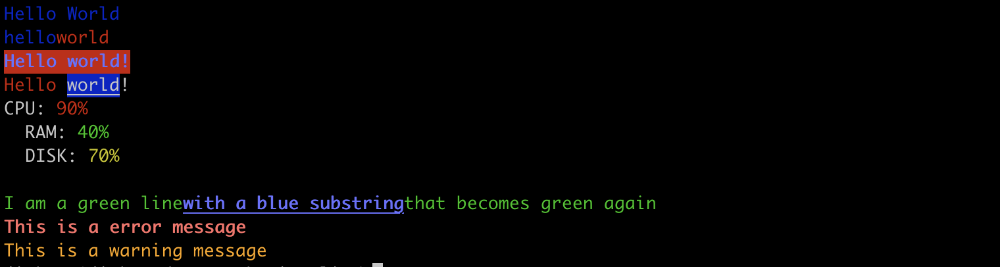

# Inquirer

  A collection of common interactive command line user interfaces.

[npm-inquirer](https://www.npmjs.com/package/inquirer)

## Install

```js
npm install --save inquirer
```

## Usage

```js
inquirer.prompt([
  // pass your questions in here
]).then((answers) => {
  // use user feedback... whatever
}).catch((error) => {
  // errro
})
```
:::tip
Inquirer v9 higher are native esm modules, this mean you cannot use the commonjs syntax
require('inquirer') anymore.
```js
npm install --save inquirer@^8.0.0

const inquirer = require('inquirer')
```
:::

```js
// 一个简单的案例, 下图是执行这段代码的结果
inquirer.prompt([
  {
    type: 'input',
    name: 'username',
    message: '你的名字'
  },
  {
    type: 'input',
    name: 'password',
    message: '请输入密码'
  }
]).then((answer) => {
  console.log(answer)
})
```

## param

1. type: 表示咨询的问题类型,其合法的值有 input, number, confirm, list, rawList, expand, checkbox, password, editor
2. name: 用来作为answers对象的键名(The name use when storing the answer in the answers hash).
3. message: 描述当前询问的信息 (也可以定义为一个函数)
4. default: 默认值(if nothing is entered, or a function that returns the default values).
5. choices: (Array|Function) 一个数组或者返回一个数组的函数(Array values can be simple *numbers* *strings* or *objects*
  containing a **name** (to display in list), a **value**(to save the answer hash).)
6. validate: (Function) 如果输入合法 返回true, 否则返回false
7. when: (Function|Boolean) Receive the current user answers hash and should return *true* or *false* depending on
whether or not this question should be asked. 
8. loop: enable list looping
9. prefix: change the default prefix message
10. suffix: change the default suffix message

```js
inquirer.prompt[{
    type: 'rawlist',  // 使用rawlist 选项前会有序号
    type: 'list',
    name: 'framework',
    // choices 两种使用方式
    choices: ['Angular', 'Vue', 'React'],
    choices: [
      {
        name: 'Angular',
        value: 'a'
      },
      {
        name: 'Vue',
        value: 'v'
      },
      {
        name: 'React',
        value: 'r'
      }
    ],
    message: 'Please select a framework',
    default: 1 // ‘r’ 设置为数组索引 / 或者数组项 对象的value值
  }
]).then((answer) => {
  console.log(answer)
})
// { framework: 'Vue'} / {framework: 'v' }

//...
// 必须输入数字
[
  {
    type: 'number',
    name: 'age',
    message: 'age',
    validate: (input) => {
      if (/\d+/.test(input)) {
        return true
      }
      return 'You need to provide a number'
    }
  }
]
```

```js
// type: checkbox
[
  {
    type: 'checkbox',
    choices: ['apple', 'banana', 'grape', 'pineapple', 'orange'],
    choices: [
      {
        name: 'apple',
        value: 'apple'
      },
      {
        name: 'banana',
        value: 'banana'
      },
      {
        name: 'grape',
        value: 'grape'
      },
      {
        name: 'orange',
        value: 'orange',
        disabled: true // 禁止选择
      }
    ],
    name: 'fruit',
    message: 'please select a fruit'
  }
]
// { fruits: ['apple', 'banana'] }
```
```js
// password (输入内容不可见)
[
  {
    type: 'password',
    name: 'password',
    message: 'type your password'
  }
]

// expand
/**
 * choices object will taken an extra parameter called key for the expand prompt.
 */
[
  {
    type: 'expand',
    name: 'expand',
    message: 'expand message',
    choices: [
      {
        name: 'hello',
        value: 'hello',
        key: 'e' // 提示信息
      },
      {
        name: 'world',
        value: 'world',
        key: 'w'
      }
    ]
  }
]
```

```js
// 对上面的用法做一个简单的总结
import inquirer from 'inquirer';

inquirer.prompt([
  {
    type: 'input',
    name: 'username',
    message: 'username'
  },
  {
    type: 'number',
    name: 'age',
    message: 'your age',
    validate: (age) => {
      if (/\d+/.test(age)) {
        return true
      }
      return 'provide a number'
    }
  },
  {
    type: 'list',
    name: 'front-end-framework',
    choices: ['vue', 'angular', 'react', 'nuxt', 'next'],
    message: 'select a front-end framework'
  },
  {
    type: 'list',
    name: 'back-end-framework',
    choices: ['express', 'koa', 'nestjs'],
    message: 'select a back-end framework'
  },
  {
    type: 'checkbox',
    name: 'editor',
    choices: ['vscode', 'hbuilder', 'webstorm', 'atom', 'edit-plus'],
    message: 'select a code editor'
  },
  {
    type: 'confirm',
    name: 'like',
    message: 'do you like code'
  }
]).then((answers) => {
  console.log(answers)
})
/*
{
  username: 'jack',
  age: 20,
  'front-end-framework': 'vue',
  'back-end-framework': 'koa',
  editor: [ 'vscode', 'webstorm' ],
  like: true
}
*/
```

## download-git-repo

  Download and extract a git repository (Github, GitLab) from node.

1. **GitHub** github:owner/name or simply owner/name
2. **GitLab** gitlab:owner/name

  The *repository* parameter defaults to the *master* branch, but you can specify a branch or tag as URL fragment
  like *owner/name#branch-name*

```js
const download = require('download-git-repo')
download('direct:https://github.com/xxx/yyy/a.zip', 'test/tmp', (err) => {
  console.log(err)
})

download('direct:https://github.com/xxx/yyy.git', 'test/tmp', {clone: true}, (err) => {
  console.log(err)
})

download('direct:http://github.com/xxx/yyy.git#branch-name', 'test/tmp', {clone: true}, err => {
  console.log(err)
})
```

  If using **direct** without clone, you must pass the full url to the zip file. If using **direct** with clone,
  you must pass the full url to the git repo and you can specify a branch.

## ora

  Elegant terminal spinner

```js
import ora from 'ora';
const spinner = ora('Loading unicorns').start()

setTimeout(() => {
  spinner.color = 'yellow';
  spinner.text = 'Loading rainbows';
  spinner.stop()
  spinner.succeed('success')
  spinner.fail('I am fail')
  spinner.warn('warn message')
  spinner.info('info message')
}, 1000)
```

[npm-ora](https://www.npmjs.com/package/ora)

## chalk

  命令行样式工具
```js
npm install chalk
```
  chalk v5 is ESM, if you want to use chalk with TypeScript or a build tool, you will probably want to use 
  chalk v4.

```js
import chalk from 'chalk'
const { log } = console;

log(chalk.blue('hello') + chalk.red('world'))
log(chalk.blue.bgRed.bold('Hello world!'))
log(chalk.red('Hello'), chalk.underline.bgBlue('world') + '!')

log(
  `CPU: ${chalk.red('90%')}
  RAM: ${chalk.green('40%')}
  DISK: ${chalk.yellow('70%')}
  `
)
log(chalk.green(
  'I am a green line' + chalk.blue.underline.bold('with a blue substring') + 'that becomes green again'
))

const error = chalk.bold.red;
const warning = chalk.hex('#FFA500')

log(error('This is a error message'))
log(warning('This is a warning message'))
```

  Chain styles and call the last one as a method with a string argument. Order does not matter.

  chalk.red.yellow.green is equivalent to chalk.green



[npm-chalk](https://www.npmjs.com/package/chalk)