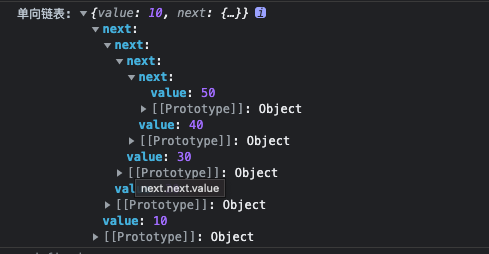

# 链表

## 单向链表

  将一个数组转换成为单向链表(每个数据元素在存储时配备一个指针),用于指向自己的直接后继元素。
```ts
const array = [10,20,30,40,50]

interface ListProps {
  value: number
  next? : ListProps
}
function createList (array: number []): ListProps {
  const length = array.length
  if(length === 0) throw new Error('something went wrong')
  let curObj = {
    value: array[length - 1]
  }
  if(length === 1) return curObj
  for(let i = length - 2; i >= 0; i--) {
    curObj = {
      value: array[i],
      next: curObj
    }
  }
  return curObj
}
const result = createList(array)
```


## 反转单向链表

  将上述例子生成的单向链表进行反转
```ts
function reverseList(object: ListProps): ListProps {
  let prev: undefined | ListProps = undefined
  let cur: undefined | ListProps = undefined
  let next: undefined | ListProps = object
  while (next) { // 当有next的时候 遍历
    if (cur && !prev) {
      delete cur.next
    }
    // 整体移动指针
    if(cur && prev) {
      cur.next = prev
    }
    prev = cur
    cur = next
    next = next?.next
  }
  cur.next = prev
  return cur
}
```

## 链表排序

```ts
interface NodeItem {
  value: number
  next?: NodeItem
}
// 将数组创建为一个链表结构
function create_list_node(array: number[]): NodeItem {
  let node: NodeItem = {
    value: array[array.length - 1]
  }
  if(array.length === 1) return node
  for(let i = array.length - 2; i >= 0; i--) {
    const value = array[i]
    const next_node = {
      value,
      next: node
    }
    node = next_node
  }
  return node
}

// ------- 开始排序 ------
// 交换两个 节点的值
const swap = (p: NodeItem, q: NodeItem) => {
  const p_value = p.value
  const q_value = q.value
  q.value = p_value
  p.value = q_value
}

const list_node = create_list_node([6, 1, 2, 7, 9 ,3, 4, 5, 10, 8])

function sort(list_node: NodeItem) {
  let p = list_node
  let q = list_node.next
  const head = p.value
  while(q) {
    if(q.value < head) {
      if(p.next) {
        p = p.next
        swap(p, q)
      }
    }
    q = q.next
  }
  swap(list_node, p)
  // 找到中间点, 左边都是比中间点小的值, 右边都是比中间点大的值
  return p
}

function real_sort(start:NodeItem , end?: NodeItem) {
  if(start !== end) {
    const part = sort(start)
    real_sort(start, part)
    if(part.next) {
      real_sort(part.next)
    }
  }
}

real_sort(list_node)

function list_to_array(list_node: NodeItem) {
  const temp: number[] = []
  while(list_node) {
    temp.push(list_node.value)
    // @ts-ignore
    list_node = list_node.next
  }
  return temp
}

console.log(list_to_array(list_node)) //[1,2,3,4,5,6,7,8,9,10]
```
## 链表实现队列

```ts
class Queue1 {
  private headNode = null
  private tailNode = null
  private len = 0
  add (value) {
    const node = {
      value,
      next: null
    }
    // 如果没有头部节点
    if (this.headNode === null) {
      this.headNode = node
    }
    const tail = this.tailNode
    if(tail) {
      tail.next = node
    }
    this.tailNode = node
    this.len += 1
  }
  delete () {
    if(!this.headNode) return null
    if(this.len <= 0) return null
    const head = this.headNode
    this.headNode = head.next
    this.len -= 1
    return head.value
  }
  get length() {
    return this.len
  }
}

const queue_1 = new Queue1()
queue_1.add(10)
queue_1.add(20)
queue_1.add(30)
queue_1.add(40)
console.log(queue_1.length)   // 4
console.log(queue_1.delete()) // 10
console.log(queue_1.length)   // 3
```

