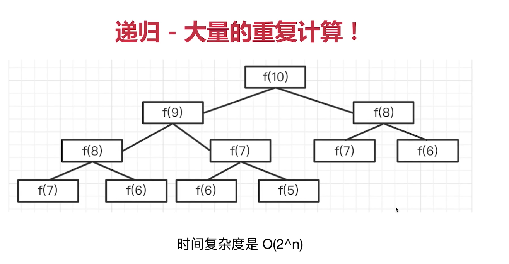

# 其他

## 两个栈模拟队列

  栈结构 '先进后出', 队列 '先进先出'。
```ts
class Queue {
  private stack1: number [] = []
  private stack2: number [] = []
  add(n: number) {
    this.stack1.push(n)
  }
  delete():number {
    let res: number
    while(this.stack1.length) {
      this.stack2.push(this.stack1.pop())
    }
    res = this.stack2.pop()
    while(this.stack2.length) {
      this.stack1.push(this.stack2.pop())
    }
    return res
  }
  get length():number {
    return this.stack1.length
  }
}
q.add(10)
q.add(20)
q.add(30)
const q = new Queue()
console.log(q.length) // 3
console.log(q.delete()) // 10
console.log(q.delete()) // 20
console.log(q.delete()) // 30
console.log(q.delete()) // undefined
```
## 斐波那契数列

```ts
// 使用递归实现一个斐波那契数列
function fibonacci(n: number): number {
  if(n <= 0) return 0
  if(n === 1) return 1
  return fibonacci(n - 1) + fibonacci(n - 2)
}

console.log(fibonacci(5)) // 5
console.log(fibonacci(8)) // 21
console.log(fibonacci(10))  // 55
console.log(fibonacci(100)) // 程序崩溃
```
  在求数列第100个数的时候程序已经奔溃了, 因为这个递归包含很多重复的计算



  将上面的方式使用for循环进行优化
```ts
function fibonacci(n: number) : number {
  if(n <= 0) return 0
  if(n === 1) return 1
  let prev = 0, cur = 1, result = 0
  for(let i = 2; i <= n; i++) {
    result = prev + cur
    prev = cur
    cur = result
  }
  return result
}
console.log(fibonacci(5)) // 5
console.log(fibonacci(8)) // 21
console.log(fibonacci(10))  // 55
console.log(fibonacci(100)) // 354224848179262000000
```

  除了使用for循环进行优化, 还可以使用尾递归进行优化。ES6中明确规定, 所有ECMAScript的实现都必须
  部署'尾调用优化'
```ts
function fibonacci(n: number, prev: number = 0, cur:number = 1):number {
  if(n <= 1) return cur
  return fibonacci(n - 1, cur, cur + prev)
}
console.log(fibonacci(5)) // 5
console.log(fibonacci(8)) // 21
console.log(fibonacci(10))  // 55
console.log(fibonacci(100)) // 354224848179262000000
```

## SleepMan

```ts

class SleepMan {
  private name: string
  private tasks: Function []
  constructor(name: string) {
    this.name = name
    this.tasks = []
    setTimeout(() => {
      this.next()
    }, 0)
  }
  eat(food: string) {
    const task = () => {
      console.log(`eat - ${food}`)
      this.next()
    }
    this.tasks.push(task)
    return this
  }
  sleep(time) {
    const task = () => {
      setTimeout(() => {
        console.log('sleep')
        this.next()
      },time * 1000)
    }
    this.tasks.push(task)
    return this
  }
  next() {
    const task = this.tasks.shift()
    task && task()
  }
}
const kyrie = new SleepMan('kyrie')
kyrie.eat('apple').sleep(3).eat('banana').sleep(2).eat('orange')
/*
eat - apple
sleep
eat - banana
sleep
eat - orange
*/
```
## LRU(Least Recently Used)
  
  最近最少使用,是一种常见的页面置换算法, 选择最近久未使用的数据予以淘汰。
```js
//使用JavaScript 的map 数据结构存储,map是一种有序的结构,后面的数据是最近访问的数据
class ResourceMap {
  constructor(length) {
    this.length = length
    this.map = new Map()
  }
  get(key) {
    const data = this.map;
    if(!data.has(key)){
      return null
    }
    const value = data.get(key)
    data.delete(key)
    data.set(key, value)
  }
  set(key, value) {
    const data = this.map
    if(data.has(key)) {
      data.delete(key)
    }
    data.set(key, value)
    if(this.map.size > this.length) {
      const temp = []
      //this.map.keys()是一个Iterator
      for(const key of this.map.keys()){
        temp.push(key)
      }
      this.map.delete(temp[0])
    }
  }
}

const map = new ResourceMap(2)
map.set('a', {firstName: 'kyrie'})
map.set('b', {firstName: 'lebron'})

console.log(map)
/*
  map: Map(2) {
    'a' => { firstName: 'kyrie' },
    'b' => { firstName: 'lebron' }
  }
*/

map.get('a')
/*
  map: Map(2) {
    'b' => { firstName: 'lebron' },
    'a' => { firstName: 'kyrie' }
  }
*/
console.log(map)

console.log(map.get('c')) // null

map.set('d', {firstName: 'durant'})
console.log(map)
/*
map: Map(2) {
  'a' => { firstName: 'kyrie' },
  'd' => { firstName: 'durant' }
}
*/

map.get('a')
console.log(map)
/*
  map: Map(2) {
    'd' => { firstName: 'durant' },
    'a' => { firstName: 'kyrie' }
  }
*/
```

```js
// 如果不使用map,可以结合array/object来实现。
class ResourceMap { // 最先访问的数据在前面
  constructor(length) {
    this.length = length
    this.keys = []  // 数组存储key
    this.map = {}   // 对象存储值
  }
  get(key) {
    // 判断是否存在key!
    if(!this.keys.includes(key)) return null
    const keyIndex = this.keys.findIndex(k === key)
    this.keys.splice(keyIndex, 1)
    this.keys.unshift(key)
  }
  set(key, value) { // 设置: key/value
    if(!this.keys.includes(key)) {
      this.keys.unshift(key)
    }else{
      const keyIndex = this.keys.findIndex(k => k === key)
      this.keys.splice(keyIndex, 1)
      this.keys.unshift(key)
    }
    this.map[key] = value
    if(this.keys.length > this.length) {
      const lastKey = this.keys.pop()
      Reflect.deleteProperty(this.map, lastKey)
    }
  }
}

const map = new ResourceMap(2)
map.set('a', {player: 'lebron'})
map.set('b', {player: 'kyrie'})

console.log(map)
/*
keys: [ 'b', 'a' ],
map: { a: { player: 'lebron' }, b: { player: 'kyrie' } }
*/
console.log(map.get('c')) // null

map.set('c', {player:'wade'})
console.log(map)
/*
keys: [ 'c', 'b' ],
map: { b: { player: 'kyrie' }, c: { player: 'wade' } }
*/
```
