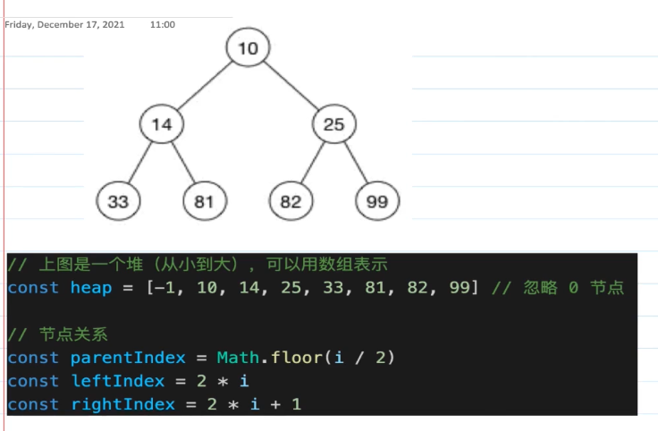

# 树

## 二叉树

  根据根节点在遍历时的位置 可以分为 前序遍历, 中序遍历, 后序遍历。
```ts
const binary_tree = {
  value: 1,
  left: {
    value: 2,
    left: {
      value: 3,
    },
    right: {
      value: 4,
    }
  },
  right: {
    value: 5,
    left: {
      value: 6
    },
    right: {
      value: 7
    }
  }
}
// 前序遍历
function front_tree_map(node: TreeNodeProps) {
  if(!node) return
  console.log(node.value)
  front_tree_map(node.left)
  front_tree_map(node.right)
}
front_tree_map(binary_tree) // 1 2 3 4 5 6 7


// 中序遍历
function middle_tree_map(node: TreeNodeProps) {
  if(!node) return
  middle_tree_map(node.left)
  console.log(node.value)
  middle_tree_map(node.right)
}
middle_tree_map(binary_tree)  // 3 2 4 1 6 5 7

// 后序遍历
function back_tree_map(node: TreeNodeProps) {
  if(!node) return
  back_tree_map(node.left)
  back_tree_map(node.right)
  console.log(node.value)
}
back_tree_map(binary_tree)  // 3 4 2 6 7 5 1
```
## 数组和二叉树


