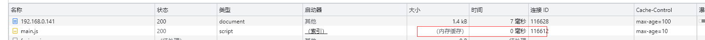

# 缓存

  HTTP缓存会存储与请求关联的响应, 并将存储的响应复用于后续请求。

## 基于age的缓存策略

  存储的HTTP响应有两种状态: **fresh** 和 **state**。*fresh* 表示响应仍然有效, 可以重复使用, 而 *state* 状态表示缓存的响应已经过期。

```js
const http = require('http')
http.createServer(function(req, res) {
  if (req.url === '/main.js') {
    const js = fs.readFileSync('./main.js', 'utf-8')
    res.writeHead(200, {
      'Content-Type': 'text/javascript',
      'Cache-Control': 'max-age=10'
    })
    res.end(js)
  }
})
```
  以上实例, **max-age=10** 表示 如果在请求了资源后的 10s 内再次发起请求 则使用缓存。超过10s 则重新请求新的资源内容!

 

## 验证响应

  过时的响应不会被立即丢弃。HTTP有一种机制, 可以通过询问源服务器将陈旧的响应转换为新的响应。这称为验证。验证是通过使用包含 **If-Modified-Since**
  或 **If-None-Match** 请求标头的条件请求完成的。

**Last-Modified/If-Modified-Since**

```js
// 响应头
{
  'Connection': 'keep-alive'
  'Content-Type': 'text/javascript'
  'Date': 'Mon, 15 May 2023 06:38:29 GMT'
  'Keep-Alive': 'timeout=5'
  'Last-Modified': 'Mon May 15 2023 14:34:02 GMT'
}

// 再次请求时
{
  'Host': '192.168.0.141:3000'
  'If-Modified-Since': 'Mon May 15 2023 14:34:02 GMT'
  'Referer': 'http://192.168.0.141:3000/'
}
```

**Etag/If-None-Match**

  **Etag** 响应标头的值是服务器生成的任意值。如果 **Etag** 标头的值与请求头中的 **If-None-Match**值相同, 则服务器将返回 **304 Not Modified**。
  但是，如果服务器确定请求的资源现在应该具有不同的 ETag 值，则服务器将其改为 200 OK 和资源的最新版本进行响应

```js
// 响应头
{
  Date: 'Mon, 15 May 2023 07:36:38 GMT'
  Etag: 1234
  'Keep-Alive': 'timeout=5'
}

// 请求头
{
  Host: '192.168.0.141:3000'
  'If-None-Match': 1234
  Referer: 'http://192.168.0.141:3000/'
}
```

  如果不希望重复使用响应, 而是始终希望从服务器获取最新内容, 可以使用 **no-cache** 指令强制验证。**no-cache** 指令不会阻止响应的存储, 而是
  阻止在没有重新验证的情况下重用响应。

  如果不希望将响应存储在任何缓存中, 使用 **no-store**。

## Vary

  区分响应的本质是URL, 首部字段 **Vary** 可对缓存进行控制。

[Cache-Control/Vary](https://developer.mozilla.org/zh-CN/docs/Web/HTTP/Caching#vary_%E5%93%8D%E5%BA%94)
