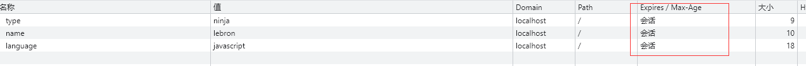

# Cookie

  服务器收到 HTTP 请求后，服务器可以在响应标头里面添加一个或多个 **Set-Cookie** 选项。浏览器收到响应后通常会保存下 **Cookie**，并将其放在 **HTTP Cookie** 标头内，向同一服务器发出请求时一起发送。

```js
res.writeHead(200, {
  'Set-Cookie': 'language=javascript',
  // 设置多个cookie
  'Set-Cookie': ['language=javascript', 'name=kyrie'],
  'Content-Type': 'text/plain;charset=utf-8'
})

// 或者通过这种方式
res.setHeader('Set-Cookie', ['type=ninja', 'name=lebron'])

res.end('你好,世界')
```

  在下一次请求的时候, 浏览器会携带 下发的 Cookie
```js
{
  'Cache-Control': 'max-age=0'
  'Connection': 'keep-alive'
  'Cookie': 'language=javascript; type=ninja; name=kyrie'
}'
```

## Cookie生命周期

- 会话期Cookie 在当前的会话结束之后删除。
- 在过期时间 *Expires* 指定的日期或 有效期 *Max-Age* 指定的一段时间之后被删除



```js
res.writeHead(200, {
  'Content-Type': 'text/plain;charset=utf-8',
  // 设置有效期100s, 超过有效期之后 cookie 不会携带在请求头
  'Set-Cookie': 'language=javascript;max-age=100'
})
```

## httpOnly / Secure

  JavaScript 的 document.cookie API 无法访问 带有 httpOnly属性的cookie. 主要目的为防止跨站脚本攻击(XSS)对Cookie的信息窃取。
```js
// node
res.writeHead(200, {
  'Set-Cookie': 'language=javascript;max-age=100;httpOnly=true'
})

// document.cookie  // 空字符串
```

  标记为 Secure 的 **Cookie** 只应通过被 **HTTPS** 协议加密过的请求发送给服务端。它永远不会使用不安全的 **HTTP** 发送(localhost除外)