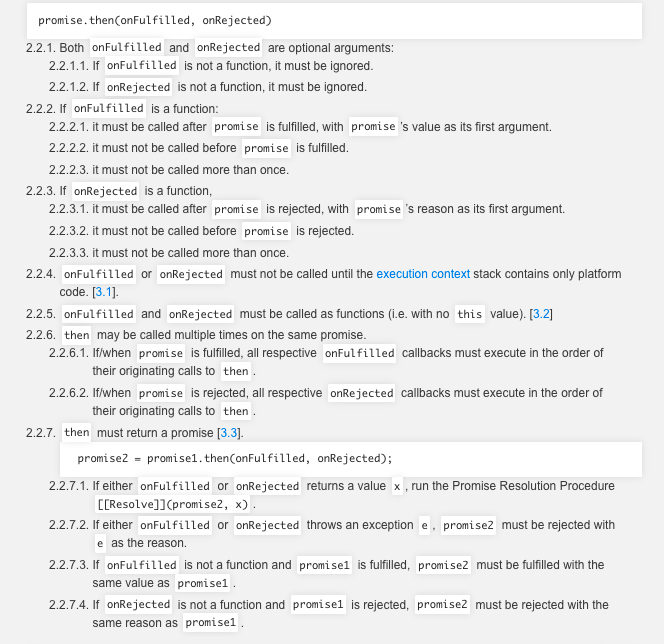
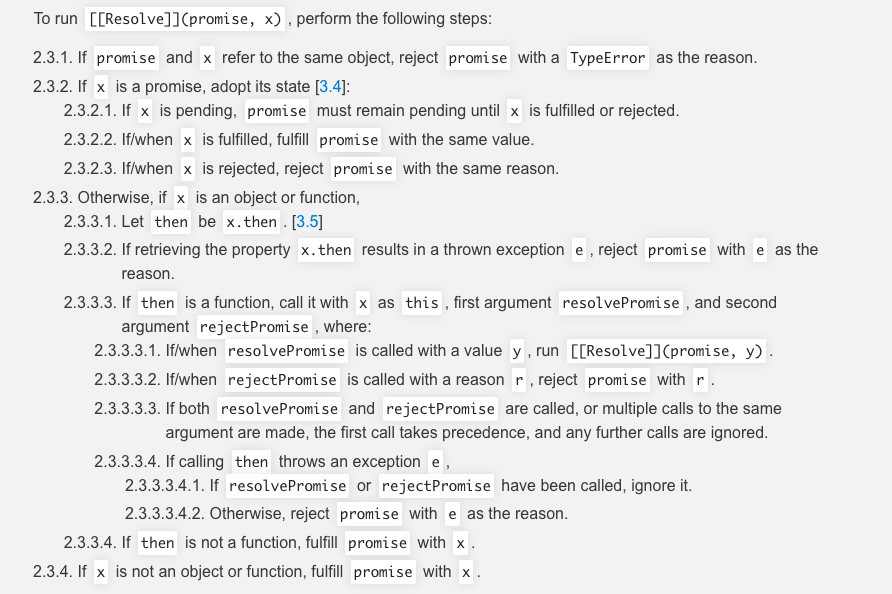

# Promise

  Promise对象是一个构造函数,用来生成Promise实例。用于表示一个异步操作的最终完成(或失败)及其结果值。
```js
// 基本用法
const promise = new Promise((resolve,reject) => {
  if(/*成功的代码*/){
    resolve(value)
  }else{
    reject(error)
  }
})
```
## 约定

  1. 在本轮事件循环完成之前(微任务阶段执行),回调函数是不会被调用的。
  2. 即使异步操作已经完成(成功或者失败),在这之后通过then()添加的回调函数也会被调用。
  3. 通过多次调用then() 可以添加多个回调函数,他们会按照插入顺序执行。
  4. .then()方法返回一个promise

[MDN-promise对象](https://developer.mozilla.org/zh-CN/docs/Web/JavaScript/Guide/Using_promises)

[PromiseA+规范](https://promisesaplus.com/)

## Promise状态
  
  A promise must be in one of three states: pending, fulfilled, or rejected.

  **Pending**:
  1. may transition to either the fulfilled or rejected state
  2. resolve -> fulfilled
  3. reject -> rejected

  **Fulfilled**:

  1. 被resolve之后的状态
  2. must have a value, which must not change
    2.1  value is any legal JavaScript value(including undefined, a thenable or a promise)

  **Rejected**:

  1. promise被reject之后的状态
  2. must have a reason, which must not change
    2.1 reason is a value that indicated why a promise was rejected.

## 在旧式回调API创建Promise

  可以通过Promise的构造器从0开始创建Promise,这种方式应当只在封装旧API的时候用到。理想状态下,所有的异步函数都已经返回Promise了。
```js
const wait = ms => new Promise(resolve => setTimeout(resolve,ms))
```

## Promise执行时序

  即使一个已经变成resolve状态的Promise,传递给then()的函数也总是会被异步调用. 传入到then()中的函数被放入到一个微任务队列中。
  而不是立即执行。
```js
const wait = ms => new Promise(resolve => setTimeout(resolve, ms));

wait().then(() => console.log(4));
Promise.resolve().then(() => console.log(2)).then(() => console.log(3));
console.log(1); // 1, 2, 3, 4
```
## Promise.prototype.then

  A promise must provide a then method to access its current or eventual value or reason.
  A promise's then method accepts two arguments:
```js
const promise2 = promise.then(onFulfilled, onRejected)
```

```js
const promise1 = new Promise((resolve) => {
  resolve('hello')
})
const promise2 = new Promise((resolve) => {
  resolve('world')
})
const promise3 = new Promise((resolve) => {
  resolve('!')
})
Promise.resolve()
.then(() => {
  return promise1
}).then((v) => {
  console.log(v)
  return promise2
}).then((v) => {
  console.log(v)
  return promise3
}).then(v => {
  console.log(v)
})
// 依次输出 hello world !
```



## Promise.prototype.catch

  Promise.prototype.catch()方法是 .then(null,rejection) 或 .then(undefined,rejection)的别名。
  then方法中抛出的异常也会被 catch所捕获。
```js
// 捕获promise抛出的错误
new Promise((resolve,reject) => {
  reject(new Error('fail'))
}).then(result => {
  console.log(result)
})
.catch((err) => {
  console.log(err)  // Error fail
})

// 捕获then方法中抛出的错误
new Promise((resolve) => {
  resolve('hello')
}).then((v) => {
  console.log(v)
  throw new Error('fail again')
}).catch((error) => {
  console.log(error)  // fail again
})
```
  一般来说,不要在then()方法里面定义reject状态的回调函数(即then的第二个参数),总是使用catch方法
```js
const promise3 = new Promise((resolve,reject) => {
  resolve('ok')
}).then((v) => {
  console.log('value:',v)
  throw new Error('哈哈哈哈')
},(error) => {
  console.log('捕获到了错误吗?:',error)
})
.catch((error) => {
  console.log('捕获到了错误吗?:',error)
})
// 上面的例子中,then的第二个回调函数无法捕获 resolve状态里的错误。
```

::: tip
Promise对象抛出的错误不会传递到代码外层,不会退出进程终止脚本执行。
:::
```js
function foo() {
  return new Promise((resolve,reject) => {
    resolve(x + 2)
  })
}
foo().then(() => {
  console.log('everything is great')
})
setTimeout(() => {console.log('hello')},1000)
// Uncaught (in promise) ReferenceError: x is not defined
// 123
```
## Promise.prototype.finally

  该方法是ES2018引入标准的, 不管promise对象最后的状态如何都会执行的操作。 finally返回的是一个promise。
```js
// finally的实现方式
Promise.prototype.finally = function(callback) {
  return this.then(
    value => Promise.resolve(callback()).then(() => value),
    err => Promise.resolve(callback()).then(() => {throw new Error(err)})
  )
}
```
## Promise.all
```js
  const p = Promise.all([p1,p2,p3])
```
  该方法接收一个数组作为参数,p1 p2 p3都是Promise实例,如果不是,则会调用Promise.resolve()方法。
  1. 只有数组里的所有promise状态都变为fulfiller, p的状态才会变成fulfilled。
  2. 有一个promise实例被reject,则第一个被reject的实例的返回值回传递给p的回调函数。
```js
const promise1 = new Promise(resolve => {
  resolve('hello')
})
const promise2 = new Promise(resolve => {
  resolve('world')
})
Promise.all([promise1,promise2]).then(result => {
  console.log(result);  // ['hello','world']
})
```

## Promise.race

  只要其中一个实例率先改变状态,p的状态就跟着改变。
```js
const p = Promise.race([p1, p2, p3]);
```
```js
const promise3 = new Promise((resolve) => {
  setTimeout(() => {
    resolve('hello world')
  },3000)
})
const promise4 = new Promise((resolve,reject) => {
  setTimeout(() => {
    reject('请求超时')
  },2000)
})
Promise.race([promise3,promise4]).then((v) => {
  console.log(v)
})
.catch((err) => {
  console.log(err)
})
```
:::tip
Promise.all() 和 Promise.race()方法接受的都是一个 promise的iterable类型的输入,并且只返回一个Promise实例。
:::
## Promise.allSettled

  Promise.allSettled 方法接收一组promise实例作为参数。包装成一个新的Promise实例。
  不管是fulfilled 还是 rejected。
```js
Promise.allSettled([promise3,promise4]).then(v => {
  console.log(v)
  // [
  //   { status: 'fulfilled', value: 'hello world' },
  //   { status: 'rejected', reason: '请求超时' }
  // ]
})
```
  **对Promise.allSettled 的实现**
```js
// Promise.allSettled的参数是一个可迭代对象。每个成员都是Promise。
function has_iterator(data){
  return typeof data[Symbol.iterator] === 'function';
}

function allSettled(promiseArray){
  return new Promise((resolve) => {
    if(!has_iterator(promiseArray)){
      return reject(new TypeError('参数没有iterator接口'))
    }
    const temp = [];
    let count = 0;
    for(let promise of promiseArray){
      Promise.resolve(promise).then(v => {
        temp.push({
          status:'fulfilled',
          value:v
        })
      }).catch(err => {
        temp.push({
          status:'rejected',
          reason: err
        })
      }).finally(() => {
        count += 1;
        if(count === promiseArray.length ){
          resolve(temp)
        }
      })
    }
  })
}
// 测试 
const p1 = new Promise((resolve) => {
  resolve('p1')
})
const p2 = new Promise(resolve => {
  setTimeout(() => {
    resolve('p2')
  }, 2000)
})
const p3 = new Promise((resolve,reject) => {
  setTimeout(() => {
    reject('error')
  },1000)
})

allSettled([p1,p2,p3]).then(v => {
  console.log('allSettled-value:', v)
  /*
   [
    { status: 'fulfilled', value: 'p1' },
    { status: 'rejected', reason: 'error' },
    { status: 'fulfilled', value: 'p2' }
  ]
  */
})
```

## Promise.resolve

  将现有对象转为Promise对象。
  1. 参数是一个promise实例,那么Promise.resolve将不会做任何修改 原封不动的返回这个实例
```js
const promise1 = new Promise((resolve) => {
  resolve('hello world')
})
const promise2 = Promise.resolve(promise5)
console.log(promise1 === promise2)  // true
```
  promise.then()方法返回的是一个新的promise实例
```js
const promise1 = new Promise((resolve) => {
  resolve('hello world')
})
const promise2 = Promise.resolve(promise1).then(v => {
  console.log(v)
})
console.log(promise1 === promise2)  // false
```
  2. 参数是一个thenable对象 (该对象具有then方法)
```js
let thenable = {
  then: function(resolve, reject) {
    resolve(42);
  }
};
```
  3. 参数不是具有then方法的对象,或者根本就不是一个对象。
```js
Promise.resolve(true).then(v => {console.log(v)}) // true
Promise.resolve('hello world').then(v => {console.log(v)})  // hello world
Promise.resolve(123).then(v => {console.log(v)})  // 123
Promise.resolve({}).then(v => {console.log(v)}) // {}
Promise.resolve([]).then(v => {console.log(v)}) // []
Promise.resolve(undefined).then(v => {console.log(v)})  // undefined
Promise.resolve(null).then(v => {console.log(v)}) // null
Promise.resolve(Symbol('foo')).then(v => {console.log(v)})  // Symbol('foo')
Promise.resolve(() => {}).then(v => {console.log(v)}) //[Function (anonymous)]
```

  4. 不带有任何参数
  Promise.resolve()方法允许调用时不带参数,直接返回一个resolved状态的Promise对象
```js
console.log('global start')
setTimeout(() => {
  console.log('world')
},0)
Promise.resolve('hello').then(v => {
  console.log('hello')
})
console.log('global end')
// 输出顺序为  global start -- global end -- hello -- world
```
:::tip
Promise.resolve() 是在本轮事件循环结束时执行, 而不是在下一轮事件循环的开始执行
:::

## Promise.reject

  Promise.reject(reason)方法也会返回一个新的 Promise 实例，该实例的状态为rejected
```js
const p = Promise.reject('出错了');
// 等同于
const p = new Promise((resolve, reject) => reject('出错了'))

p.then(null, function (s) {
  console.log(s)
});
```
[ES6-promise](https://es6.ruanyifeng.com/#docs/promise)

[MutationObserver](https://developer.mozilla.org/zh-CN/docs/Web/API/MutationObserver)

[宏任务与微任务](https://developer.mozilla.org/zh-CN/docs/Web/API/HTML_DOM_API/Microtask_guide/In_depth)

## 一个有用的附加方法

  无论Promise对象的回调以then还是catch方法结尾,只要最后一个方法抛出错误,都有可能无法捕捉到。(因为Promise内部的错误
  不会冒泡到全局).我们可以提供一个done方法，它总是处于回调链的尾端,保证抛出任何可能出现的错误。
```js
Promise.prototype.done = function(onFulfilled,onRejected) {
  this.then(onFulfilled, onRejected).catch(reason => {
    setTimeout(() => {throw reason}, 0)
  })
}
```
