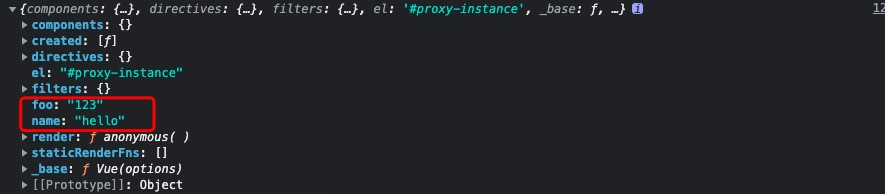

# Vue Instance

## Vue构造函数

```js
//  /src/core/instance/index.js
// Vue定义构造函数的地方.
function Vue (options) {
  // instanceof 用来检测构造函数的prototype是否出现在实例对象的原型链上
  if (process.env.NODE_ENV !== 'production' &&
    !(this instanceof Vue)
  ) {
    warn('Vue is a constructor and should be called with the `new` keyword')
  }
  //初始化传递给Vue构造函数的所有选项。
  this._init(options)
}
// 注册Vue._init方法, 初始化vm
initMixin(Vue)
// 注册vm的$data/$props/$set/$delete/$watch
stateMixin(Vue)
// 注册$on/$once/$emit/$off
eventsMixin(Vue)
// 注册生命周期函数_update/$forceUpdate/$destroy
lifecycleMixin(Vue)
// 渲染相关的方法以及$nextTick / _render方法
renderMixin(Vue)
```
[MDN-instanceof](https://developer.mozilla.org/zh-CN/docs/Web/JavaScript/Reference/Operators/instanceof)

## initMixin(vm)

  在initMixin内部, 给Vue构造函数的原型上注册了一个_init方法.
  然后给设置了一个 vm._isVue = true, 防止后续设置对象为响应式对象时将其也设置为响应式对象。
```js
// core/instance/init.js
Vue.prototype._init = function(options) { // 用户传递的options选项
  // 标识当前是一个实例
  vm._isVue = true
  /* 合并options, 判断是组件还是Vue实例, 将合并后的选项作为vm.$options的值
    此处先跳过。。。 
  */
  if (options && options._isComponent) {
    initInternalComponent(vm, options)
  } else {
    vm.$options = mergeOptions(
      resolveConstructorOptions(vm.constructor),  // parent
      options || {},  // child
      vm  // instance
    )
  }

  // 给vm._renderProxy 赋值为当前vm实例
  if (process.env.NODE_ENV !== 'production') {
    initProxy(vm)
  } else {
    vm._renderProxy = vm
  }
}
```
```js
// initProxy 方法
let initProxy
if (process.env.NODE_ENV !== 'production') {
  // 定义一个白名单,允许在模版中直接使用而不用在data中 或者 methods中定义的数据或方法
  /*下面的变量在js全局环境中 可以直接使用的,所以可不在data,或者methods computed中定义*/
  const allowedGlobals = makeMap(
    'Infinity,undefined,NaN,isFinite,isNaN,' +
    'parseFloat,parseInt,decodeURI,decodeURIComponent,'+
    'encodeURI,encodeURIComponent,' +
    'Math,Number,Date,Array,Object,Boolean,String,RegExp,Map,'+
    'Set,JSON,Intl,BigInt,' +
    'require'
  )
  const warnNonPresent = (target, key) => {
    // 属性或者方法 没有设置但是在 模版中中使用了。
  }
  const warnReservedPrefix = (target, key) => {
    // ... 省略
  }
  // 判断浏览器是否支持 Proxy
  const hasProxy = typeof Proxy !== 'undefined' && isNative(Proxy)
  if (hasProxy) {
    // 内置的事件标识符,判断是否是Vue内置提供的事件修饰符,如果是的话禁止
    const isBuiltInModifier
      = makeMap('stop,prevent,self,ctrl,shift,alt,meta,exact')
    config.keyCodes = new Proxy(config.keyCodes, {
      set (target, key, value) {
        if (isBuiltInModifier(key)) { // 如果是内置的事件修饰符,则不允许修改
          warn(//...)
          return false
        } else {
          target[key] = value
          return true
        }
      }
    })
  }

  const hasHandler = {  // 对象 in 操作符进行代理
    has (target, key) {
      const has = key in target //判断属性是属于vm实例上的属性
      /*
      如果属性是在白名单里 或者 是以下划线开头的字符串并且不在$data里 
      ,在编译时是可以访问到的属性(渲染函数_c _v等)
      */
      const isAllowed = 
        allowedGlobals(key) || 
        (typeof key === 'string' && 
        key.charAt(0) === '_' && !(key in target.$data))
      if (!has && !isAllowed) {
        if (key in target.$data) warnReservedPrefix(target, key)
        else warnNonPresent(target, key)
      }
      return has || !isAllowed
    }
  }

  const getHandler = {  // 拦截对象的属性读取操作
    get (target, key) {
      if (typeof key === 'string' && !(key in target)) {
        if (key in target.$data) warnReservedPrefix(target, key)
        else warnNonPresent(target, key)
      }
      return target[key]
    }
  }

  initProxy = function initProxy (vm) {
    if (hasProxy) {
      const options = vm.$options // 传递给Vue构造函数的初始化选项 options。
      const handlers = options.render && options.render._withStripped
        ? getHandler
        : hasHandler
        // 将代理对象赋值给vm._renderProxy,对vm实例对象的属性访问会被拦截。
      vm._renderProxy = new Proxy(vm, handlers)
    } else {
      vm._renderProxy = vm
    }
  }
}

/*
vm.$options.render = function(){
  with(this){ this指向vm._renderProxy
    return _c('div',[_v(_s(a))])
  }
}
*/
/*
在with语句块内访问a 就相当于访问vm._renderProxy的a属性。
*/
export { initProxy }
```
```js
// $options
/*用于将当前Vue实例的初始化选项。需要在选项中包含自定义property时会有用处*/
new Vue({
  el:'#proxy-instance',
  name: 'hello',
  foo: '123',
  created(){
    console.log(this.$options.name) // hello
  }
})

// optionMergeStrategies
Vue.config.optionMergeStrategies._my_option = function (parent, child, vm) {
  return child + 1
}
const Profile = Vue.extend({
  _my_option: 1
})
// Profile.options._my_option = 2
```


[Vue-$options-api文档](https://cn.vuejs.org/v2/api/#vm-options)

[instance-proxy参考](https://blog.csdn.net/nicexibeidage/article/details/82112055)
