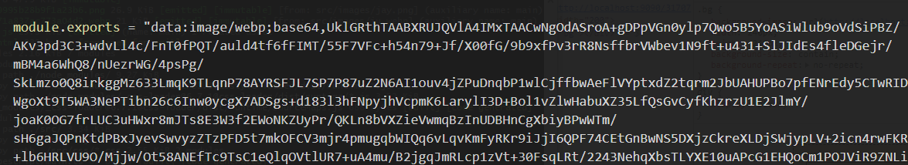
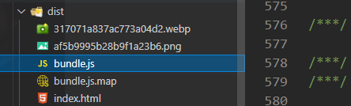
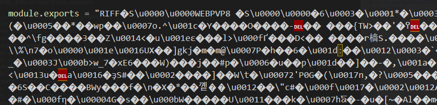
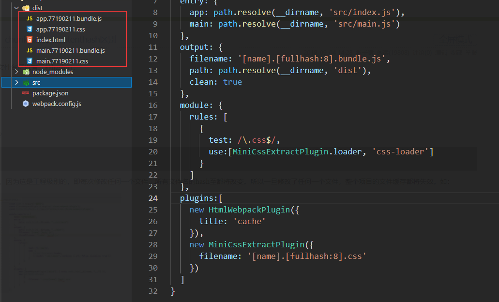
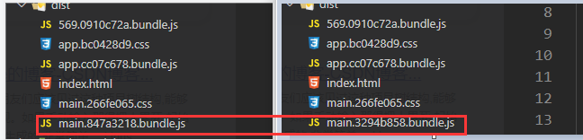
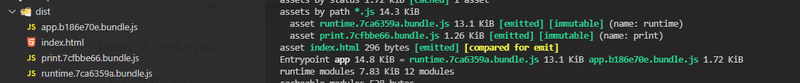
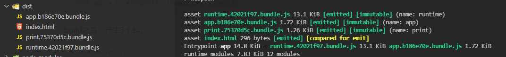

# getting start

## 入口

```js
module.exports = {
  mode:'development',
  context: path.resolve(__dirname, 'app') // 基础目录,(绝对路径)
  entry: path.resolve(__dirname, 'src/index.js'), // 入口
  output: { // 出口
    path: path.resolve(__dirname, 'src/dist'),
    filename: 'bundle.js',
    /*
    fullhash: compilation完整的hash值
    id: 此chunk的id
    name: 此chunk的名称
    chunkhash: 此chunk的hash, 包含该chunk的所有元素
    contenthash: 只包含该内容类型的元素
    chunkFilename: 非初始 chunk文件的名称, 这些文件名需要在运行时根据chunk发送的请求去生成。
    */
    chunkLoading: 'jsonp', // 加载chunk的方法(jsonp(web) import(ESM))
    clean: true, // 在生成文件之前清空output目录
    publicPath: ''  // 按需加载或加载外部资源 每个url的前缀
  }
}
```
  output.filename 的文件 hash长度 可以使用 hash:16 contenthash:16等指定, 或者通过指定 output.hashDigestLength
  在全局配置长度。

## 管理资源

### style-loader/css-loader

  模块loader可以链式调用。链中的每个loader都将对资源进行转换。链会逆序执行。第一个loader将其结果传递给
  下一个loader,依此类推。

```js
// style-loader  Inject CSS into the DOM
//在背后使用了module.hot.accpet,在css依赖模块更新之后,会将其patch到<style>标签中

// src/index.js
import './style.css'
function createElement() {
  const div = document.createElement('div')
  div.classList.add('item')
  div.textContent = '你好生活'
  return div
}
document.body.appendChild(createElement())

// webpack.config.js
module.exports = {
  // ...
  entry: path.resolve(__dirname, 'src/index.js'),
  output: {
    path: path.resolve(__dirname, 'dist'),
    filename: 'bundle.js'
  },
  module: {
    rules: [
      {
        test: /\.css$/,
        use:['style-loader', 'css-loader']
      }
    ]
  }
}
```
### 资源模块

  资源模块(asset module)是一种模块类型, 它允许使用资源文件(字体,图标等), 而无需配置额外的loader.

1. asset/resource:  发送一个单独的文件并导出URL.
2. asset/inline:    导出一个资源的data URI
3. asset/source:    导出资源的源代码
4. asset:           在导出一个data URI 和 发送一个单独的文件之间自动选择。小于8kb的文件,将会视为inline模块类型。
```js
module.exports = {
// ...
  module: {
    rules: [
      {
        test: /\.(png|webp|jpg|jpeg)$/,
        type: 'asset/source'  // 'asset/resource' 'asset/inline' 'asset'
      }
    ]
  }
}
```
  下面是分别按照 inline / resource / source的方式配置 打包后的结果。

1. asset/inline



2. asset/resource



3. asset/source



  默认情况下, asset/resource 模块以[hash][ext][query] 文件名发送到输出目录,可以在webpack配置中设置output.assetMoudleFilename来修改模板字符串
```js
module.exports = {
  output: {
    filename: 'bundle.js',
    path: path.resolve(__dirname, 'dist'),
    assetModuleFilename: 'images/[hash][ext][query]'
  }
}
```
  webpack按照 type:'asset' 打包资源文件时,自动地在 resource 和 inline之间进行选择: 小于8kb的文件,将会视为inline模块类型,
  否则会被视为resource模块类型。
  可以通过 选项 parser.dataUrlCondition.maxSize 配置。
```js
module.exports = {
  module: {
    rules: [
      {
        test: /\.png$/,
        type: 'asset',
        parser: {
          dataUrlCondition: {
            maxSize: 10 * 1024  // 1024kb
          }
        }
      }
    ]
  }
}
```
## 代码分离

  代码分离是把代码分离到不同的bundle中, 然后可以按需加载或并行加载这些文件。代码分离可以获取更小的bundle.

  常用的代码分离方法有三种:

1. 入口起点: 使用entry 配置手动的分离代码
2. 防止重复: 使用SplitChunksPlugin 去重和分离chunk
3. 动态导入: 通过模块的内联函数调用分离代码

### 配置多个入口

```js
// webpack.config.js
// - 多个入口
module.exports = {
  mode: 'development',
  entry: {
    app: path.resolve(__dirname, 'src/index.js'),
    main: path.resolve(__dirname, 'src/main.js')
  },
  output: {
    filename: '[name].bundle.js',
    path: path.resolve(__dirname, 'dist'),
    clean: true
  }
  // ...
}
```
  上面配置会将bundle打包成 app.bundle.js 和 main.bundle.js, 但是会有一个问题, 两个入口文件中都引入了lodash,
  这样配置会在两个bundle中造成重复引用。
```js
// webpack.config.js
{
  entry: {
    app: {
      import: path.resolve(__dirname, 'src/index.js'),
      dependOn: 'shared'
    },
    main: {
      import:  path.resolve(__dirname, 'src/main.js'),
      dependOn: 'shared'
    },
    shared: 'lodash'
  },
  optimization: {
    runtimeChunk: 'single'
  }
}
```

### SplitChunksPlugin

  可以将公共的依赖模块提取到已有的入口chunk中。或者提取到一个新生成的chunk.
```js
// webpack.config.js
module.exports = {
  mode: 'development',
  // ... 
  entry: {
    app: path.resolve(__dirname, 'src/index.js'),
    main: path.resolve(__dirname, 'src/main.js')
  },
  output: {
    filename: '[name].bundle.js',
    path: path.resolve(__dirname, 'dist'),
    clean: true
  },
  optimization: {
    runtimeChunk: 'single',
    splitChunks: {
      chunks: 'all'
    }
  }
}
```

### 动态导入

  使用import()语法来实现动态导入
```js
// main.js
function print(message) {
  console.log(message)
}
export default print

// index.js
const button = document.createElement('button')
button.textContent = 'click'
button.addEventListener('click', function() {
  import(/*webpackChunkName: 'print'*/ './main.js').then(fn => {
    console.log(fn)
    fn.default('hello')
  })
}, false)
document.body.appendChild(button)


// webpack.config.js
{
  // ...
  entry: path.resolve(__dirname, 'src/index.js'),
  optimization: {
    runtimeChunk: 'single',
    splitChunks: {
      chunks: 'all'
    }
  }
}
```
  当点击button按钮的时候, 会异步加载 print.bundle.js 文件, 默认导出的函数 挂载 在 对象的default 属性上
  


### prefetch / preload

  prefetch(预获取) / preload (预加载)
```js
import(/*webpackPrefetch: true*/ './util/index.js')
```
  prefetch: 只要父chunk完成加载, webpack就会添加prefetch hint(预取指示)

  preload:
1. preload chunk 会在父chunk加载时, 以并行方式开始加载. 而prefetch chunk会在父chunk加载结束后开始加载
2. preload chunk 具有中等优先级, 并立即下载。 prefetch chunk会在浏览器闲置时下载
3. preload chunk会在父chunk中立即请求,用于当下时刻, prefetch chunk会用于未来的某个时刻。

```js
// src/index.js 
// 改造一下上面的例子
import(/*webpackPrefetch: true*/ './main.js').then(fn => {
  fn.default('hello')
})

//会在html 生成下面的 引用
//<link rel="prefetch" as="script" href="http://localhost:9098/src_main_js.bundle.js">
```

## 缓存

  命中缓存可以降低网络流量, 使网站加载速度更快。

  webapck提供了一种称为 substitution(可替换模板字符串)的方式, 通过带括号字符串来模板化文件名。
  其中, [contenthash] substitution将根据资源内容创建出唯一hash. 当资源内容发生变化时,[contenthash]也会发生改变。

  在介绍 hash 之前先介绍一下 contenthash fullhash 和 chunkhash 之间的区别

### fullhash

  之前是hash --> 现在值改为了fullhash

  如果使用hash的话, 每次修改任何一个文件, 所有打包生成的文件名hash都会改变, 所以一旦修改了任何一个文件, 整个项目的缓存都将失效。


  上图 是 打包后的结果,可以看到 bundle.js 和分离出来的 css文件 hash值都是一致的, 修改其中一个文件的内容再次打包 :


  上图可以看到 仅更改一个文件, 所有的文件名hash值都已发生改变。

###  chunkhash

  chunkhash是根据不同的入口文件进行依赖文件解析,构建对应的chunk。生成对应的hash值。将上面的demo文件名改为 chunkhash 再次打包:


  不同的bundle 的hash值不一致, 但是css文件是作为模块引入到Javascript中的, 所以对应的css文件hash 和 bundle.js hash值一致。

  这样就产生了一个问题：如果仅修改js文件 但是不修改css文件, 或者只修改css文件 不修改 js文件, 会导致两者的 hash值都发生改变。

  下图 左 和 图右 分别是 修改了 main.js 和 main.css文件后打包后的结果
  可以发现 app.js 和 app.css文件hash值没有发生改变, 但是 main.js 和main.css 文件hash 都 发生改变了.


### contenthash

  contenthash 将根据资源内容创建出唯一 hash。当资源内容发生变化时,contenthash 也会发生变化。



  上图只更改了main.js文件, 打包前后只有main.bundle.js hash值发生了改变。

  webpack还提供了一个优化功能,可以使用optimization.runtimeChunk 选项将runtime代码拆分为一个单独的chunk. 将其设置为
  single为所有chunk创建一个runtime bundle.
```js
// webpack.config.js
{
  // ...
  optimization:{
    runtimeChunk: 'single'
  }
}
```
  runtimeChunk 指的是webpack的运行环境和模块信息清单, 模块信息清单在每次有模块变更hash时 都会变。将这部分内容单独打包出来,
  就不会因为某个模块的变更导致模块信息的模块缓存失效.
```js
// webpack.config.js
module.exports = {
  mode: 'development',
  entry: {
    app: path.resolve(__dirname, 'src/index.js'),
    // index.js中异步导入了一个js文件 print.js
  },
  output: {
    filename: '[name].[contenthash:8].bundle.js',
    path: path.resolve(__dirname, 'dist'),
    clean: true
  },
  optimization: {
    runtimeChunk: 'single'
  }
}
```
  此时, 更新index.js文件, 只有app.js的hash值会改变, 而如果更改 print.js 则 print.bundle.js和 runtime.bundle.js
  hash值都将更改。


1. 第一次打包的结果


2. 更改index.js后打包结果


3. 更改print.js后打包结果
