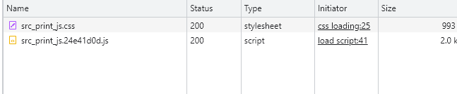
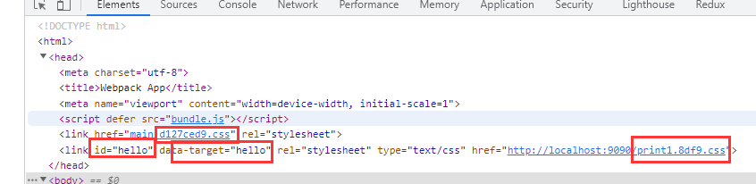
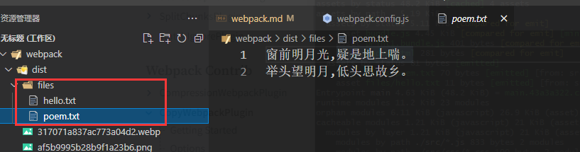
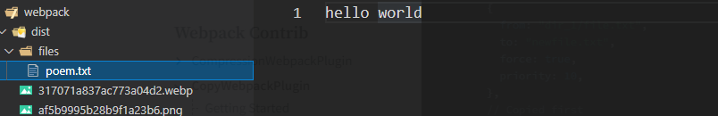
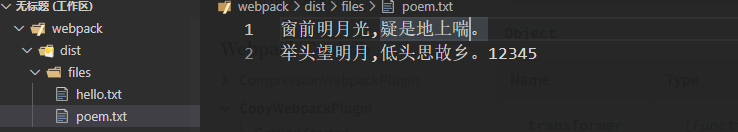
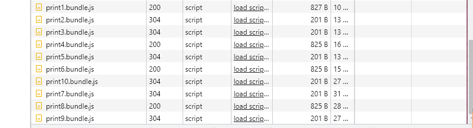
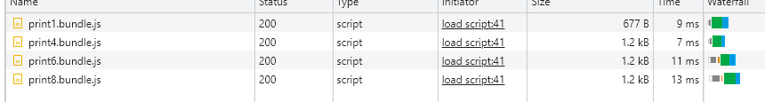

# plugins

## html-webpack-plugin

  This is a webpack plugin that simplifies creation of HTML files to serve your webpack bundles.
  This is especially useful for webpack bundles that includes a hash in the filename which changes every compilation.

```js
const HtmlWebpackPlugin = require('html-webpack-plugin')
module.exports = {
  // ...
  plugins: [
    new HtmlWebpackPlugin({
      title: 'html-webpack-plugin',  // document.title   default: Webpack App
      // filename: 'about.html',  //     default: index.html
      // filename: '[name].html',  // 根据入口名字生成
      template: path.join(__dirname, 'src/template.html'),
      inject: 'body', // true | head | body | false
      /*
      inject all assets into the given template or templateContent.
      body: all javascript resources will be placed at the bottom of the body element
      head: will place the scripts in the head element
      true: will add it to the head/body depending on the scriptLoading option.
      false: will disable automatic injections
      */
      // publicPath: '/assets/',  
      // index.html 引用的资源路径 used for script and link tags
      scriptLoading: 'blocking',   // blocking defer module
      favicon: path.join(__dirname, 'src/icon.svg'),  // icon图标
      minify: false,  // true if mode is 'production' otherwise false
      hash: true, // 引入的 js css文件名后带hash值  
      // if true then append a unique webpack compilation hash to all 
      // included scripts and css files
      cache: false,
      chunks: ['app'], // Allows you to add only some chunks
      meta: {     // allows to inject meta tags
        viewport: 'width=device-width,initial-scale=1',
        content: 'webpack,html-webpack-plugin',
        keywords: 'webpack',
        'theme-color': '#4285f4'
      },
      // base: 'http://192.168.0.141:8080', will inject a base tag 
    })
  ]
}
```


## mini-css-extract-plugin

  This plugin extract CSS into separate files. It creates a CSS file per JS file which contains CSS.
  It supports On-Demand-Loading of CSS and SourceMaps;

```js
// webpack.config.js
const MiniCssExtractPlugin = require("mini-css-extract-plugin");

module.exports = {
  plugins: [new MiniCssExtractPlugin({
    filename: '[name].[contenthash:8].css',  //文件名  default: [name].css
    chunkFilename: '[name].[contenthash:4].css', // determines the name of non-entry chunks files
    attributes: { 
//if defined, mini-css-extract-plugin will attach given attributes 
//with their values on <link> element.It only applied to dynamically loaded css chunks
      id: 'hello',
      'data-target': 'hello'
    },
    insert: 'head',// string / function
    /*
    inserts the link tag at the given position for non-initial css chunks.
    */ 
    linkType: 'text/css',  // boolean (false disables the link type attribute)
    /*
    This option allows loading asynchronous chunks with a custom link type.
    */
    ignoreOrder: true // Enable to remove warnings about conflicting order
  })],
  module: {
    rules: [
      {
        test: /\.css$/i,
        use: [MiniCssExtractPlugin.loader, "css-loader"],
      }
    ]
  }
}

// index.js
const button = document.createElement('button')
button.textContent = '点击'
button.addEventListener('click', function() {
  import('./print.js').then(d => {
    d.default('hello world')
  })
})

// print.js
import './css/print.css'
function print(message) {
  console.log(message)
}
```
  下图是在点击按钮时 异步加载print.js文件 以及 在print.js中引入的css。
  




**Loader 选项**

  publicPath: Specifies a custom public path for the external resources like images, files,
  Works like output.publicPath
```js
const MiniCssExtractPlugin = require('mini-css-extract-plugin')
module.exports = {
  module: {
    rules: [
      {
        test: /\.css$/,
        use: [{
          loader: MiniCssExtractPlugin.loader,
          options: {
            publicPath: '/assets/'
          }
        }]
      }
    ]
  },
  plugins:[new MiniCssExtractPlugin()]
}
```

### Minimizing For Production

  To minify the output, use a plugin like css-minimizer-webpack-plugin

```js
// webpack.config.js
const MiniCssExtractPlugin = require('mini-css-extract-plugin')
const CssMinimizerPlugin = require('css-minimizer-webpack-plugin')
module.exports = {
  module: {
    rules: [
      {
        test: /\.css$/,
        use: []
      }
    ]
  },
  plugins: [
    new MiniCssExtractPlugin({
      filename: '[name].[contenthash:8].css',
      chunkFilename: '[name].css'
    })
  ],
  optimization: {
    minimize: true  // 开发环境压缩css代码
    minimizer: [
      new CssMinimizerPlugin()
    ]
  }
}
```
  以上配置在 mode 为 production时 会压缩css. 如果想在开发环境下也压缩, 可以设置optimization.minimize 为true

### Extracting all CSS in a single file

```js
// webpack.config.js
module.exports = {
  optimization: {
    splitChunks: {
      cacheGroups: {
        styles: {
          name: 'styles',
          type: 'css/mini-extract',
          chunks: 'all',
          enforce: true
        }
      }
    }
  }
}
```
## css-minimizer-webpack-plugin

  这个插件使用cssnano优化和压缩css.
```js
const MiniCssExtractPlugin = require("mini-css-extract-plugin");
const CssMinimizerPlugin = require("css-minimizer-webpack-plugin");

module.exports = {
  module: {
    rules: [
      {
        test: /.s?css$/,
        use: [MiniCssExtractPlugin.loader, "css-loader", "sass-loader"],
      },
    ],
  },
  optimization: {
/*This will enable CSS optimization only in production mode
  If you want to run it also in development set the optimization.minimize 
  option to true
*/
    minimizer: [
      new CssMinimizerPlugin({
        test:/\.css(\?.*)?$/i,  // test to match files against
        include:undefined, // files to include
        exclude:undefined,  // files to exclude
        parallel: true  //  enable/disable multi-process parallel running.
      })
    ]
  },
  plugins: [new MiniCssExtractPlugin()]
};
```
## copy-webpack-plugin

  Copies individual files or entire directories, which already exist, to the build directory.
```js
// webpack.config.js
const CopyPlugin = require('copy-webpack-plugin')
module.exports = {
  plugins: [
    new CopyPlugin({
      patterns: [
        {
          from: 'files',
          to: path.resolve(__dirname, 'dist/files'),
          context: path.resolve(__dirname, 'src')
        }
      ]
    })
  ]
}
```


```js
//...
{
  patterns: [
    {
      from: 'files/poem.txt',
      to: path.resolve(__dirname, 'dist/files/poem.txt'),
      context: path.resolve(__dirname, 'src'),
      priority: 10,
      force: true,
    },{
      from: 'files/hello.txt',
      to: path.resolve(__dirname, 'dist/files/poem.txt'),
      context: path.resolve(__dirname, 'src'),
      priority: 20,
      force: true,
    }
  ]
}
```
1. priority

  Allows to specify the priority of copying files with the same destination name,Files for the
  patterns with higher priority will be copied later.



2. transform

  Allows to modify the file contents
```js
// webpack.config.js
new CopyPlugin({
  patterns: [
    {
      from: 'files',
      to: path.resolve(__dirname, 'dist/files'),
      context: path.resolve(__dirname, 'src'),
      transform(context) {
        return context.toString() + '12345'
      }
    }
  ]
})
```


3. concurrency

  limits the number of simultaneous requests to fs

## terser-webpack-plugin

  如果使用webpack v5或者更高版本, 同时希望自定义配置, 那么仍需安装此插件。
```js
// webpack.config.js
module.exports = {
  optimization: {
    minimize: true,
    minimizer: [new TerserPlugin({
      test: /\.js(\?.*)?$/i,
      include: undefined,  // 匹配参与压缩的文件
      exclude: undefined, // [/node_modules/] 排除
      extractComments: false, // 是否将注释玻璃到单独的文件中. *.LICENSE.txt
      terserOptions: {
        format: {
          comments: false // 删除所有注释
        }
      }
    })],
  }
}
```

## EnvironmentPlugin

  The EnvironmentPlugin is shorthand for using the DefinePlugin on process.env keys.
```js
module.exports = {
  plugins: [
    new webpack.EnvironmentPlugin({
      NODE_ENV: 'development',  // using development
      DEBUG: true
    })
  ]
}

// not specifying the environment variable raises an 'EnvironmentPlugin.${key}', 
// environment variable is undefined error.
```
## LimitChunkCountPlugin

  While writing your code, you may have already added many code split points to load stuff on demand.After compiling you might
  notice that some chunks are too small - creating larget HTTP overhead.
  LimitChunkCountPlugin can post-process your chunks by merging them.
```js
// index.js
import(/*webpackChunkName: 'print1'*/ './typescript/print.ts').then(({print}) => {
  print('hello world1')
})
import(/*webpackChunkName: 'print2'*/ './typescript/print2.js').then(({print}) => {
  print('hello world2')
})
// ....
import(/*webpackChunkName: 'print10'*/ './typescript/print10.js').then(({print}) => {
  print('hello world10')
})
// 在入口文件 点击按钮时 异步加载10个 js文件


// webpack.config.js
const webpack = require('webpack');
module.exports = {
  // ...
  plugins: [
    new webpack.optimize.LimitChunkCountPlugin({
      maxChunks: 5,
    }),
  ]
};
```
  在没有配置 new webpack.optimize.LimigChunkCountPlugin时 network面板是这样的



  而在配置了限制生成chunk数量时, 点击按钮加载的js文件是下面这样的, 加上主入口chunk, 一共5个



### MinChunkSizePlugin

  Keep chunk size above the specified limit by merging chunks that are smaller than the minChunkSize.
```js
new webpack.optimize.MinChunkSizePlugin({
  minChunkSize: 10000, // Minimum number of characters
});
```
## Resolve

  这些选项能够设置模块如何被解析。

1. alias

  创建 import 或者 require 的别名, 来确保模块引入变得更简单
```js
// webpack.config.js
const path = require('path')
module.exports = {
  // ...
  resolve: {
    alias: {
      '@': path.resolve(__dirname, 'src'),
    }
  }
}
```
2. resolve.enforceExtension

  如果是true, 将不允许无扩展名文件, 默认false

3. extensions

  尝试按顺序解析这些后缀名。如果有多个文件有相同的名字，但后缀名不同，webpack 会解析列在数组首位的后缀的文件 
  并跳过其余的后缀。
```js
// webpack.config.js
module.exports = {
  // ...
  resolve: {
    extensions: ['.js', '.jsx', '.ts'],
    mainFiles: ['index'],  // 解析目录时要使用的文件名
    // webpack解析模块时 应该搜索的目录
    modules: [path.resolve(__dirname, 'src'), 'node_modules']
  }
}
```
  能够是用户在引入模块时不带扩展
```js
import { print } from './print'
print('hello world')
```