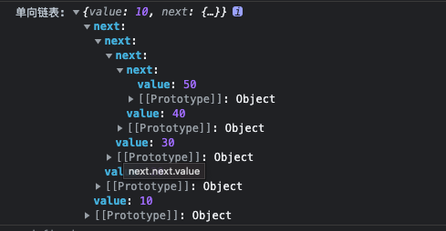
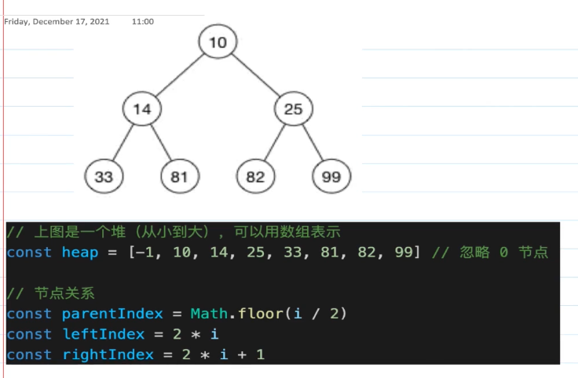
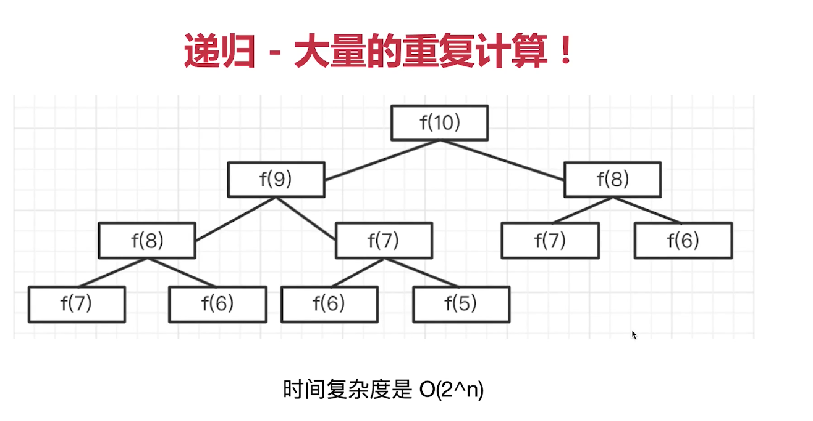

# 算法

## 数组
### 电话号码的字母组合

  例子: 输入数字23 会输出 ['ad', 'ae', 'af', 'bd', 'be', 'bf', 'cd', 'ce', 'cf']
```js
// -------- 数字2-9 对应的字母组合 -----------
const number_map = {
  2: 'abc',
  3: 'def',
  4: 'ghi',
  5: 'jkl',
  6: 'mno',
  7: 'pqrs',
  8: 'tuv',
  9: 'wxyz'
}
function fn( str) {
  if(!str.length) return []
  if(str.length === 1) return str.split('').map(item => number_map[item])
  const code = []
  for(const s of str) {
    if(number_map[s]) {
      code.push(number_map[s])
    }
  }
  if(code.length === 1) return code
  function combine(array) {
    const result = []
    for(let i = 0; i < array[0].length; i++) {
      for(let j = 0; j < array[1].length; j++) {
        result.push(`${array[0][i]}${array[1][j]}`)
      }
    }
    array.splice(0, 2, result)
    array.splice(0, 2, result)
    if(array.length > 1) {
      combine(array)
    }else{
      return result
    }
    return array[0]
  }
  return combine(code)
}
console.log(fn('23')) // ['ad', 'ae', 'af', 'bd', 'be', 'bf', 'cd', 'ce', 'cf']
console.log(fn('234')) 
// ['adg', 'adh', 'adi', 'aeg', 'aeh', 'aei', 'afg', 'afh', 'afi', 'bdg', 'bdh', 
// 'bdi', 'beg', 'beh', 'bei', 'bfg', 'bfh', 'bfi', 'cdg', 'cdh', 'cdi', 'ceg', 'ceh', 
// 'cei', 'cfg', 'cfh', 'cfi']
console.log(fn('25')) // ['aj', 'ak', 'al', 'bj', 'bk', 'bl', 'cj', 'ck', 'cl']
```

### 卡牌分组

```ts
// ------- 选定一个数字X, 将数组分数,
// 1. 每组都有x张牌, 2. 组内所有的牌上都写着相同的整数
function card_group(list: number[]): boolean {
  if(!list.length) return false
  const rest = list.slice().sort();
  const result: number[][] = []
  let min: number = Number.MAX_SAFE_INTEGER
  for(let i = 0, length = rest.length; i < length; i++) {
    const temp: number[] = []
    temp.push(rest[i])
    for(let j = i + 1; j <= rest.length; j++) {
      if(rest[i] === rest[j]) {
        temp.push(rest[j])
      } else {
        i = j - 1
        result.push(temp)
        if(temp.length < min) {
          min = temp.length
        }
        break;
      }
    }
  }
  if(min < 2) return false
  let flag = true
  result.every(item => {
    if(item.length % min !== 0) {
      flag = false
      return false
    }
  })
  return flag
}

console.log(card_group([1,2,3,4,4,3,2,1,2,5,6,5,7]))  // false
console.log(card_group([1,1,2,2,3,3,4,4]))  // true
console.log(card_group([1,1,2,2,2,2]))  // true
```
### 将一个数组旋转k步

```ts
// [1,2,3,4,5,6,7] ->3步 [5,6,7,1,2,3,4,5]

// 第一种实现方式
function rotate_1(array:number[] = [], k = 1): number[] {
  if(!array.length) return []
  if(k < 0) {
    k = Math.abs(k)
  }
  if(k > array.length) {
    k = k % array.length
  }
  const arr1: number [] = array.slice(array.length - k)
  const arr2: number [] = array.slice(0, array.length - k)
  return [...arr1, ...arr2]
}

// 第二种实现方式
function rotate_2(array:number[] = [], k = 1): number[] {
  if(!array.length) return []
  if(k < 0) {
    k = Math.abs(k)
  }
  if(k > array.length) {
    k = k % array.length
  }
  for(let i = 0; i < k; i++) {
    array.unshift(array.pop())
  }
  return array
}

// 测试
const array = [1,2,3,4,5,6,7]
console.log(rotate_1(array, 3)) // 5,6,7,1,2,3,4
console.log(rotate_1(array, 8)) // 7 1 2 3 4 5 6

console.log(rotate_2(array, 3)) // 5,6,7,1,2,3,4
console.log(rotate_2(array, 8)) // 7 1 2 3 4 5 6
```
  以上两种方法均可实现将一个数组旋转k步, 但是方法二的 时间复杂度为 O(n^2), 而方法一的时间复杂度为O(1)
  对上面对两个写法做一个测试:
```js
const array = []
for(let i = 0; i < 10 * 10000; i++){
  array.push(i)
}
console.time('rotate1')
console.log(rotate_1(array, 5* 10000))
console.timeEnd('rotate1')  // 测了几次 在 7 - 10 ms 之间


console.time('rotate2')
console.log(rotate_2(array, 5 * 10000))
console.timeEnd('rotate2') // 1.8s - 2.2s 之间
```
### 二分查找

```ts
// ------- 循环方法 ------
function binary_search(array: number[], target: number): number {
  const length = array.length
  if(length === 0) return -1
  let startIndex = 0, endIndex = length - 1
  while(startIndex <= endIndex) {
    const middleIndex = Math.floor( (startIndex + endIndex) / 2 )
    const middleValue = array[middleIndex]
    if (middleValue > target) {
      endIndex = middleIndex - 1
    }else if (middleValue < target) {
      startIndex = middleIndex + 1
    } else {
      return middleIndex
    }
  }
  return -1
}

// ------- 递归方法 ------
function recursive_search(
  array: number [], target: number, startIndex?: number, endIndex?: number
): number {
  const length = array.length
  if(length === 0) return -1
  if(startIndex === undefined) startIndex = 0
  if(endIndex === undefined) endIndex = length - 1
  if(startIndex > endIndex) return -1
  const middleIndex = Math.floor((startIndex + endIndex) / 2)
  const middleValue = array[middleIndex]
  if(middleValue > target) {
    return recursive_search(array, target, startIndex, middleIndex - 1)
  }else if (middleValue < target) {
    return recursive_search(array, target, middleIndex + 1, endIndex)
  }else{
    return middleIndex
  }
}
```
  接下来构造一个足够大的数组,用来和js原生提供的方法进行比较
```js
const big_binary_array = []
for(let i = 0; i < 10 * 1000000; i ++) {
  big_binary_array.push(i)
}
console.time('find')
console.log(binary_search(big_binary_array, 9999999))  //0.44ms
console.log(recursive_search(big_binary_array, 9999999))  //0.323ms
const result = big_binary_array.find(item => item === 9999999) //126.366ms
console.timeEnd('find')

// 当数组越大的时候, 使用二分查找的速度越快, 二分查找使用递归和循环的速度差不多
```
### 数组中和为n的两个数

```ts
// 使用循环的方法
function sum(array:number [], target: number): number [] {
  const length = array.length, result = []
  if(length === 0) return []
  for(let i = 0; i < length - 1; i++) {
    const m1 = array[i]
    let flag = false
    for(let j = i + 1; j < length; j++) {
      const m2 = array[j]
      if(m1 + m2 === target) {
        result.push(m1)
        result.push(m2)
        flag = true
        break
      }
    }
    if(flag) break
  }
  return result
}

const e = [1,2,3,4,5,6,7,8,9,10]
console.log(sum(e, 19)) // [9, 10]


// 使用双指针
function sum(array: number [], target: number): number [] {
  const length = array.length;
  if(length === 0) return []
  let startIndex = 0, endIndex = length - 1
  const result: number [] = []
  while(startIndex < endIndex) {
    const n1 = array[startIndex], n2 = array[endIndex];
    const sum = n1 + n2
    if(sum < target) {
      startIndex++
    }else if(sum > target) {
      endIndex--
    }else{
      result.push(n1)
      result.push(n2)
      break
    }
  }
  return result
}
const e = [1,2,3,4,5,6,7,8,9,10]
console.log(sum(e, 19)) // [9, 10]
```
### 移动指定元素到数组末尾(不改变原数组)

```ts
// 将 0 移动到数组末尾
function moveZero(array: number[]) {
  const length = array.length
  if(length === 0) return
  let pointerLength = 0 // 数组末尾全是0, 此时不用 再去遍历末尾的数据
  for(let i = 0; i < length - pointerLength; i++) {
    const item = array[i]
    if(item === 0) {
      array.push(item)
      array.splice(i, 1)
      pointerLength += 1
      i-- // 防止重复的0漏掉
    }
  }
}
const zeroArray = [1,2,0,0,0,1,2,0,1,1,2,3,0,4]
moveZero(zeroArray)
console.log(zeroArray)
/*
[
  1, 2, 1, 2, 1, 1,
  2, 3, 4, 0, 0, 0,
  0, 0
]
*/

// 对上面的方法使用双指针优化 因为数组是连续存储空间, 上面的方法时间复杂度是O(n^2)
// j指向第一个0, i 指向j 后面第一个非0 的数字
function moveZero(array: number []) {
  let i,
    j = -1
  for(i = 0; i < array.length; i++) {
    // 指向第一个0
    if(array[i] === 0 && j < 0) {
      j = i
    }
    if(array[i] !== 0 && j >= 0) {
      if(array[j] === 0) {
        const n = array[i]
        array[i] = array[j]
        array[j] = n
      }
      j++
    }
  }
}

const zeroArray = [1,2,0,0,0,1,2,0,1,1,2,3,0,4]
moveZero(zeroArray)
console.log(zeroArray)
/*
[
  1, 2, 1, 2, 1, 1,
  2, 3, 4, 0, 0, 0,
  0, 0
]
*/
```
  对上面的两个方法进行一个性能对比。
```js
// 先构造一个足够大的数组
const array = []
for(let i = 0; i < 10 * 10000; i++) {
  if(i % 10 === 0) {
    array.push(0)
  }else{
    array.push(i)
  }
}
console.time('zero')
moveZero(array)  // 229.207ms 使用第一种方法 
moveZero(array)  // 4.256ms    使用第二种方法
console.timeEnd('zero')
```
### 数组转为树

```ts
/*
[
  {id:1, name:'部门A', parentId: 0},
  {id:2, name:'部门B', parentId: 1},
  {id:3, name:'部门C', parentId: 1},
  {id:4, name:'部门D', parentId: 2},
  {id:4, name:'部门E', parentId: 2},
  {id:4, name:'部门F', parentId: 3}
]
*/
function convert(array: ArrayNode []) {
  const map: Map<number, TreeNode> = new Map()
  let root = null
  array.forEach(item => {
    const { id, name, parentId } = item
    const treeNode: TreeNode = { id, name }
    map.set(id, treeNode)
    const parentNode = map.get(parentId)  // 判断是否在某个节点树上
    if(parentNode) {
      if(!parentNode.children) parentNode.children = []
      parentNode.children.push(treeNode)
    }
    if(parentId === 0) root = treeNode
  })
  return root
}
```

### 树转为数组

```js
// ---------------- 将树转化为数组 ---------------
const tree_node = {
  id: 1,
  name: "部门A",
  children: [
    {
      id:2,
      name: "部门B",
      children:[
        {id: 4, name: "部门D" },
        {id: 5 ,name: "部门E" }
      ]
    },
    {
      id: 3,
      name: "部门C",
      children: [
        {id: 6, name:"部门F" }
      ]
    }
  ]
}
//  广度优先遍历
function tree_to_array(tree) {
  const temp = []
  const queen = [tree]
  const map = new Map()
  while(queen.length) {
    const currentNode = queen.pop()
    if(!currentNode) break;
    const {id, name, children = [] } = currentNode // 最后一个元素
    const parentNode = map.get(currentNode) // 判断当前节点是否有父节点
    let parentId
    if(!parentNode) {
      parentId = 0
    }else{
      parentId = parentNode.id
    }
    temp.push({
      parentId,
      name,
      id
    })
    if(children.length) {
      children.forEach(item => {
        map.set(item, currentNode) // 将每个节点和父节点做个映射
        queen.unshift(item) // 将当前节点依次添加进队列里
      })
    }
  }
  return temp
}

console.log(tree_to_array(tree_node))
/*
[
  { parentId: 0, name: '部门A', id: 1 },
  { parentId: 1, name: '部门B', id: 2 },
  { parentId: 1, name: '部门C', id: 3 },
  { parentId: 2, name: '部门D', id: 4 },
  { parentId: 2, name: '部门E', id: 5 },
  { parentId: 3, name: '部门F', id: 6 }
]
*/
```
### 种花

```ts
// 种花问题, 给定一个数组, 0表示未种花,1表示已种花, 花不能在相邻地方种植, 是否在给定数组里 种植 n朵花

function test_flower(array: number[], number: number): boolean {
  let max: number = 0;
  for(let i = 0, length = array.length - 1; i < length; i++) {
    if(array[i] === 0) {
      // 第一个元素就为0, 判断右边是否等于 0
      if(i === 0 && array[i+1] === 0) {
        max++
        i++
      }else if(array[i-1] === 0 && array[i+1] === 0) {
        max++
        i++
      }
    }
  }
  return max >= number
}
```
### 格雷编码

```ts
// ------ 格雷编码 ---------
/*
1: 0 1
2: 00 01 11 10
3  000 001 011 010 110 111 101 100
返回数组长度为 2^n, 第一位数字 按数组长度/2, 前半部分为0, 后半部分为1。后面的数字为 n-1时的结果并首位对应
*/
function grey_code(n: number): string [] {
  if(n === 1) return ['0', '1']
  const prev = grey_code(n - 1)
  const result = []
  const max = Math.pow(2, n) - 1;
  for(let i = 0; i < prev.length; i++) {
    result[i] = `0${prev[i]}`
    result[max-i] = `1${prev[i]}`
  }
  return result
}

console.log(grey_code(2)) // ['00', '01', '11', '10']
console.log(grey_code(3)) // ['000', '001', '011', '010', '110', '111', '101', '100']
console.log(grey_code(4))
// ['0000', '0001', '0011', '0010', '0110', '0111', '0101', '0100', '1100', '1101',
// '1111', '1110', '1010', '1011', '1001', '1000']
```
## 字符串
### 判断字符串括号匹配

```ts
//   (a[b{c}]) 左右括号是匹配的, (a{b[c)d]}) 是不匹配的
// 利用 栈的思想, 匹配的话就出栈。
const leftSymbols:string = '([{';
const rightSymbols:string = ')]}';

// 判断是否是左右括号匹配
function is_equal(s1: string, s2: string):boolean {
  return (s1 === '{' && s2 === '}') 
        || (s1 === '(' && s2 === ')') 
        || (s1 === '[' && s2 === ']')
}

function fn(str: string) : boolean {
  const array:string [] = []
  for(const s of str) {
    if(!leftSymbols.includes(s) && !rightSymbols.includes(s)) continue
    if(leftSymbols.includes(s)) {
      array.push(s)
    }else{ // 出现右边括号,判断最后一个进栈的括号和右括号是否匹配,匹配则pop出来
      if(is_equal(array[array.length-1],s)) {
        array.pop()
      }else{
        return false
      }
    }
  }
  return array.length === 0
}
// 测试
const string1 = '(a{b[c]})',
      string2 = '{a[b(c])}',
      string3 = '[a{b(]c)}]';

console.log('f1', foo(string1)) // true
console.log('f2', foo(string2)) // false
console.log('f3', foo(string3)) // false
```
### 连续出现最长的字符

```ts
const string = 'aaabcbddeedssssdddddddddd';

function getMaxCharLength(str: string): CharProps {
  const length = str.length;
  if(length === 0) {
    return {
      char:'',
      length: 0
    }
  }
  const res: CharProps = {
    char: '',
    length: 0
  }
  for(let i = 0; i < length; i++) {
    let pointerLength = 0
    for(let j = i; j < length; j++) {
      if(str[i] === str[j]) {
        pointerLength += 1
      }
      // 记录当后一个字母与前一个字母不想等, 或者 已经遍历结束了
      /*
      注意第二种情况, 如果没有 j === length - 1,当最后一段字符是连续最长的, 
      此时不会满足 str[i] !== str[j]
      */
      if(str[i] !== str[j] || j === length - 1) {
        if(pointerLength > res.length) {
          res.length = pointerLength
          res.char = str[i]
        }
        if(i < length - 1) {
          i = j - 1;
        }
        break;
      }
    }
  }
  return res
}
// 测试
console.log(getMaxCharLength(string)) // { char: 'd', length: 10 }


// 利用双指针, i一直向下遍历, 如果str[i] !== str[j]的时候, 此时让j 追上 i的位置
function getMaxCharLength( str: string): CharProps {
  const length = str.length;
  const res: CharProps = {
    char: '',
    length: 0
  }
  if(length === 0) return res
  let j = 0
  let pointerLength = 0
  for(let i = 0; i < length; i++) {
    if(str[i] === str[j]) {
      pointerLength += 1
    }
    if(str[i] !== str[j] || i === length -1) {
      if(pointerLength > res.length) {
        res.length = pointerLength
        res.char = str[j]
      }
      pointerLength = 0
      if(i < length - 1) {
        j = i
        i--
      }
    }
  }
  return res
}

console.log(getMaxCharLength(string))
// { char: 'd', length: 10 }
```
### 回文数字

  求出指定范围内所有的回文数字
```ts
// ----- 将数字转化为字符串, 然后与将字符串转变为数组 再反转后 转化为字符串相比 -----
function reverseNumber(n: number) :number[] {
  if(n === 0) return []
  const result:number[] = []
  for(let i = 1; i <= n; i++) {
    console.log(n.toString().split('').reverse().join(''))
    if(i.toString() === i.toString().split('').reverse().join('')){
      result.push(i)
    }
  }
  return result
}

console.log(reverseNumber(100))
/*
[
  1,  2,  3,  4,  5,  6,
   7,  8,  9, 11, 22, 33, 44,
  55, 66, 77, 88, 99
]
*/

// ----- 依次判断字符首位对应位置的字符是否相等 -------
function reverseNumber(n: number): number [] {
  if(n === 0) return []
  const result: number[] = []
  for(let i = 1; i <= n; i++) {
    let start = 0, end = i.toString().length - 1;
    let flag = true
    while(start < end) {
      if(i.toString()[start] === i.toString()[end]) {
        start+=1;
        end -= 1
      }else{
        flag = false
        break;
      }
    }
    if(flag) {
      result.push(i)
    }
  }
  return result
}
console.log(reverseNumber(100))
/*
[
 1,  2,  3,  4,  5,  6,
7,  8,  9, 11, 22, 33, 44,
55, 66, 77, 88, 99
]
*/

// ------ 不再利用字符串转换,直接求一个数的反转数 -------
function reverseNumber(n: number): number [] {
  if(n === 0) return []
  const result: number[] = []
  for(let i = 1; i <= n; i++) {
    // 直接求一个数的反转数
    let x = i // 当前数字
    let rev = 0 // 反转数字
    while(x > 0) {
      rev = rev * 10 + x % 10
      x = Math.floor(x / 10)
    }
    if(rev === i) {
      result.push(i)
    }
  }
  return result
}
console.log(reverseNumber(100))
/*
[
1,  2,  3,  4,  5,  6,  7,
8,  9, 11, 22, 33, 44, 55,
66, 77, 88, 99
]*/
```
### 字母大小写转换

  将一段字符串中的大写字母转换为小写字母, 将小写字母转换为大写字母, 其余字符不变。

```js
// ---- 利用正则表达式 -------
function letterSwitch(str: string): string {
  const length = str.length;
  if(length === 0) return ''
  let result = '';
  const reg1 = /[a-z]/,
        reg2 = /[A-Z]/;
  for(const item of str) {
    if(reg1.test(item)) {
      result += item.toUpperCase()
    }else if(reg2.test(item)) {
      result += item.toLowerCase()
    }else{
      result += item
    }
  }
  return result
}

const string = 'AccxD2@xYz'
console.log(letterSwitch(string)) // aCCXd2@XyZ


// ----- 利用ASCII编码 --------
// 大写字母在ASCII编码对照表里 10进制 范围是 65 - 90, 小写字母范围是 97 - 122
function letterSwitch(str: string): string {
  const length = str.length;
  if(length === 0) return ''
  let result = '';
  for(const item of str) {
    const code = item.charCodeAt(0)
    if(code >= 65 && code <= 90) {
      result += item.toLowerCase()
    }else if(code >= 97 && code <= 122) {
      result += item.toUpperCase()
    }else{
      result += item
    }
  }
  return result
}
console.log(letterSwitch(string)) // aCCXd2@XyZ
```

## 两个栈模拟队列

  栈结构 '先进后出', 队列 '先进先出'。
```ts
class Queue {
  private stack1: number [] = []
  private stack2: number [] = []
  add(n: number) {
    this.stack1.push(n)
  }
  delete():number {
    let res: number
    while(this.stack1.length) {
      this.stack2.push(this.stack1.pop())
    }
    res = this.stack2.pop()
    while(this.stack2.length) {
      this.stack1.push(this.stack2.pop())
    }
    return res
  }
  get length():number {
    return this.stack1.length
  }
}
q.add(10)
q.add(20)
q.add(30)
const q = new Queue()
console.log(q.length) // 3
console.log(q.delete()) // 10
console.log(q.delete()) // 20
console.log(q.delete()) // 30
console.log(q.delete()) // undefined
```

## 单向链表

  将一个数组转换成为单向链表(每个数据元素在存储时配备一个指针),用于指向自己的直接后继元素。
```ts
const array = [10,20,30,40,50]

interface ListProps {
  value: number
  next? : ListProps
}
function createList (array: number []): ListProps {
  const length = array.length
  if(length === 0) throw new Error('something went wrong')
  let curObj = {
    value: array[length - 1]
  }
  if(length === 1) return curObj
  for(let i = length - 2; i >= 0; i--) {
    curObj = {
      value: array[i],
      next: curObj
    }
  }
  return curObj
}
const result = createList(array)
```


## 反转单向链表

  将上述例子生成的单向链表进行反转
```ts
function reverseList(object: ListProps): ListProps {
  let prev: undefined | ListProps = undefined
  let cur: undefined | ListProps = undefined
  let next: undefined | ListProps = object
  while (next) { // 当有next的时候 遍历
    if (cur && !prev) {
      delete cur.next
    }
    // 整体移动指针
    if(cur && prev) {
      cur.next = prev
    }
    prev = cur
    cur = next
    next = next?.next
  }
  cur.next = prev
  return cur
}
```
## 链表实现队列

```ts
class Queue1 {
  private headNode = null
  private tailNode = null
  private len = 0
  add (value) {
    const node = {
      value,
      next: null
    }
    // 如果没有头部节点
    if (this.headNode === null) {
      this.headNode = node
    }
    const tail = this.tailNode
    if(tail) {
      tail.next = node
    }
    this.tailNode = node
    this.len += 1
  }
  delete () {
    if(!this.headNode) return null
    if(this.len <= 0) return null
    const head = this.headNode
    this.headNode = head.next
    this.len -= 1
    return head.value
  }
  get length() {
    return this.len
  }
}

const queue_1 = new Queue1()
queue_1.add(10)
queue_1.add(20)
queue_1.add(30)
queue_1.add(40)
console.log(queue_1.length)   // 4
console.log(queue_1.delete()) // 10
console.log(queue_1.length)   // 3
```
## 二叉树

### 遍历

  根据根节点在遍历时的位置 可以分为 前序遍历, 中序遍历, 后序遍历。
```ts
const binary_tree = {
  value: 1,
  left: {
    value: 2,
    left: {
      value: 3,
    },
    right: {
      value: 4,
    }
  },
  right: {
    value: 5,
    left: {
      value: 6
    },
    right: {
      value: 7
    }
  }
}
// 前序遍历
function front_tree_map(node: TreeNodeProps) {
  if(!node) return
  console.log(node.value)
  front_tree_map(node.left)
  front_tree_map(node.right)
}
front_tree_map(binary_tree) // 1 2 3 4 5 6 7


// 中序遍历
function middle_tree_map(node: TreeNodeProps) {
  if(!node) return
  middle_tree_map(node.left)
  console.log(node.value)
  middle_tree_map(node.right)
}
middle_tree_map(binary_tree)  // 3 2 4 1 6 5 7

// 后序遍历
function back_tree_map(node: TreeNodeProps) {
  if(!node) return
  back_tree_map(node.left)
  back_tree_map(node.right)
  console.log(node.value)
}
back_tree_map(binary_tree)  // 3 4 2 6 7 5 1
```
### 数组和二叉树




## 斐波那契数列

```ts
// 使用递归实现一个斐波那契数列
function fibonacci(n: number): number {
  if(n <= 0) return 0
  if(n === 1) return 1
  return fibonacci(n - 1) + fibonacci(n - 2)
}

console.log(fibonacci(5)) // 5
console.log(fibonacci(8)) // 21
console.log(fibonacci(10))  // 55
console.log(fibonacci(100)) // 程序崩溃
```
  在求数列第100个数的时候程序已经奔溃了, 因为这个递归包含很多重复的计算



  将上面的方式使用for循环进行优化
```ts
function fibonacci(n: number) : number {
  if(n <= 0) return 0
  if(n === 1) return 1
  let prev = 0, cur = 1, result = 0
  for(let i = 2; i <= n; i++) {
    result = prev + cur
    prev = cur
    cur = result
  }
  return result
}
console.log(fibonacci(5)) // 5
console.log(fibonacci(8)) // 21
console.log(fibonacci(10))  // 55
console.log(fibonacci(100)) // 354224848179262000000
```

  除了使用for循环进行优化, 还可以使用尾递归进行优化。ES6中明确规定, 所有ECMAScript的实现都必须
  部署'尾调用优化'
```ts
function fibonacci(n: number, prev: number = 0, cur:number = 1):number {
  if(n <= 1) return cur
  return fibonacci(n - 1, cur, cur + prev)
}
console.log(fibonacci(5)) // 5
console.log(fibonacci(8)) // 21
console.log(fibonacci(10))  // 55
console.log(fibonacci(100)) // 354224848179262000000
```

## SleepMan

```ts

class SleepMan {
  private name: string
  private tasks: Function []
  constructor(name: string) {
    this.name = name
    this.tasks = []
    setTimeout(() => {
      this.next()
    }, 0)
  }
  eat(food: string) {
    const task = () => {
      console.log(`eat - ${food}`)
      this.next()
    }
    this.tasks.push(task)
    return this
  }
  sleep(time) {
    const task = () => {
      setTimeout(() => {
        console.log('sleep')
        this.next()
      },time * 1000)
    }
    this.tasks.push(task)
    return this
  }
  next() {
    const task = this.tasks.shift()
    task && task()
  }
}
const kyrie = new SleepMan('kyrie')
kyrie.eat('apple').sleep(3).eat('banana').sleep(2).eat('orange')
/*
eat - apple
sleep
eat - banana
sleep
eat - orange
*/
```
## LRU(Least Recently Used)
  
  最近最少使用,是一种常见的页面置换算法, 选择最近久未使用的数据予以淘汰。
```js
//使用JavaScript 的map 数据结构存储,map是一种有序的结构,后面的数据是最近访问的数据
class ResourceMap {
  constructor(length) {
    this.length = length
    this.map = new Map()
  }
  get(key) {
    const data = this.map;
    if(!data.has(key)){
      return null
    }
    const value = data.get(key)
    data.delete(key)
    data.set(key, value)
  }
  set(key, value) {
    const data = this.map
    if(data.has(key)) {
      data.delete(key)
    }
    data.set(key, value)
    if(this.map.size > this.length) {
      const temp = []
      //this.map.keys()是一个Iterator
      for(const key of this.map.keys()){
        temp.push(key)
      }
      this.map.delete(temp[0])
    }
  }
}

const map = new ResourceMap(2)
map.set('a', {firstName: 'kyrie'})
map.set('b', {firstName: 'lebron'})

console.log(map)
/*
  map: Map(2) {
    'a' => { firstName: 'kyrie' },
    'b' => { firstName: 'lebron' }
  }
*/

map.get('a')
/*
  map: Map(2) {
    'b' => { firstName: 'lebron' },
    'a' => { firstName: 'kyrie' }
  }
*/
console.log(map)

console.log(map.get('c')) // null

map.set('d', {firstName: 'durant'})
console.log(map)
/*
map: Map(2) {
  'a' => { firstName: 'kyrie' },
  'd' => { firstName: 'durant' }
}
*/

map.get('a')
console.log(map)
/*
  map: Map(2) {
    'd' => { firstName: 'durant' },
    'a' => { firstName: 'kyrie' }
  }
*/
```

```js
// 如果不使用map,可以结合array/object来实现。
class ResourceMap { // 最先访问的数据在前面
  constructor(length) {
    this.length = length
    this.keys = []  // 数组存储key
    this.map = {}   // 对象存储值
  }
  get(key) {
    // 判断是否存在key!
    if(!this.keys.includes(key)) return null
    const keyIndex = this.keys.findIndex(k === key)
    this.keys.splice(keyIndex, 1)
    this.keys.unshift(key)
  }
  set(key, value) { // 设置: key/value
    if(!this.keys.includes(key)) {
      this.keys.unshift(key)
    }else{
      const keyIndex = this.keys.findIndex(k => k === key)
      this.keys.splice(keyIndex, 1)
      this.keys.unshift(key)
    }
    this.map[key] = value
    if(this.keys.length > this.length) {
      const lastKey = this.keys.pop()
      Reflect.deleteProperty(this.map, lastKey)
    }
  }
}

const map = new ResourceMap(2)
map.set('a', {player: 'lebron'})
map.set('b', {player: 'kyrie'})

console.log(map)
/*
keys: [ 'b', 'a' ],
map: { a: { player: 'lebron' }, b: { player: 'kyrie' } }
*/
console.log(map.get('c')) // null

map.set('c', {player:'wade'})
console.log(map)
/*
keys: [ 'c', 'b' ],
map: { b: { player: 'kyrie' }, c: { player: 'wade' } }
*/
```
