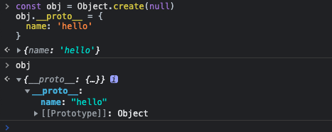
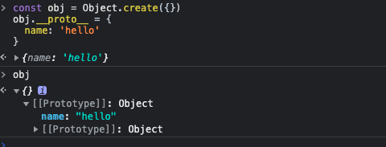

# 构造函数

  构造函数是用来初始化新创建的对象的。使用关键字new来调用构造函数。
  构造函数的prototype属性会被用作新对象的原型。

  原型对象是类的唯一标识,当且仅当两个对象继承自同一个原型对象时,它们才是属于同一个类的实例。
```js
function Player(name){
  this.name = name;
}
const player = new Player('kyrie')

log(player, player.__proto__ === Player.prototype) // {name:'kyrie'}  true
```
```js
// Demo
function Range(from, to) {
  this.from = from;
  this.to = to;
}
Range.prototype.includes = function(x){
  return this.from <= x && this.to >= x;
}
Range.prototype.foreach = function(f){
  for(let i =  Math.ceil(this.from); i <= this.to; i++){
    f(i)
  }
}
Range.prototype.toString = function(){
  return '(' + this.from + '...' + this.to + ')';
}

const range_1 = new Range(1.3, 8)
const range_2 = new Range(3,6)
console.log(range_1.includes(12), range_1.includes(5))  // false true
range_2.foreach(console.log)  // 3 4 5 6
console.log(range_1.toString()) // 1.3 ... 8


/*
Range.prototype = {
  ...
}
这样写法会覆盖本身原型对象上存在的一些属性。
*/
```
:::tip
任何JavaScript函数都可以用作构造函数,并且调用构造函数是需要用到一个prototype属性的。 每个JavaScript函数
(ECMAScript5中的Function.bind()方法返回的函数除外),都自动拥有一个prototype属性。这个对象包含唯一一个不可枚举
属性constructor。指向构造函数
:::

```js
function D(){
}
console.log('d.prototype:', D.prototype)
console.log(Object.getOwnPropertyNames(D.prototype))  // ['constructor']
console.log(Object.getOwnPropertyDescriptor(D.prototype,'constructor'))
/*
{
  value: [Function: D],
  writable: true,
  enumerable: false,
  configurable: true
}
*/
```
## 构造函数的返回值

  - 如果没有显示的返回值,则返回this,即new 出来的对象
  - 如果有返回值 是简单数据类型,则返回this, 否则返回 return 出来的值。
```js
function F1(){
  this.name = 'f1'
}
function F2(){
  this.name = 'f2'
  return 123
}
function F3(){
  this.name = 'f3'
  return {
    message:'hello world'
  }
}
function F4(){
  this.name = 'f4'
  return '123'
}
function F5(){
  this.name = 'f5'
  return true
}
function F6(){
  this.name = 'f6'
  return [1,2,3]
}
const f1 = new F1()
const f2 = new F2()
const f3 = new F3()
const f4 = new F4()
const f5 = new F5()
const f6 = new F6()
console.log(f1, f2, f3, f4, f5, f6)
// {name:'f1'} {name:'f2'} {message:'hello world'} 
// {name:'f4'} {name:'f5'} [1,2,3]
```
  new关键字会进行如下的操作:
  - 创建一个空的简单的JavaScript对象 {}
  - 为新创建的对象添加属性__proto__,将该属性链接至构造函数的原型对象
  - 将新创建的对象作为this的上下文
  - 如果该函数没有返回对象,则返回this.

## 实现new关键字创建对象

```js
/*这里我们没有办法去实现一个new关键字,通过一个函数,传入构造函数和传递参数,返回一个实例对象*/
function createObject() {
  // 取出构造函数
  const [fn, ...args] = Array.from(arguments);
  /*判断函数是否为箭头函数,箭头函数没有prototype属性*/
  if(!fn.prototype){
    throw new Error(`${fn.name} is not a constructor`)
  }
  fn.target = fn;
  // 将对象的__proto__ 指向构造函数的prototype
  const object = Object.create(fn.prototype)
  const returnValue = fn.apply(object, args)
  return typeof returnValue === 'object' ? returnValue : object;
}

// 测试
function Animal(name){
  this.name = name;
}
const animal = createObject(Animal, 'monkey')
console.log(animal) // {name: 'monkey'}
animal.__proto__ === Animal.prototype
```
```js
// 如果是手动给 将object的__proto__ 赋值给function.prototype, 不能使用
// Object.create(null) 来创建一个空对象, 此时在修改__proto__ 原型指向无效
// 只是给 object 添加了一个 __proto__ 属性 这个属性指向 function.prototype

const obj = Object.create(null)
obj.__proto__ = {
  name: 'hello'
}
console.log('hello:', obj.name) // undefined

const obj1 = Object.create({})
obj1.__proto__ = {
  name: 'hello'
}
console.log('hello:', obj1.name)  // hello
```



:::danger
箭头函数函数不可以用作构造函数
:::
```js
const ArrowFunction = (name) => {
  this.name = name;
}
const arrow = new ArrowFunction('hello') // ArrowFunction is not a constructor
```
  new 一个构造函数的时候会将this指向到创建到实例对象, 而构造函数的this是在定义时决定的。
  上面的箭头函数 this 其实指向的是window。

## new.target

  new.target属性允许你检测函数或构造方法是否通过new运算符被调用的。在通过new运算符被初始化的函数或构造方法中,new.target返回一个指向
  构造函数方法或函数的引用。在普通函数调用中,new.target的值是undefined。

:::tip
new.target属性适用于所有函数访问的元属性。在箭头函数中,new.target指向最近的外层函数的new.target。
:::

```js
function Foo() {
  console.log('new.target:',new.target)
}
Foo()
new Foo()

// new.target: undefined
// new.target: [Function: Foo]
```
  在类的构造方法中, new.target指向直接被new执行的构造函数。并且当一个父类构造方法在子类构造函数中被调用。
```js
class A {
  constructor() {
    console.log(new.target.name);
  }
}
class B extends A {
  constructor() {
    super()
  }
}
const a = new A() // A
const b = new B() // B
```
## 继承

### 原型链继承

```js
function Parent(name){
  this.name = name;
  this.colors = ['red','green', 'blue']
}
Parent.prototype.say = function(){
  console.log(this.name)
}

function Child(name){
  this.name = name
}
Child.prototype = new Parent()
Child.prototype.constructor = Child;
const c1 = new Child('hello')
const c2 = new Child('world')
c1.say()  // hello 
c1.say()  // world

c1.colors.pop()
console.log(c1.colors, c2.colors) // ['red', 'green']   ['red', 'green']

// child.__proto__ --> Child.prototype --> 
// Child.prototype.__proto___ -> Parent.prototype
```
  缺点: 如果有两个实例对象, 修改了其中一个父类上的属性, 另一个实例对象上的父类也会受到影响。

### 构造函数继承

```js
function Parent(name) {
  this.name = name;
  this.colors = ['color','red','blue']
  this.say = function(){
    console.log(this.name)
  }
}
Parent.prototype.run = function(){
  console.log('running')
}

function Child(name, age){
  Parent.call(this, name)
  this.age = age;
}

const c1 = new Child('c1', 18)
const c2 = new Child('c2', 20)
c1.say()  // c1
c2.say()  // c2

c1.colors.pop()
console.log(c1.colors, c2.colors)
//['color', 'red']  ['color', 'red', 'blue']
c1.run()  // c1.run is not a function
```
  缺点: 无法继承父类原型链上的方法.

### 组合继承

  通过call方法继承父类构造函数属性和方法, 修改子类原型对象, 继承父类原型上的对象。

```js
function Parent(name,age){
  this.name = name;
  this.age = age;
  this.say = function(){
    console.log(this.name)
  }
}
Parent.prototype.run = function() {
  console.log(this.name)
}

function Child(name, age) {
  Parent.call(this, name, age)
}
Child.prototype = new Parent()
Child.prototype.constructor = Child

const c1 = new Child('kyrie', 19)
const c2 = new Child('irving', 20)
c1.say()  c1.run()  // kyrie
c2.say()  c2.run()  // irving
```
  上面的组合继承也会有一个小问题,就是父构造函数执行了两次，可以借助一个中间构造函数再次优化
```js
function Bridge(){}
Bridge.prototype = Parent.prototype
Child.prototype = new Bridge()
Child.prototype.constructor = Child


// 将上面的步骤简单封装一下
function createBridge(parentConstructor, childConstructor) {
  function Middle(){
    this.constructor = childConstructor
  }
  Middle.prototype = parentConstructor.prototype
  return new Middle()
}
Child.prototype = createBridge(Parent, Child)


//  或者利用Object.setPrototypeOf(object, prototype)
Object.setPrototypeOf(Child.prototype, Parent.prototype)
```

### 静态属性和方法

```js
// 定义在构造函数上的静态属性和方法
function Father(name, age) {
  this.name = name;
  this.age = age;
}
Father.fullName = 'hello'
Father.say = function() {
  return 'hello'
}
for(const key in Father) {
  if(Object.prototype.hasOwnProperty.call(Father, key)) {
    console.log('people-key', key)  // fullName, say
    Child[key] = Father[key]
  }
}
// for...in 会遍历出 原型链上的属, 所以使用hasOwnProperty() 做一个判断


// 使用 Object.keys()
Object.keys(Father).forEach(prop => {
  Child[prop] = Father[prop]
})

// 使用Object.setPrototypeOf
Object.setPrototypeOf(Child, Father)
// 相当于 Child.__proto__ === Father


// ts编译后的静态属性继承的部分代码
var __extends = (this && this.__extends) || (function () {
  var extendStatics = function (d, b) {
    // 继承静态属性和方法
    extendStatics = Object.setPrototypeOf ||
    ({ __proto__: [] } instanceof Array && function (d, b) { d.__proto__ = b; }) ||
    function (d, b) { 
      for (var p in b) if (Object.prototype.hasOwnProperty.call(b, p)) d[p] = b[p]
    }
    return extendStatics(d, b);
  };
  return function (d, b) {
    if (typeof b !== "function" && b !== null)
    throw new TypeError("Class extends value " + String(b) + " is not a constructor or null");
    extendStatics(d, b);
    function __() { this.constructor = d; }
    d.prototype = b === null ? Object.create(b) : (__.prototype = b.prototype, new __());
    // d.prototype.__proto__ === __.prototype
    // d.prototype.__proto__.constructor = d
  };
})();
```
## instanceof

  instanceof 运算符用于检测构造函数的prototype 属性是否出现在某个实例对象的原型上。
```js
function Car(name, year) {
  this.name = name
  this.year = year
}
const auto = new Car('Honda', 1998)
console.log(auto instanceof Car)  // true
console.log(auto instanceof Object) // true

Car.prototype = {
  say(){
    console.log(`${this.name}`)
  }
}
console.log(auto instanceof Car)  // false
console.log(auto instanceof Object) // true
//  因为修改了Car的prototype


// ------ 普通值类型 instanceof 对应的构造函数为false ---------
console.log('123' instanceof Object)  // false
console.log(123 instanceof Number)  // false
console.log(true instanceof Boolean)  // false

// 通过new 调用时 为 true
console.log(new String(123) instanceof Object)  // true
console.log(new Number(123) instanceof Number)  // true
console.log(new Boolean(false) instanceof Boolean)  // true
```

```js
//  实现一个instanceof
function checkInstance(instance, constructor) {
  if(typeof instance == null) return false
  // 判断是不是普通类型值
  if(typeof instance !== 'object' && typeof instance !== 'function') return false
  let a = instance
  while(a){
    if(Object.getPrototypeOf(a) === constructor.prototype) {
      return true
    }else{
      a = Object.getPrototypeOf(a)
    }
  }
  return false
}
```
