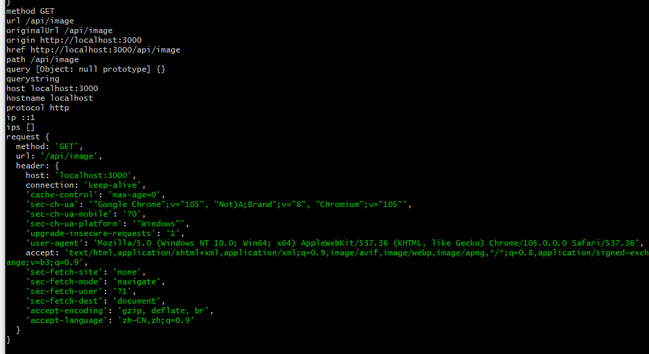

# Koa

```js
// 安装
npm install koa --save

// 使用
const Koa = require('koa')
const app = new Koa()

app.use(async ctx => {
  ctx.body = 'hello world'
})
app.listen(3000)


// 将同一个应用程序同时作为http和https 或者多个地址
const http = require('http')
http.createServer(app.callback()).listen(3000)
http.createServer(app.callback()).listen(3001)
```

## Context

  Koa Context 将node的request 和 response 对象封装到单个对象中。每个请求都将创建一个Context,并在中间件中作为接收器引用。
```js
app.use(async ctx => {
  /* ctx.request  Koa的request对象
  ctx.response    Koa的response对象
  ctx.req         Node的request对象
  ctx.res         Node的response对象
  */
})
```
```js
// Request(请求)
ctx.headers         // 请求头对象
ctx.method          // 请求方法
ctx.url             // 获取请求 URL
ctx.originalUrl     // 获取请求原始URL
ctx.origin          // 获取URL的来源，包括 protocol 和 host
ctx.href            // 获取完整的请求URL，包括 protocol，host 和 url
ctx.path            // 获取请求路径名
ctx.query           // 解析后的查询字符串
ctx.querystring     // ?原始查询参数
ctx.host            // 主机
ctx.hostname        // 主机名(hostname:port)
ctx.protocol        // 协议
ctx.request         // 请求对象
```


```js
// 响应 (Response)
ctx.response.status = 200 // 默认值为404
ctx.response.message = 'success'
ctx.response.length = 10  // 将响应的Content-Length 设置为给定值
ctx.response.body = 'hello' // 响应的主体
ctx.response.body = JSON.stringify(['kyrie', 'lebron', 'durant'])
ctx.response.body = Buffer.from('hello world')
// 响应主体可以为 string/Buffer/Stream/Object|Array的JSON字符串/null
ctx.set('Cache-Control', 'no-cache')
// 设置多个响应头
ctx.set({
  'Cache-Control': 'no-cache',
  'Last-Modified': Date.now()
})
```

## Middleware

### koa-bodyparser

  enctype: 表单Form的enctype属性规定在发送到服务器之前应该如何对表单数据进行编码。

1. application/x-www-form-urlencoded
2. multipart/form-data (不对字符编码, 在使用包含文件上传控件的表单时,必须使用该值)
3. text/plain (空格转换为 '+', 但不对特殊字符编码)

```js
// 获取post请求参数
//  在使用插件之前, 通过原生node获取post请求参数
app.use(async ctx => {
  ctx.response.status = 200
  ctx.message = 'success'
  if (ctx.request.url === '/api/login') {
    let str = ''
    ctx.req.on('data', (chunk) => {
      str += chunk
    })
    ctx.req.on('end', () => {
      console.log(str) // username=kyrie&password=123456
      ctx.body = 'success'
    })
  }
})

// 使用 koa-bodyparser插件
const bodyParser = require('body-parser')
app.use(bodyParser())
// 获取请求的参数 ctx.request.body {username: 'kyrie', password: 123456}
```
[koa-bodyparser]('https://www.npmjs.com/package/koa-bodyparser')

### koa-router

```js
const Koa = require('koa')
const router = require('koa-router')()
const app = new Koa()

router.get('/api/player', async ctx => {
  ctx.body = ['kyrie', 'lebron']
})
router.get('/api/singer', async ctx => {
  ctx.body = ['周杰伦', '王力宏']
})

const player_list = [
  {
    firstName: 'kyrie',
    lastName: 'irving',
    id: 1
  },
  {
    firstName: 'lebron',
    lastName: 'james',
    id: 2
  },
  {
    firstName: 'kevin',
    lastName: 'durant',
    id: 3
  }
]
// 动态路由
router.get('/api/player/:id', async ctx => {
  const { id } = ctx.request.params
  const player = player_list.find(player => player.id === Number(id))
  if (player) {
    ctx.body = player
  } else {
    ctx.body = 'no data'
  }
})
// 查询参数
router.get('/api/player', async ctx => {
  const { id } = ctx.request.query
  console.log(ctx.request.query, ctx.request.querystring)
  const player = player_list.find(player => player.id === Number(id))
  if (player) {
    ctx.body = player
  } else {
    ctx.body = 'no data'
  }
})

// 路由前缀
const router = require('koa-router')({
  prefix: '/api',
  host: 'baidu.com' // only match if request host exactly equal 'baidu.com'
})

app.use(router.routes()).use(router.allowedMethods())
```

### koa-static

  Koa static file serving middleware.
```js
// 一个简易的静态文件服务
const path = require('path')
const static = require('koa-static')
const app = new Koa()
app.use(static(path.resolve(__dirname, 'public')))
```
[koa-static]('https://www.npmjs.com/package/koa-static')

### @koa/cors

  解决请求跨域问题, 允许前端跨域请求
```js
const Koa = require('koa');
const cors = require('@koa/cors');

const app = new Koa();
app.use(cors());

// 如果不使用插件
app.use(async ctx => {
  ctx.set({
    'Access-Control-Allow-Methods': 'GET,POST,DELETE',
    'Access-Control-Allow-Origin': 'http://192.168.0.141:9001', // 允许跨域的源(允许所有则设置为*)
    'Access-Control-Allow-Credentials': true,
    'Access-Control-Allow-Headers': 'Content-Type'
  })
  ctx.status = 200
  ctx.message = 'success'
})
```

### koa-session

  