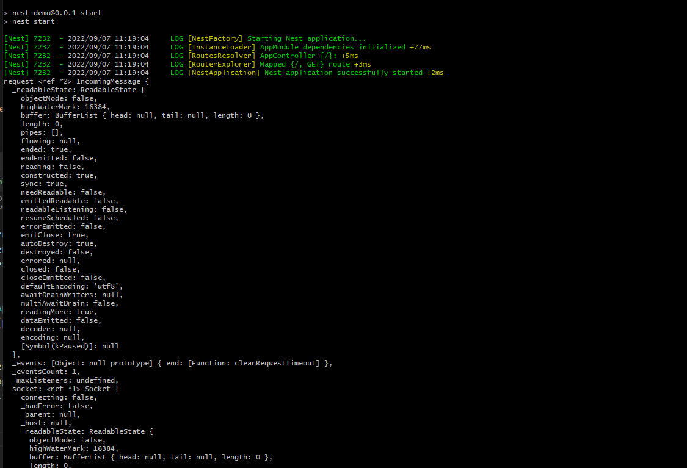

# Nest

  本文记录一下按照官方文档学习Nest的过程。

[Nestjs]('https://docs.nestjs.com/')

## Install

```js
// 安装nest 脚手架
npm i -g @nestjs/cli
nest new project-name

npm run start // 会在本地启动一个3000端口的服务
```

## Controllers

  Controllers are responsible for handling incoming requests and returning responses to the client。
  使用 @Controller() 装饰器定义一个控制器。 我们可以在控制器中指定一个前缀用来管理一系列相关的路由。

### Routing

```js
import { Controller, Get } from '@nestjs/common';

@Controller({
  host: '192.168.0.588' // 判断请求是否来自这个地址
})
@Controller('cats')
export class CatsController {
  @Get()  // 告诉nest 是一个get请求和路由(路由是由控制器装饰器的路由前缀和@Get()装饰器的路径拼接而成)
  findAll(): string {
    return 'This action returns all cats';
  }
}

// Nest提供了对应HTTP请求方法的装饰器 @Get, @Post, @Put, @Delete ... @All包括前述所有方法
```

### Request

  方法有时需要获取到客户端请求的详细信息。Nest提供一个 @Req 装饰器 用来获取请求的信息。
```js
import { Controller, Get, Req } from '@nestjs/common';
import { AppService } from './app.service';
import { Request } from 'express';

@Controller()
export class AppController {
  constructor(private readonly appService: AppService) {}

  @Get()
  getHello(@Req() request: Request): string {
    console.log('request', request);
    return this.appService.getHello();
  }
}
// 为了获取更好的express 类型, 安装 @types/express
/**
 * @Request                     req
 * @Response                    res
 * @Session                     req.session
 * @Param                       req.params
 * @Body                        req.body
 * @Query                       req.query
 * @Headers                     req.headers
*/
```


```js
// app.controller.ts
import { Controller, Get, HttpCode, Header } from 'nestjs/common'

@Controller()
export class AppController {
  @Get('/api/players')  // 通过get请求 /api/players
  @HttpCode(200)        // 状态码
  @Header('Cache-Control', 'none')  // 响应头
  @Redirect('https://www.baidu.com', 301) // @Redirect takes two arguments url and statusCode.
  getPlayers() { 
    return this.appService.getPlayers()
  }
}

// app.service.ts
export type PlayerProps = {
  firstName: string;
  lastName: string;
  id: number;
};
const player_list: PlayerProps[] = [
  {
    firstName: 'lebron',
    lastName: 'james',
    id: 1
  },
  {
    firstName: 'kyrie',
    lastName: 'irving',
    id: 2
  },
]
import { Injectable } from 'nestjs/common'
export class AppSerivce {
  getPlayers() {
    return player_list
  }
}
```

### 动态路由

```ts
// app.controller.ts
import { Controller, Get, Param } from 'nestjs/common'
export class AppController {
  @Get('/api/players/:id') // 通过get请求 /api/players/1  /api/players/2 ...
  findPlayer (@Param('id') id: string): PlayerProps {
    return this.appService.findPlayer(id)
  }
  // 另一种写法,
  findPlayer(@Param() params): PlayerProps {
    console.log('params:', params); // {id: 1}
    return this.appService.findPlayer(params.id);
  }
}

// app.service.ts
export class AppService {
  findPlayer(id: string) {
    const player = player_list.find((player) => player.id === Number(id))
    if (player) return player
    return null
  }
}
```

### Post

  使用post请求前需要定义一个 DTO(Data Transfer Object) schema. 是一个对象用来定义post请求的参数类型。
```ts
// controller.ts
import { Controller, Body, Post } from 'nestjs/common'

type UserProps = {
  username: string;
  password: string
}

@Controller()
export class AppController {
  @Post('/api/login')
  userLogin(@Body() user: UserProps) {
    return this.appService.userLogin(user)
  }
}

// app.service.ts
import { Injectable } from '@nestjs/common';
@Injectable()
export class AppService {
  userLogin(user: UserProps) {
    if (user.username === 'jack' && user.password === '123456') {
      return {
        code: 200,
        message: 'success',
      };
    } else {
      return {
        code: 0,
        message: 'error',
      };
    }
  }
}
```

## Provider

  Controllers should handle HTTP requests and delegate more complex tasks to providers. Providers are plain JavaScript classes
  that are declared as providers in a module.
```js
// player.interface.ts
type PlayerProps = {
  firstName: string;
  lastName: string;
  age: number;
};

// player.controller.ts
import { Controller, Get, Post, Body } from '@nestjs/common';
import type { PlayerProps } from './player.interface';
import { PlayerService } from './player.service';

// Controllers should handle HTTP request and delegate more complex tasks to providers.
@Controller('/api/player')
export class PlayerController {
  constructor(private readonly playerService: PlayerService) {}

  @Post('create')
  create_player(@Body() player: PlayerProps) {
    this.playerService.create(player);
  }
  @Get('find')
  get_player() {
    return this.playerService.get();
  }
}


// player.service.ts
// This service will be responsible for data storage and retrieval. and is designed to be 
// used by the PlayerController.
import { Injectable } from '@nestjs/common';
import type { PlayerProps } from './player.interface';

@Injectable()
export class PlayerService {
  private readonly players: PlayerProps[] = [
    { firstName: 'kyrie', lastName: 'irving', age: 31 },
    { firstName: 'lebron', lastName: 'james', age: 38 },
  ];
  create(player: PlayerProps) {
    this.players.push(player);
  }
  get(): PlayerProps[] {
    return this.players;
  }
}

// app.module.ts
import { Module } from '@nestjs/common';
import { PlayerService } from './player/player.service';
import { AppService } from './app.service';

// Provider registration
@Module({
  imports: [],
  controllers: [PlayerController],
  providers: [PlayerService],
})
export class AppModule {}
// A feature module simply organizes code relevant for a specific feature, keeping code
// organized and establishing clear boundaries.


// player.module.ts
import { Module } from '@nestjs/common';
import { PlayerService } from './player/player.service';
import { PlayerController } from './player/player.controller';
@Module({
  controllers: [PlayerController],
  providers: [PlayerService]
})
export class PlayerModule {}

// app.module.ts
// The last thing we need to do is import this module into the root module.
import { PlayerModule } from './player/player.module'
import { Module } from '@nestjs/common';
@Module({
  imports: [PlayerModule]
})
```

## Middleware

  Middleware is a function which is called before the route handler. Middleware have access to the
  request and response objects.

```ts
// middleware/logger.middleware.ts
import { Injectable, NestMiddleware } from '@nestjs/common';
import { Request, Response, NextFunction } from 'express';
@Injectable()
export class LoggerMiddleware implements NestMiddleware {
  use(req: Request, res: Response, next: NextFunction) {
    console.log('request...')
    next()
  }
}

// Applying middleware
// app.module.ts
import { Module, NestModule, MiddlewareConsumer } from '@nestjs/common';
import { LoggerMiddleware } from './middleware/logger.middleware';
export class AppModule implements NestModule {
  configure(consumer: MiddlewareConsumer) {
    // set up the LoggerMiddleware for the /api/player route.
    consumer.apply(LoggerMiddleware).forRoutes('api/player');
  }
}
```
