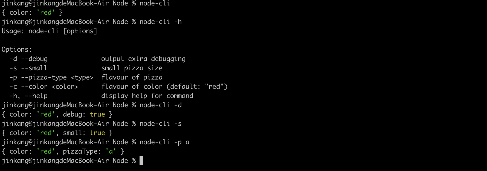
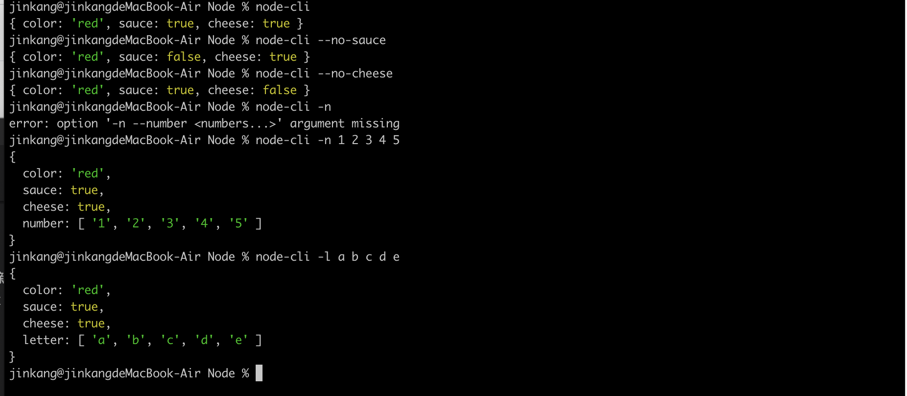

# Commander

  Commander是一个Node.js 命令行工具 (You write code to describe your command line interface)
```js
npm install commander

const { program } = require('commander');

// For large programs which may use commander in multiple ways. it is better 
// to create a local Command object to use
const { Command } = require('commander');
const program = new Command()
```

## options

  定义命令行选项的。 options are defined with the .option() method. 每个选项有一个短标识(single character)
  和一个长的名字, 通过逗号 或者空格 '|' 分割。

  多个连词符组成的选项 如:'--template-engine' 会转换成驼峰命名. templateEngine
```js
serve -p 80
serve -p80
serve --port 80
serve --port=80
```

  The two most used option types are a boolean option, and an option which takes its value from the
  following argument. Both are undefined unless specified on command line.
```js
// 下面这个例子来自官方文档
const { program } = require('commander')
// 设置选项
program
.option('-d --debug', 'output extra debugging')
.option('-s --small', 'small pizza size')
.option('-p --pizza-type <type>', 'flavour of pizza');

program.parse(process.argv)
console.log(program.opts())
// 默认值
program.option('-c --color <type>', 'flavour of color', 'red')
```



```js
/*
you can define a boolean option long name with a leading no- to set the option value
to false when used.
*/
program
.option('--no-sauce', 'remove sauce')
.option('--no-cheese', 'plain with no cheese')

// 定义一个必选项
program.option('-c --cheese <type>', 'pizza must have cheese')
// node-cli   error: required option '-c --cheese <type>' not specified

/**
* you may make an option variadic by appending ... to the value placeholder when declaring the option.
* On the command line you can then specify multiple option-arguments, and the parsed option value will
* be an array.
*/
program
.option('-n --number <numbers...>', 'specify number')
.option('-l --letter [letters...]', 'specify letters')
program.parse()
```


```js
// constructing an Option explicitly for less common cases.
program
.addOption(new Option('-t --timeout <delay>', 'timeout in seconds').default(60, 'one minute'))
.addOption(new Option('-d --drink <size>', 'drink size').choices(['small', 'medium', 'large']))
.addOption(new Option('-p --port <number>','port number').env('PORT'))
program.parse(process.argv)

/* node-cli --drink huge
option '-d --drink <size>' argument 'huge' is invalid. Allowed choices are small, medium, large. */

/*
node-cli
{ timeout: 60 }
*/
```

## Custom option processing

  可以定义函数用来转换传递的参数(You may specify a function to to custom processing of option-arguments)
  This allows you to coerce the option-argument to the desired type, or accumulate values.

  该函数接收两个参数, 第一个参数为命令行参数, 第二个参数为定义在option里的
```js
const { program } = require('program')

const _parseFloat = (value, previous) => {
  console.log(value, previous) // 10 1
  return value
}

const _parseInt = (value, previous) => {
  console.log(value, previous)  // 10 10
  return value
}

program
.option('-f --float <float>', 'float argument', _parseFloat, 1)
.option('-i --integer <number>', 'integer argument', _parseInt, 10);

program.parse(process.argv)

/**
 * node-cli -f 10  { float: 10 } 
 * node-cli -i 10  { integer: 10 }
 */
```

## Commands

  You can specify (sub)commands using .command() or .addCommand().
```js
program
.command('clone <source> [destination]')
.description('clone a repository into a newly created directory')
.action((source, destination) => {
  console.log('clone command called', source, destination)
})

program.parse(process.argv)


// 可以通过使用.argument() 方法制定每个命令的参数
program
.version('1.0.0')
.argument('<username>', 'user to login')
.argument('[password]', 'password for user, if requred', 'no password given')
.action((username, password) => {
  console.log('username', username)
  console.log('password', password)
})

// node-cli jayk 123456
// username: jayk
// password: 123456


// 接收一个数组
program
.version('1.0.0')
.command('rmdir')
.argument('<dirs...>')
.action(function(dirs) {
  dirs.forEach(dir => {
    console.log('rmdir %s', dir)
  })
})
```

## Custom argument processing

  You may specify a function to do custom processing of command-arguments. The callback function
  receives two parameters, the user specified command-argument and the previous value for the argument.
  It returns the new value for the argument.
```js
const _parseInt = (value, previous) => {
  console.log(value, previous)  // hello  parseInt
  return value
}

const _parseFloat = (value, previous) => {
  console.log(value, previous)  // world  parseFloat
  return value
}

program
.command('add')
.argument('<first>', 'integer argument', _parseInt, 'parseInt')
.argument('<second>', 'integer argument', _parseFloat, 'parseFloat')
.action((first, second) => {
  console.log(`${first} - ${second}`)
})

// node-cli add hello world

// 输出 hello world
```

## action handler

```js
program
.argument('name')
.option('-t --title <title>', 'title to use before name')
.option('-d --debug', 'display some debugging')
.action((name, options, command) => {
  if (options.debug) {
    console.log(command.name(), options)
    const title = options.title ? options.title : ''
    console.log(`title: ${title} ${name}`)
  }
})

// 执行 node-cli hello --title=你好 -d
/*
command.name() ---> node-cli
options: { title: '你好', debug: true }
title: 你好, name: hello
*/
```