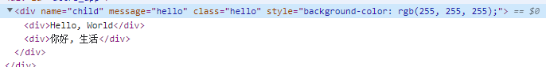
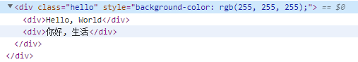
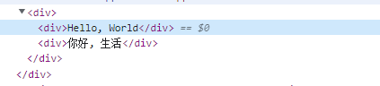
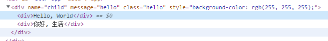
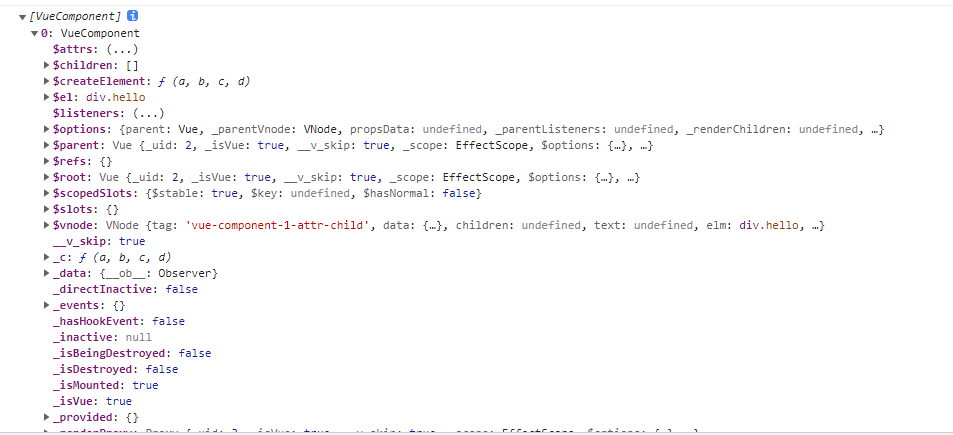

# Vue2.x迁移

## v-for中的Ref数组

  Vue3.x中, ref在for循环中不再自动创建$refs数组。需要从单个绑定的元素获取多个ref.
  
```html
<!-- 2.x的版本 -->
<ul>
  <li
    v-for="player in player_list"
    :key="player.id"
    ref="player"
  >{{player.firstName}} - {{player.lastName}}</li>
</ul>
<script>
  new Vue({
    //...
    data() {
      return {
        player_list: [
          {
            firstName: 'kyrie',
            lastName: 'irving',
            id: 1
          },
          {
            firstName: 'lebron',
            lastName: 'james',
            id: 2
          }
        ]
      }
    },
    mounted() {
      this.$nextTick(() => {
        const players = this.$refs.player
        console.log(players)
      })
    }
  })
</script>
```
```html
<!-- 3.x版本 -->
<ul>
  <li
    v-for="player in player_list"
    :key="player.id"
    :ref="setPlayerRef"
  >{{player.firstName}} - {{player.lastName}}</li>
</ul>

<script>
  createApp({
    setup() {
      const playerRefs = ref([])
      const player_list = ref([
        {
          firstName: 'kyrie',
          lastName: 'irving',
          id: 1
        },
        {
          firstName: 'lebron',
          lastName: 'james',
          id: 2
        }
      ])
      const setPlayerRef = el => {
        if(el) {
          playerRefs.value.push(el)
        }
      }
      onMounted(() => {
        console.log(playerRefs.value)
      })
      return {
        player_list,
        setPlayerRef
      }
    }
  })
</script>
```


## Attribute

  在2.x版本中, 元素的attribute 如果是falsy(undefined, null, 或 false), 则会移除它们, 否则会加上。而在3.x的版本中, 会将false
  强制转化为 'false',不会移除该属性， 如果需要显示地移除attribute, 需要设置为 null / undefined。

[Vue-Attribute](https://v3.cn.vuejs.org/guide/migration/attribute-coercion.html#%E6%A6%82%E8%A7%88)

# $attrs

  在2.x版本中, $attrs 不会包含传递到组件上的 class 和 style属性。 在inheritAttrs: false时, 其他属性不会被添加到根元素, 但是
  class 和 style  不受影响。
```html
<!-- 2.x -->
<div id='app'>
  <child-component
    name="child" 
    message="hello"
    class="hello"
    :style="{backgroundColor:'#fff'}"
  ></child-component>
</div>

<script>
const ChildComponent = {
  name: 'child-component',
  template: `<div>
    <div>Hello, World</div>
    <div>你好, 生活</div>
  </div>`,
  inheritAttrs: true,
  created() {
    console.log(this.$attrs)
    // {name: 'child', message: 'hello'}
  }
}

const app = new Vue({
  el: '#app',
  components: {
    [ChildComponent.name]: ChildComponent
  }
})
</script>
```
下图分别表示 在子组件上添加 attribute, 在设置了 inheritAttrs 为true 和 false 的结果。



```html
<div>
  <child-component
    name="child"
    message="hello"
    class="hello"
    :style="{backgroundColor:'#fff'}"
  ></child-component>
</div>

<script>
const app = createApp({
})
app.component('child-component', {
  template: `<div>
    <div>Hello, World</div>
    <div>你好, 生活</div>
  </div>`,
  inheritAttrs: false,
  setup(props, context) {
    console.log(context.attrs)
    /*
    {
      class: "hello"
      message: "hello"
      name: "child"
      style: {
        backgroundColor: "#fff"
      }
    }
    * */
  }
})
app.mount('#attr-app')
</script>
```
  在3.x版本中, 对attrs的处理比较一致, inheritAttrs为false时, 根元素不会继承所有属性包括 class 和 style, 并且子组件的attrs中包含class和style.




## $children

  在2.x的版本中, 父组件可以通过$children访问当前实例的子组件。 使用上述Demo 在mounted中访问 $children 如下图所示.
  在3.x 版本中 访问$children 为 undefined.
```js
{
// ...
  mounted() {
    console.log(this.$children)
  }
}
```


## directive

  在2.x版本中, 自定义指令通过使用下列钩子来创建
```html
<div id="directive-app">
  <p v-highlight="'red'" v-direction="1 + 1" v-if="visible">{{count}}</p>
  <button @click="increment">click</button>
  <button @click="visible = !visible">toggle</button>
</div>

<script>
new Vue({
  data() {
    return {
      count: 0,
      visible: true
    }
  },
  directives: {
    highlight: {
      inserted(el, binding, vnode, oldVnode) {
        console.log('el', el) // 指定绑定的元素
        console.log('binding', binding)
        /*
        v-highlight
          {
            expression: "'red'"
            modifiers:
            No properties
            name: "highlight"
            rawName: "v-highlight"
            value: "red"
          }
        v-direction
          {
            expression: "1 + 1"
            modifiers: {}
            name: "direction"
            rawName: "v-direction"
            value: 2
          }
        */
      },
      bind() { // 切换visible, 当visible为true的时候 指定绑定到dom上的时候调用
        console.log('bind')
      },
      // count更新时
      update(el, binding, vnode, oldVnode) {
        console.log('update', el, binding, vnode, oldVnode)
      },
      // true为false, 元素隐藏时指令与元素解绑时调用
      unbind() {
        console.log('unbind')
      }
    },
    direction: {
      inserted(el, binding) {
        console.log('direction:', binding)
      }
    }
  },
  methods: {
    increment() {
      this.count += 1
    }
  }
})  
</script>
```
  在3.x的版本中, 自定义指令的钩子函数与组件生命周期钩子函数命名一致, 并新增created / beforeUpdate / beforeUnmount等钩子。
```html
<div id="app">
  <p v-highlight:color="'red'" v-if="visible">{{count}}</p>
  <button @click="increment">add</button>
  <button @click="visible = !visible">toggle</button>
</div>

<script>
const app = createApp({
  directives: {
    highlight: {
      created() {
        console.log('created')
      },
      beforeMount() {
        console.log('beforeMount')
      },
      mounted() {
        console.log('mounted')
      },
      beforeUpdate() {
        console.log('beforeUpdate')
      },
      updated() {
        console.log('updated')
      },
      beforeUnmount() {
        console.log('beforeUnmount')
      },
      unmounted() {
        console.log('unmounted')
      }
    }
  },
  setup() {
    const count = ref(0)
    const visible = ref(true)
    const increment = () => {
      count.value += 1
    }
    return {
      count,
      increment,
      visible
    }
  }
})
/*
{
  arg: 'color'
  dir: {created: ƒ, beforeMount: ƒ, mounted: ƒ, beforeUpdate: ƒ, updated: ƒ, …}
  instance: Proxy {…} 当前实例, 实例是指令的一部分
  modifiers: {}
  oldValue: undefined
  value: "red"
}
*/
</script>
<!-- 隐藏元素时依次调用 beforeUnmount / unmounted -->
<!-- 元素显示时 依次调用 created beforeMount mounted -->
```

## webComponent

```html
<template id='primary-button'>
  <button></button>
<template>

<script>
class PrimaryButton extends HTMLElement {
  constructor() {
    super()
    const templateEle = document.querySelector('#primary-button')
    const content = templateEle.content.cloneNode(true)
    const shadow = this.attachShadow({mode: 'closed'})
    const style = document.createElement('style')
    style.textContent = `
      button {
        padding: 5px 10px;
        background-color: #1890ff;
        color: #fff;
        outline: none;
        border: 1px solid #1890ff;
        cursor: pointer;
      }
    `
    shadow.append(content, style)
  }
}
window.customElements.define('primary-button', PrimaryButton)
<script>
```
  上述通过webComponent定义了一个自定义元素, 如果在Vue中直接使用会报警告, 没有定义 primary-button 组件。在2.x版本中, 通过Vue.config.ignoreElements
  将标签配置为自定义元素
```js
Vue.config.ignoreElements = ['primary-button']
```
  在3.x的版本中, 此检查在编译期间执行.
```js
// webpack 中的配置
{
  rules: [
    {
      test: /\.vue$/,
      use: 'vue-loader',
      options: {
        compilerOptions: {
          isCustomElement: tag => tag === 'primary-button'
        }
      }
    }
  ]
}

// 模板编译
const app = Vue.createApp({})
app.config.compilerOptions.isCustomElement = tag => tag === 'primary-button'
```

  在渲染动态组件时的差异:
```js
<button is='primary-button'></button>

/* 在2.x版本中将会渲染 一个  primary-button 组件
 在3.x版本中, 将is 作为attribute 传递给createElement调用,并作为原生attribute渲染, 因为在3.x版本中,
  is attribute的特殊处理限制在了 component标签中。
*/
```

## mixin

```js
// 2.x 版本
const mixin = {
  data() {
    return {
      player: {
        firstName: 'kyrie',
        lastName: 'irving'
      }
    }
  }
}
new Vue({
el: '#mixin-app',
  data() {
    return {
      player: {
        age: 30
      }
    }
  },
  mixins: [mixin],
  created() {
    console.log(this.player)
    /*
    * {
        age: 30
        firstName: "kyrie"
        lastName: "irving"
    * }
    * */
  }
})
```
```js
// 3.x 版本
const mixin = {
  data() {
    return {
      player: {
        firstName: 'kyrie',
        lastName: 'irving'
      }
    }
  }
}

const mixin_app = createApp({
  data() {
    return {
      player: {
        age: 30
      }
    }
  },
  mixins: [mixin],
  created() {
    console.log(this.player)
    /*
    * {age: 30}
    * */
  }
})
```

## emits

  Vue3组件提供一个emits选项,用来表示当前组件可以向父组件触发的事件。
```html
<div id="emit-app">
  <my-button @click="handleClick"></my-button>
</div>

<script>
  const emit_app = createApp({
    setup() {
      const handleClick = () => {
        console.log('父组件触发了')
      }
      return {
        handleClick
      }
    }
  })
  emit_app.component('my-button', {
    template: `<button @click="handleClick">click</button>`,
    emits: ['click'],
    setup(props, context) {
      const handleClick = () => {
        console.log('子组件触发了')
        context.emit('click')
      }
      return {
        handleClick
      }
    }
  })
/*
  在子组件监听一个子组件触发的原生click事件，如果子组件没有emits选项, 此时click会触发两次。
一次来自 $emit()。
另一次来自应用在根元素上的原生事件监听器。
*/ 
</script>
```

## 移除的API

1. 在3.x版本中已经移除了 $on，$off 和 $once
2. 移除了 filter 过滤器
3. 在2.x版本中, 不支持多个根节点组件, 在3.x版本中 组件可以包含多个根节点, 但是要求开发者显示定义attribute应该分布在哪里。
4. Vue.extend移除
5. 全局API通过具名导出支持tree-shaking
6. 不在支持数字的keyCode事件修饰符, 不支持config.keyCodes
7. 移除$listeners, 组件监听的事件作为 attrs的一部分
8. propsData被移除, 可以在createApp() 第二个参数给根组件传递props
9. 移除.native事件修饰符
```html
<!-- 2.x -->
<input type="text" @keyup.13="keyup">
<input type="text" @keyup.enter="keyup">


<!-- 3.x -->
<!-- 捕获q 和 Q -->
<input type="text" @keyup.q="keyup">
```
```js
// 全局API
import { nextTick } from 'vue'
```
```js
// 片段
app.component('child-component', {
  template: `<div>
    <div>Hello, World</div>
    <div>你好, 生活</div>
  </div>
  <div v-bind="$attrs">我是兄弟节点</div>`,
  inheritAttrs: true
})

// 3.x 移除Vue.extend, 应该始终通过createApp() 创建实例
const Profile = {
  template: `<div>{{firstName}} - {{lastName}}</div>`,
  data() {
    return {
      firstName: 'Kevin',
      lastName: 'Durant'
    }
  }
}
createApp(Profile).mount('#app')
```

## 渲染函数和函数式组件

```js
// 渲染函数 2.x
Vue.component('player-list', {
  render: function(createElement) {
    return createElement('ul', 
      this.list.map(p => createElement('li',[
        createElement('span', p.firstName), createElement('span', p.lastName)
      ]))
    )
  },
  props: {
    list: {
      type: Array,
      required: true
    }
  }
})

// 函数式组件 2.x
Vue.component('smart-list', {
  functional: true,
  render: function(createElement, context) {
/*
组件需要的一切都是通过context参数传递, 它是一个对象包含如下字段:
1. props: 包含传递给组件的非props attribute, 和 组件props
2. children: 子节点数组
3. data: 传递给组件的整个数据对象, on, staticClass  attrs等
4. parent: 对父组件的引用
5. listeners: 所有父组件为当前组件注册的事件监听器的对象
// ... 
*/ 
    return createElement('ul', 
      context.data,
      // 使用JavaScript代替 v-for
      context.props.list.map(p => createElement('li',[
        createElement('span', p.firstName), createElement('span', p.lastName)
      ]))
    )
  }
})

const function_vm = new Vue({
  el: '#function-app',
  data() {
    return {
      player_list: [
        {
          firstName: 'kyrie',
          lastName: 'irving'
        },
        {
          firstName: 'lebron',
          lastName: 'james'
        }
      ]
    }
  }
})
```
  在3.x版本中, 所有的函数式组件都是用普通函数创建的。该函数接受props 和 context两个参数, context包含 attrs, slots 和emit。
  此外, h函数是全局导入 而不是在render函数中隐式提供。
```js
const DynamicHeading = (props, context) => {
  return h(`h${props.level}`, context.attrs, context.slots)
}
DynamicHeading.props = ['level']
createApp({
  components: {
    [DynamicHeading.name]: DynamicHeading
  }
}).mount('#function-app')

// 渲染函数
function_app.component('anchored-heading', {
  props: {
    level: {
      type: Number,
      required: true
    }
  },
  render() {
    return h(`h${this.level}`, {}, this.$slots.default())
  }
})
```

## 挂载API

  在2.x版本中, 当挂载一个具有template选项的组件时, 被渲染的元素内容会替换成要挂载的目标元素。 而在3.x版本中, 被渲染的应用会作为子元素插入。
```js
// 2.x
const root_vm = new Vue({
  el: '#root',
  data() {
    return {
      message: 'hello world'
    }
  },
  template: `<div class="root">{{message}}</div>`
})
/*
<div id='root'></div>
将被渲染为
<div class='root'></div>
*/

// 3.x
createApp({
  template: `<div class="root">{{message}}</div>`,
  setup() {
    const message = ref('hello world')
    return {
      message
    }
  }
}).mount('#root')
/*
<div id="root" data-v-app="">
  <div class="root">hello world</div>
</div>
*/

// setup 返回一个渲染函数
const ButtonIncrement = {
  setup() {
    const count = ref(0)
    const increment = () => {
      count.value += 1
    }
    return () => h('button', {
      onClick: increment,
    },[count.value])
  }
}
createApp(ButtonIncrement).mount('#root')
```

## v-for和v-if的优先级

  在2.x版本中同一个元素上使用v-if 和 v-for时, v-for会优先作用, 但是在3.x版本中, v-if总是优先v-for生效。
```html
<!-- 2.x -->
<ul>
  <li v-for="p in player_list" v-if="p.visible">{{p.name}}</li>
</ul>
<script>
new Vue({
  data() {
    return {
      player_list: [
        {
          name: 'kyrie',
          visible: false
        },
        {
          name: 'lebron',
          visible: true
        },
        {
          name: 'durant',
          visible: false
        }
      ]
    }
  }
})
/*
渲染为 <ul><li>lebron</li></ul>
*/ 
</script>
```
```html
<!-- 这么写会报错 -->
<ul>
  <li v-for="p in player_list" v-if="p.visible">{{p.name}}</li>
</ul>

<script>
  createApp({
    setup() {
      const player_list = ref([
        {
          name: 'kyrie',
          visible: false
        },
        {
          name: 'lebron',
          visible: true
        },
        {
          name: 'durant',
          visible: false
        }
      ])
      return {
        player_list
      }
    }
  })
</script>
```

## Teleport

  Teleport可以将组件挂载与Vue App 根节点之外的地方。
```html
<!-- 将挂载在body下面 -->
<teleport to="body">
  <div v-if="modalOpen" class="modal">
    <div>
      I'm a teleported modal! 
      (My parent is "body")
      <button @click="modalOpen = false">
        Close
      </button>
    </div>
  </div>
</teleport>
```