# Webpack

## 开始

```js
module.exports = {
  mode:'development',
  entry: path.resolve(__dirname, 'src/index.js'), // 入口
  output: { // 出口
    path: path.resolve(__dirname, 'src/dist'),
    filename: 'bundle.js'
  }
}
```
## 管理资源

### style-loader/css-loader

  模块loader可以链式调用。链中的每个loader都将对资源进行转换。链会逆序执行。第一个loader将其结果传递给
  下一个loader,依此类推。

```js
// style-loader  Inject CSS into the DOM
//在背后使用了module.hot.accpet,在css依赖模块更新之后,会将其patch到<style>标签中

// src/index.js
import './style.css'
function createElement() {
  const div = document.createElement('div')
  div.classList.add('item')
  div.textContent = '你好生活'
  return div
}
document.body.appendChild(createElement())

// webpack.config.js
module.exports = {
  // ...
  entry: path.resolve(__dirname, 'src/index.js'),
  output: {
    path: path.resolve(__dirname, 'dist'),
    filename: 'bundle.js'
  },
  module: {
    rules: [
      {
        test: /\.css$/,
        use:['style-loader', 'css-loader']
      }
    ]
  }
}
```
### 资源模块
  资源模块(asset module)是一种模块类型, 它允许使用资源文件(字体,图标等), 而无需配置额外的loader.

1. asset/resource:  发送一个单独的文件并导出URL.
2. asset/inline:    导出一个资源的data URI
3. asset/source:    导出资源的源代码
4. asset:           在导出一个data URI 和 发送一个单独的文件之间自动选择。小于8kb的文件,将会视为inline模块类型。
```js
module.exports = {
// ...
  module: {
    rules: [
      {
        test: /\.(png|webp|jpg|jpeg)$/,
        type: 'asset/source'  // 'asset/resource' 'asset/inline' 'asset'
      }
    ]
  }
}
```
  下面是分别按照 inline / resource / source的方式配置 打包后的结果。

1. asset/inline

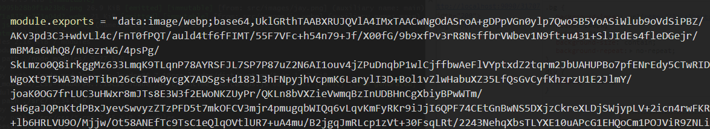

2. asset/resource

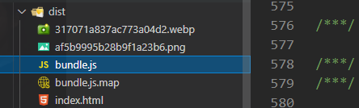

3. asset/source

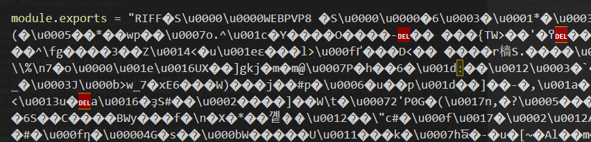

  默认情况下, asset/resource 模块以[hash][ext][query] 文件名发送到输出目录,可以在webpack配置中设置output.assetMoudleFilename来修改模板字符串
```js
module.exports = {
  output: {
    filename: 'bundle.js',
    path: path.resolve(__dirname, 'dist'),
    assetModuleFilename: 'images/[hash][ext][query]'
  }
}
```
  webpack按照 type:'asset' 打包资源文件时,自动地在 resource 和 inline之间进行选择: 小于8kb的文件,将会视为inline模块类型,
  否则会被视为resource模块类型。
  可以通过 选项 parser.dataUrlCondition.maxSize 配置。
```js
module.exports = {
  module: {
    rules: [
      {
        test: /\.png$/,
        type: 'asset',
        parser: {
          dataUrlCondition: {
            maxSize: 10 * 1024  // 1024kb
          }
        }
      }
    ]
  }
}
```
## 代码分离

  代码分离是把代码分离到不同的bundle中, 然后可以按需加载或并行加载这些文件。代码分离可以获取更小的bundle.

  常用的代码分离方法有三种:

1. 入口起点: 使用entry 配置手动的分离代码
2. 防止重复: 使用SplitChunksPlugin 去重和分离chunk
3. 动态导入: 通过模块的内联函数调用分离代码

### 配置多个入口

```js
// webpack.config.js
// - 多个入口
module.exports = {
  mode: 'development',
  entry: {
    app: path.resolve(__dirname, 'src/index.js'),
    main: path.resolve(__dirname, 'src/main.js')
  },
  output: {
    filename: '[name].bundle.js',
    path: path.resolve(__dirname, 'dist'),
    clean: true
  }
  // ...
}
```
  上面配置会将bundle打包成 app.bundle.js 和 main.bundle.js, 但是会有一个问题, 两个入口文件中都引入了lodash,
  这样配置会在两个bundle中造成重复引用。
```js
// webpack.config.js
{
  entry: {
    app: {
      import: path.resolve(__dirname, 'src/index.js'),
      dependOn: 'shared'
    },
    main: {
      import:  path.resolve(__dirname, 'src/main.js'),
      dependOn: 'shared'
    },
    shared: 'lodash'
  },
  optimization: {
    runtimeChunk: 'single'
  }
}
```

### SplitChunksPlugin

  可以将公共的依赖模块提取到已有的入口chunk中。或者提取到一个新生成的chunk.
```js
// webpack.config.js
module.exports = {
  mode: 'development',
  // ... 
  entry: {
    app: path.resolve(__dirname, 'src/index.js'),
    main: path.resolve(__dirname, 'src/main.js')
  },
  output: {
    filename: '[name].bundle.js',
    path: path.resolve(__dirname, 'dist'),
    clean: true
  },
  optimization: {
    runtimeChunk: 'single',
    splitChunks: {
      chunks: 'all'
    }
  }
}
```

### 动态导入

  使用import()语法来实现动态导入
```js
// main.js
function print(message) {
  console.log(message)
}
export default print

// index.js
const button = document.createElement('button')
button.textContent = 'click'
button.addEventListener('click', function() {
  import(/*webpackChunkName: 'print'*/ './main.js').then(fn => {
    console.log(fn)
    fn.default('hello')
  })
}, false)
document.body.appendChild(button)


// webpack.config.js
{
  // ...
  entry: path.resolve(__dirname, 'src/index.js'),
  optimization: {
    runtimeChunk: 'single',
    splitChunks: {
      chunks: 'all'
    }
  }
}
```
  当点击button按钮的时候, 会异步加载 print.bundle.js 文件, 默认导出的函数 挂载 在 对象的default 属性上
  
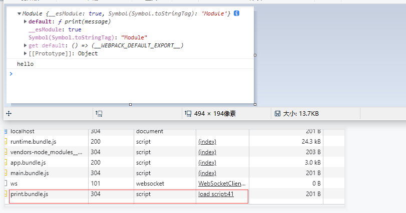

### prefetch / preload

  prefetch(预获取) / preload (预加载)
```js
import(/*webpackPrefetch: true*/ './util/index.js')
```
  prefetch: 只要父chunk完成加载, webpack就会添加prefetch hint(预取指示)

  preload:
1. preload chunk 会在父chunk加载时, 以并行方式开始加载. 而prefetch chunk会在父chunk加载结束后开始加载
2. preload chunk 具有中等优先级, 并立即下载。 prefetch chunk会在浏览器闲置时下载
3. preload chunk会在父chunk中立即请求,用于当下时刻, prefetch chunk会用于未来的某个时刻。

```js
// src/index.js 
// 改造一下上面的例子
import(/*webpackPrefetch: true*/ './main.js').then(fn => {
  fn.default('hello')
})

//会在html 生成下面的 引用
//<link rel="prefetch" as="script" href="http://localhost:9098/src_main_js.bundle.js">
```

## 缓存

  命中缓存可以降低网络流量, 使网站加载速度更快。

  webapck提供了一种称为 substitution(可替换模板字符串)的方式, 通过带括号字符串来模板化文件名。
  其中, [contenthash] substitution将根据资源内容创建出唯一hash. 当资源内容发生变化时,[contenthash]也会发生改变。

  在介绍 hash 之前先介绍一下 contenthash fullhash 和 chunkhash 之间的区别

### fullhash

  之前是hash --> 现在值改为了fullhash

  如果使用hash的话, 每次修改任何一个文件, 所有打包生成的文件名hash都会改变, 所以一旦修改了任何一个文件, 整个项目的缓存都将失效。


  上图 是 打包后的结果,可以看到 bundle.js 和分离出来的 css文件 hash值都是一致的, 修改其中一个文件的内容再次打包 :

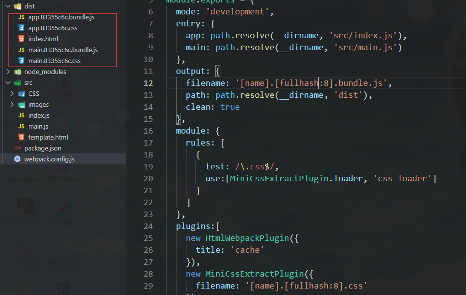

  上图可以看到 仅更改一个文件, 所有的文件名hash值都已发生改变。

###  chunkhash

  chunkhash是根据不同的入口文件进行依赖文件解析,构建对应的chunk。生成对应的hash值。将上面的demo文件名改为 chunkhash 再次打包:

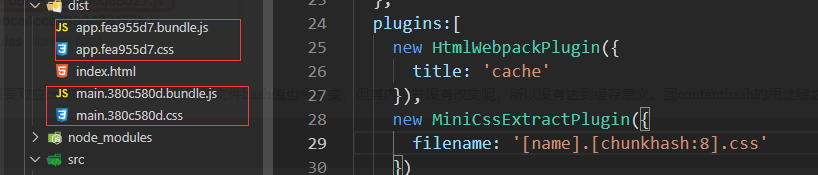

  不同的bundle 的hash值不一致, 但是css文件是作为模块引入到Javascript中的, 所以对应的css文件hash 和 bundle.js hash值一致。

  这样就产生了一个问题：如果仅修改js文件 但是不修改css文件, 或者只修改css文件 不修改 js文件, 会导致两者的 hash值都发生改变。

  下图 左 和 图右 分别是 修改了 main.js 和 main.css文件后打包后的结果
  可以发现 app.js 和 app.css文件hash值没有发生改变, 但是 main.js 和main.css 文件hash 都 发生改变了.

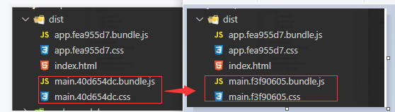

### contenthash

  contenthash 将根据资源内容创建出唯一 hash。当资源内容发生变化时,contenthash 也会发生变化。

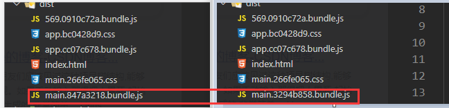

  上图只更改了main.js文件, 打包前后只有main.bundle.js hash值发生了改变。

  webpack还提供了一个优化功能,可以使用optimization.runtimeChunk 选项将runtime代码拆分为一个单独的chunk. 将其设置为
  single为所有chunk创建一个runtime bundle.
```js
// webpack.config.js
{
  // ...
  optimization:{
    runtimeChunk: 'single'
  }
}
```
  runtimeChunk 指的是webpack的运行环境和模块信息清单, 模块信息清单在每次有模块变更hash时 都会变。将这部分内容单独打包出来,
  就不会因为某个模块的变更导致模块信息的模块缓存失效.
```js
// webpack.config.js
module.exports = {
  mode: 'development',
  entry: {
    app: path.resolve(__dirname, 'src/index.js'),
    // index.js中异步导入了一个js文件 print.js
  },
  output: {
    filename: '[name].[contenthash:8].bundle.js',
    path: path.resolve(__dirname, 'dist'),
    clean: true
  },
  optimization: {
    runtimeChunk: 'single'
  }
}
```
  此时, 更新index.js文件, 只有app.js的hash值会改变, 而如果更改 print.js 则 print.bundle.js和 runtime.bundle.js
  hash值都将更改。


1. 第一次打包的结果
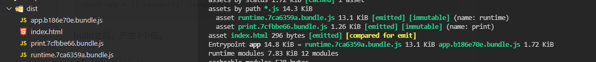

2. 更改index.js后打包结果
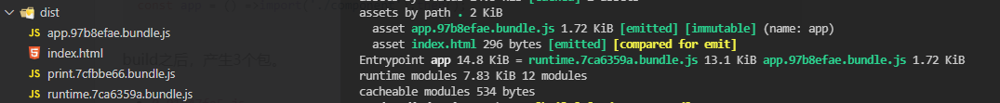

3. 更改print.js后打包结果
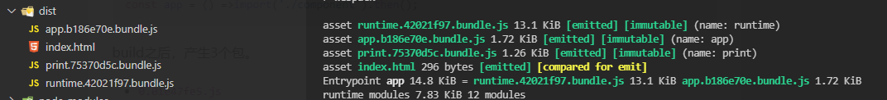

## Loader

### Style-loader

```js
// injectType: allows to setup how styles will be injected into the DOM
/*
default: styleTag
singletonStyleTag: Automatically injects styles into the DOM using one <style>
*/

// lazyStyleTag:
// injects styles into the DOM using multiple <style></style> on demand.
// webpack.config.js
{
  // ...
  module: {
    rules: [
      {
        test: /\.css$/,
        exclude:/\.lazy\.css$/,
        use:['style-loader','css-loader']
      },
      {
        test: /\.lazy\.css$/,
        use:[
          {
            loader: 'style-loader',
            options: {
              injectType: 'lazyStyleTag'
            }
          },
          'css-loader'
        ]
      }
    ]
  }
}
```

  - attributes: the style-loader will attach given attributes with their values on style element
```js
// ... 
{
  test: /\.css$/,
  use: [{
    loader: 'style-loader',
    options: {
      attributes: {
        id: 123
      }
    }
  }, 'css-loader']
}
```
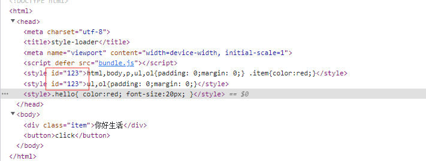

  - insert: default: head  指定style标签插入的位置
```js
// webpack.config.js
// ...
{
  test: /\.css$/,
  use:[{
    loader:'style-loader',
    options: {
      insert: 'body'
    }
  },'css-loader']
}
```
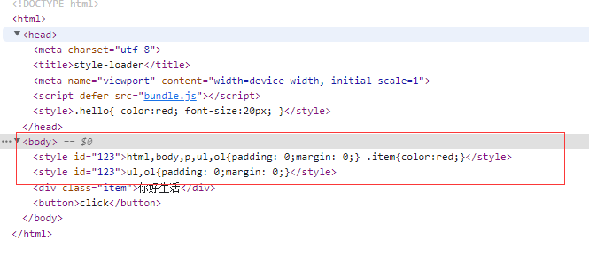

  - Source maps

  The loader automatically inject source maps when previous loader emit them. Therefore,to generate source maps,
  set the sourceMap option to true for the previous loader

### CSS-loader

  The css-loader interprets @import and url() and will resolve them.

#### url: Boolean / Object

  Enable/disable url() resolving

#### import:  Boolean / Object
  
  allows to enables/disables @import at-rules handing.
```js
// webpack.config.js
// ...
rules: [
  {
    test: /\.css$/i,
    loader: "css-loader",
    options: {
      url: false  // boolean  设置为false 无法解析背景图片url地址 (本地资源路径)
      url: { // object
        filter: (url, resourcePath) => {
          if(url.includes('webp')) { // 不会处理webp文件 （本地资源路径）
            return true
          }else{
            return false
          }
        }
      },
      import: true  // default: false
      import: {
        filter: (url, media, resourcePath) => {
          if(url.includes('style.css')) {
            return false
          }
          return true
        }
      }
    },
  }
```
  import设置为false时, 浏览器会报警告。
:::danger
 Refused to apply style from 'http://localhost:9008/index.css' because its MIME type ('text/html') is not a supported stylesheet MIME type, and strict MIME checking is enabled.
:::

#### modules

  Allows to enable/disable CSS Modules

  default: undefined

1. undefined:
  enable CSS modules for all files matching /\.module\.\w+$/i.test(filename)

2. true:
  enable CSS modules for all files

3. false: 
  disable CSS modules for all files

4. string: disables CSS modules for all files and set the mode option.

```js
// index.js  入口
import './css/index.module.css'
import './css/index.css'

// webpack.config.js
// ...
module: {
  rules: [
    {
      test: /\.css$/,
      use: ['style-loader',{
        loader: 'css-loader',
        options: {
          modules: undefined, // defualt
          modules: true,
          modules: {
            auto: undefined,  //enable CSS modules for all files
            auto: true,  // 匹配 module.css的文件
            auto: false, // disable CSS modules
            auto: /\.module\.css/, // enable CSS modules for all files matching 
            auto: function(resourcePath) {
              if(resourcePath.includes('index')) { // 过滤掉所有文件名包含index的文件
                return false
              }
              return true
            },
          }
        }
      }]
    }
  ]
}
```
  默认情况下(undefined), 只会处理 结尾为module.css结尾的文件
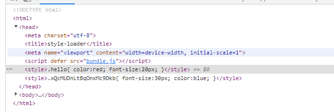

  设置为true时, 处理所有的CSS文件
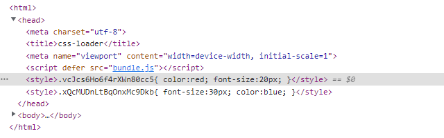

#### mode

  CSS modules 允许使用:global(.className)的语法, 声明一个全局规则。凡是这样声明的class, 都不会被编译成哈希字符串。

```js
// webpack.config.js
{
  test: /\.css$/,
  use:['style-loader', {
    loader: 'css-loader',
    options: {
      // Using `local` value has same effect like using 'modules:true'
      // 所有文件类名都不会被编译为哈希字符串 使用:local 的css 会会编译为 哈希类名
      modules: 'global',
      modules: 'local' // 所有文件类名都会被编译为哈希字符串 但是使用:global 的 css 除外
      localIdentName: '[hash:base64:8]', //hash clss 生成的规则
      // name: 文件名
      // folder 文件夹名称
      // path 文件夹的相对路径
      // file filename and path
      // hash hash字符串
      // local : original class 转换前的类名

      // Allows to redefine basic loader context for local ident name
      localIdentContext: path.resolve(__dirname, 'src/css')

      // Allows to specify hash function to generate classes. 
      localIdentHashFunction: 'md4'

      // Allows to specify hash digest length to generate class
      localIdentHashDigestLength: 28

      hashStrategy: 'resource-path-and-local-name'  // 生成has的策略
    }]
  }]
}
```
#### importLoaders

  The options importLoaders allows you to configure how many loaders before css-loader shoule be applied 
  to @import ed resources and CSS modules imports
```js
// webpack.config.js
module.exports = {
  module: {
    rules: [
      {
        test: /\.css$/,
        use:['style-loader', {
          loader: 'css-loader',
          options: {
            importLoaders: 2
            // 0 => no loaders (default);
            // 1 => postcss-loader;
            // 2 => postcss-loader, sass-loader
          }
        },'postcss-loader', 'sass-loader']
      }
    ]
  }
}
```
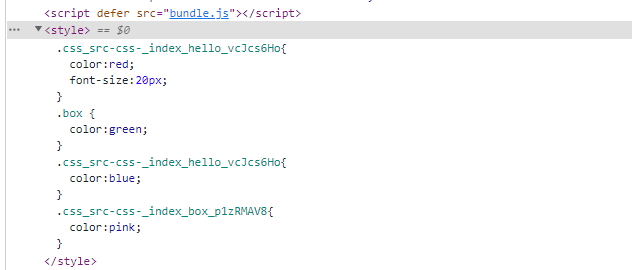
  
## Plugins

### html-webpack-plugin

  This is a webpack plugin that simplifies creation of HTML files to serve your webpack bundles.
  This is especially useful for webpack bundles that includes a hash in the filename which changes every compilation.

```js
const HtmlWebpackPlugin = require('html-webpack-plugin')
module.exports = {
  // ...
  plugins: [
    new HtmlWebpackPlugin({
      title: 'html-webpack-plugin',  // document.title   default: Webpack App
      // filename: 'about.html',  //     default: index.html
      // filename: '[name].html',  // 根据入口名字生成
      template: path.join(__dirname, 'src/template.html'),
      inject: 'body', // true | head | body | false
      /*
      inject all assets into the given template or templateContent.
      body: all javascript resources will be placed at the bottom of the body element
      head: will place the scripts in the head element
      true: will add it to the head/body depending on the scriptLoading option.
      false: will disable automatic injections
      */
      // publicPath: '/assets/',  
      // index.html 引用的资源路径 used for script and link tags
      scriptLoading: 'blocking',   // blocking defer module
      favicon: path.join(__dirname, 'src/icon.svg'),  // icon图标
      minify: false,  // true if mode is 'production' otherwise false
      hash: true, // 引入的 js css文件名后带hash值  
      // if true then append a unique webpack compilation hash to all 
      // included scripts and css files
      cache: false,
      chunks: ['app'], // Allows you to add only some chunks
      meta: {     // allows to inject meta tags
        viewport: 'width=device-width,initial-scale=1',
        content: 'webpack,html-webpack-plugin',
        keywords: 'webpack',
        'theme-color': '#4285f4'
      },
      // base: 'http://192.168.0.141:8080', will inject a base tag 
    })
  ]
}
```
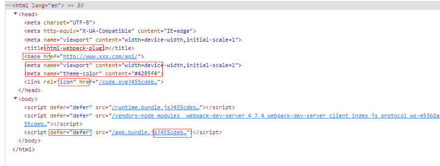

### mini-css-extract-plugin

  This plugin extract CSS into separate files. It creates a CSS file per JS file which contains CSS.
  It supports On-Demand-Loading of CSS and SourceMaps;

```js
// webpack.config.js
const MiniCssExtractPlugin = require("mini-css-extract-plugin");

module.exports = {
  plugins: [new MiniCssExtractPlugin({
    filename: '[name].[contenthash:8].css',  //文件名  default: [name].css
    chunkFilename: '[name].[contenthash:4].css', // determines the name of non-entry chunks files
    attributes: { 
//if defined, mini-css-extract-plugin will attach given attributes 
//with their values on <link> element.It only applied to dynamically loaded css chunks
      id: 'hello',
      'data-target': 'hello'
    },
    insert: 'head',// string / function
    /*
    inserts the link tag at the given position for non-initial css chunks.
    */ 
    linkType: 'text/css',  // boolean (false disables the link type attribute)
    /*
    This option allows loading asynchronous chunks with a custom link type.
    */
    ignoreOrder: true // Enable to remove warnings about conflicting order
  })],
  module: {
    rules: [
      {
        test: /\.css$/i,
        use: [MiniCssExtractPlugin.loader, "css-loader"],
      }
    ]
  }
}

// index.js
const button = document.createElement('button')
button.textContent = '点击'
button.addEventListener('click', function() {
  import('./print.js').then(d => {
    d.default('hello world')
  })
})

// print.js
import './css/print.css'
function print(message) {
  console.log(message)
}
```
  下图是在点击按钮时 异步加载print.js文件 以及 在print.js中引入的css。
  
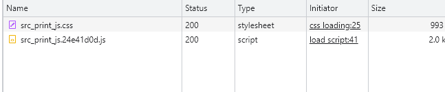

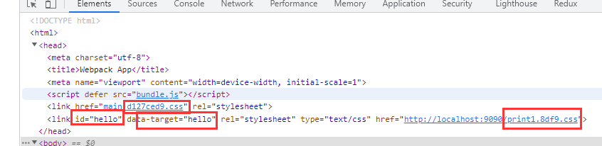

**Loader 选项**

  publicPath: Specifies a custom public path for the external resources like images, files,
  Works like output.publicPath
```js
const MiniCssExtractPlugin = require('mini-css-extract-plugin')
module.exports = {
  module: {
    rules: [
      {
        test: /\.css$/,
        use: [{
          loader: MiniCssExtractPlugin.loader,
          options: {
            publicPath: '/assets/'
          }
        }]
      }
    ]
  },
  plugins:[new MiniCssExtractPlugin()]
}
```

#### Minimizing For Production

  To minify the output, use a plugin like css-minimizer-webpack-plugin

```js
// webpack.config.js
const MiniCssExtractPlugin = require('mini-css-extract-plugin')
const CssMinimizerPlugin = require('css-minimizer-webpack-plugin')
module.exports = {
  module: {
    rules: [
      {
        test: /\.css$/,
        use: []
      }
    ]
  },
  plugins: [
    new MiniCssExtractPlugin({
      filename: '[name].[contenthash:8].css',
      chunkFilename: '[name].css'
    })
  ],
  optimization: {
    minimize: true  // 开发环境压缩css代码
    minimizer: [
      new CssMinimizerPlugin()
    ]
  }
}
```
  以上配置在 mode 为 production时 会压缩css. 如果想在开发环境下也压缩, 可以设置optimization.minimize 为true

#### Extracting all CSS in a single file

```js
// webpack.config.js
module.exports = {
  optimization: {
    splitChunks: {
      cacheGroups: {
        styles: {
          name: 'styles',
          type: 'css/mini-extract',
          chunks: 'all',
          enforce: true
        }
      }
    }
  }
}
```
### CssMinimizerWebpackPlugin

  这个插件使用cssnano优化和压缩css.
```js
const MiniCssExtractPlugin = require("mini-css-extract-plugin");
const CssMinimizerPlugin = require("css-minimizer-webpack-plugin");

module.exports = {
  module: {
    rules: [
      {
        test: /.s?css$/,
        use: [MiniCssExtractPlugin.loader, "css-loader", "sass-loader"],
      },
    ],
  },
  optimization: {
    minimizer: [
      new CssMinimizerPlugin(){
        test:/\.css(\?.*)?$/i
      },
    ],
  },
  plugins: [new MiniCssExtractPlugin()]
};
```

### EnvironmentPlugin

  The EnvironmentPlugin is shorthand for using the DefinePlugin on process.env keys.
```js
module.exports = {
  plugins: [
    new webpack.EnvironmentPlugin({
      NODE_ENV: 'development',  // using development
      DEBUG: true
    })
  ]
}

// not specifying the environment variable raises an 'EnvironmentPlugin.${key}', 
// environment variable is undefined error.
```
### IgnorePlugin

  IgnorePlugin prevents the generation of modules for import or require calls matching the regular expressions
  or filter functions.
```js
new webpack.IgnorePlugin({
  resourceRegExp,
  contextRegExp
})
/*
resourceRegExp 是针对发在发生导入的源代码中传递给require或者import的字符串进行匹配,
contextRegExp 参数用来选择指定的目录。
*/
```
### LimitChunkCountPlugin

  While writing your code, you may have already added many code split points to load stuff on demand.After compiling you might
  notice that some chunks are too small - creating larget HTTP overhead.
  LimitChunkCountPlugin can post-process your chunks by merging them.
```js
// index.js
import(/*webpackChunkName: 'print1'*/ './typescript/print.ts').then(({print}) => {
  print('hello world1')
})
import(/*webpackChunkName: 'print2'*/ './typescript/print2.js').then(({print}) => {
  print('hello world2')
})
// ....
import(/*webpackChunkName: 'print10'*/ './typescript/print10.js').then(({print}) => {
  print('hello world10')
})
// 在入口文件 点击按钮时 异步加载10个 js文件


// webpack.config.js
const webpack = require('webpack');
module.exports = {
  // ...
  plugins: [
    new webpack.optimize.LimitChunkCountPlugin({
      maxChunks: 5,
    }),
  ]
};
```
  在没有配置 new webpack.optimize.LimigChunkCountPlugin时 network面板是这样的


  而在配置了限制生成chunk数量时, 点击按钮加载的js文件是下面这样的, 加上主入口chunk, 一共5个

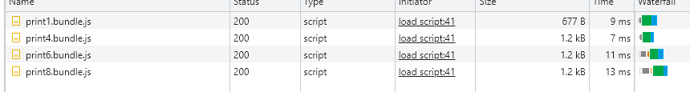

### MinChunkSizePlugin

  Keep chunk size above the specified limit by merging chunks that are smaller than the minChunkSize.
```js
new webpack.optimize.MinChunkSizePlugin({
  minChunkSize: 10000, // Minimum number of characters
});
```

## 开发环境和生产环境

  开发环境和生产环境下的构建目标不同, 可以将某些在production和development环境下的通用配置提取出来,
  然后分别为不同环境下写彼此独立的webpack配置. 使用webpack-merge工具 将不同环境下的配置合并。

  以下配置是针对上述知识点做的一个demo
  
```js
// webpack.common.js
const path = require('path')
const HtmlWebpackPlugin = require('html-webpack-plugin')

module.exports = {
  entry: {
    app: path.resolve(__dirname, 'src/index.js')
  },
  output: {
    clean: true,
    path: path.resolve(__dirname, 'dist')
  },
  module: {
    rules: [
      {
        test: /\.(png|webp|jpeg|jpg)$/,
        type: 'asset/resource'
      }
    ]
  },
  plugins:[
    new HtmlWebpackPlugin({
      title: 'webpack-merge'
    })
  ]
}


// webpack.development.js
const { merge } = require('webpack-merge')
const common = require('./webpack.common.js')
const path = require('path')

module.exports = merge(common, {
  mode: 'development',
  devtool: 'inline-source-map',
  output: {
    filename: '[name].bundle.js'
  },
  devServer: {
    port: '9008',
    host: '0.0.0.0',
    static: path.resolve(__dirname, 'dist')
  },
  module: {
    rules: [
      {
        test: /\.css$/,
        use:['style-loader', 'css-loader']
      }
    ]
  }
})

// webpack.production.js
const { merge } = require('webpack-merge')
const common = require('./webpack.common.js')
const MiniCssExtractPlugin = require('mini-css-extract-plugin')
const CssMinimizerPlugin = require('css-minimizer-webpack-plugin')

module.exports = merge(common, {
  mode: 'production',
  output: {
    filename: '[name].[contenthash].js'
  },
  module: {
    rules: [
      {
        test: /\.css$/,
        use: [MiniCssExtractPlugin.loader, 'css-loader']
      }
    ]
  },
  plugins:[
    new MiniCssExtractPlugin({
      filename: '[name].[contenthash].css',
      chunkFilename: '[name].css'
    })
  ],
  optimization: {
    runtimeChunk: 'single',
    usedExports: true,
    minimizer:[new CssMinimizerPlugin()],
    splitChunks: {
      cacheGroups: {
        vendor: {
          test: /[\\/]node_modules[\\/]/,
          name: 'vendors',
          chunks: 'all'
        }
      }
    }
  }
})
```
```js
// package.json
{
  // ...
  "scripts": {
    "serve": "webpack serve --config webpack.development.js",
    "build": "webpack --config webpack.production.js"
  }
}
```
